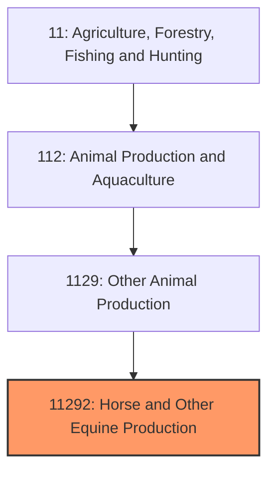
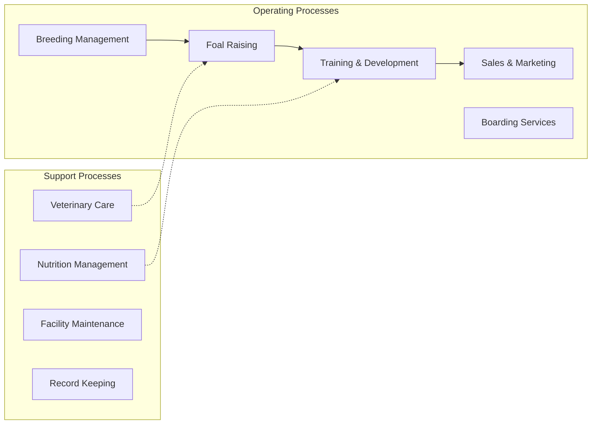

# Horse and Other Equine Production

> Establishments primarily engaged in raising horses, mules, donkeys, and other equines for sale, breeding, racing, recreation, or working purposes.

## Overview

The horse and equine production industry encompasses breeding, raising, and training horses and other equines for diverse markets including racing, show competition, recreational riding, working ranch operations, and therapeutic programs. The U.S. horse industry supports approximately 7.2 million horses and generates significant economic activity through direct sales, breeding services, training, boarding, and related activities. Unlike most livestock sectors, the equine industry is predominantly driven by recreational and sporting demand rather than food production.

The industry operates across a wide spectrum, from large-scale breeding operations producing Thoroughbreds for racing to small family farms raising horses for local riding schools. Major breeds include Quarter Horses (the most populous American breed), Thoroughbreds, Arabians, Paints, and Warmbloods, each serving distinct market segments with different value profiles.

## Market Context

| Metric | Value |
|--------|-------|
| U.S. Horse Population | ~7.2 million horses |
| Industry Economic Impact | $122 billion annually |
| Number of Horse Owners | ~2 million |
| Average Cost per Horse | $3,000-5,000/year (maintenance) |
| Racing Industry Value | $11 billion annually |

The market segments vary dramatically in value, with elite Thoroughbred yearlings selling for millions at auction while recreational horses may trade for a few thousand dollars. The breeding segment for performance horses commands premium prices based on bloodlines and proven performance.

## Industry Hierarchy

## Key Statistics

| Metric | Value |
|--------|-------|
| NAICS Code | 11292 |
| Level | Industry |
| Parent | [Other Animal Production](../) |
| Child Industries | 0 |

## Related Occupations

- [Farmers, Ranchers, and Other Agricultural Managers](/occupations/Management/FarmersRanchersAndOtherAgriculturalManagers) - Manage breeding operations and farm business
- [Animal Trainers](/occupations/PersonalCareAndService/AnimalTrainers) - Train horses for racing, show, and recreational use
- [Veterinarians](/occupations/Healthcare/Veterinarians) - Provide equine medical care, reproduction services, and preventive health
- [Veterinary Technologists and Technicians](/occupations/Healthcare/VeterinaryTechnologistsAndTechnicians) - Assist with equine medical procedures
- [Farmworkers and Laborers](/occupations/FarmingFishingAndForestry/FarmworkersAndLaborers) - Daily care, feeding, and stable management
- [Animal Breeders](/occupations/FarmingFishingAndForestry/AnimalBreeders) - Manage breeding programs and genetic selection

## Core Business Processes

### Breeding Management
Selection of breeding stock, mare management through gestation, foaling assistance, and maintenance of breeding records for registration purposes.

**Key Activities:**
- Stallion selection and breeding contracts
- Mare reproductive health management
- Live cover or artificial insemination coordination
- Pregnancy monitoring and foaling preparation
- Registration with breed associations

### Training and Development
Preparing young horses for their intended use through groundwork, breaking, and specialized training programs.

**Key Activities:**
- Halter breaking and basic handling
- Ground training and desensitization
- Under-saddle training progression
- Discipline-specific training (racing, dressage, western, etc.)
- Competition preparation

### Sales and Marketing
Marketing horses through various channels including auctions, private sales, and breeding services.

**Key Activities:**
- Photography and videography for marketing
- Auction consignment and preparation
- Online listing management
- Client relationship development
- Transportation coordination

## Industry Value Chain

## Regulatory Environment

- **USDA Animal and Plant Health Inspection Service (APHIS)** - Regulates interstate movement, import/export, and disease surveillance
- **State Racing Commissions** - Regulate Thoroughbred and harness racing, including drug testing and licensing
- **Bureau of Land Management (BLM)** - Manages wild horse and burro populations on federal lands
- **State Veterinarians** - Require health certificates and Coggins tests for interstate transport
- **Breed Registries** - Maintain studbooks and set breeding standards (Jockey Club, AQHA, etc.)

### Key Regulations
- Coggins test requirements for Equine Infectious Anemia (EIA)
- Interstate health certificate requirements
- Racing medication rules and drug testing
- Import quarantine requirements
- Breed registration standards

## Technology & Innovation

- **Reproductive Technologies** - Artificial insemination, embryo transfer, and cooled/frozen semen shipping
- **Genetic Testing** - DNA parentage verification, disease marker screening, and performance gene analysis
- **Performance Monitoring** - GPS tracking, heart rate monitors, and gait analysis systems
- **Veterinary Diagnostics** - Digital radiography, ultrasound, and MRI for lameness diagnosis
- **Nutrition Science** - Specialized feeds, supplements, and feeding management systems
- **Facility Technology** - Automated waterers, climate-controlled barns, and exercise equipment

## Market Segments

### Racing Industry
Thoroughbred, Quarter Horse, and Standardbred racing operations focused on producing competitive racehorses through selective breeding and professional training.

### Show and Competition
Breeding and training horses for disciplines including dressage, show jumping, western pleasure, reining, and cutting competitions.

### Recreational
Production of horses suitable for trail riding, pleasure riding, and family use, often emphasizing temperament and versatility.

### Working Horses
Ranch horses, polo ponies, and horses for mounted patrol or therapeutic riding programs.

## Industry Outlook

The equine industry continues to evolve with changing demographics and economic conditions. While the racing segment faces challenges from competition with other entertainment options and regulatory pressures, recreational horse ownership remains strong. The therapeutic riding sector shows growth potential as equine-assisted therapy gains recognition. Technology adoption, particularly in reproductive techniques and performance monitoring, enables more efficient breeding programs. The industry's connection to lifestyle and recreation rather than necessity creates both vulnerability to economic downturns and resilience through dedicated enthusiast communities. Export markets for American breeding stock, particularly Quarter Horses, provide additional growth opportunities.

---

*Source: NAICS 11292 - Horse and Other Equine Production*
