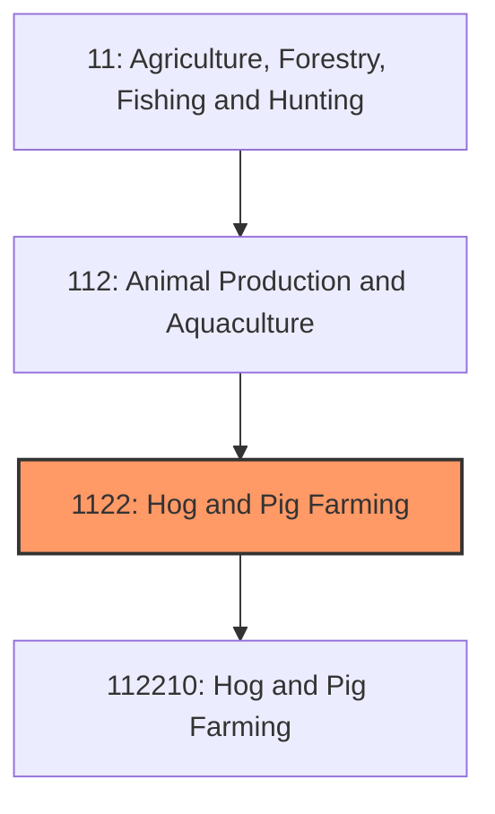
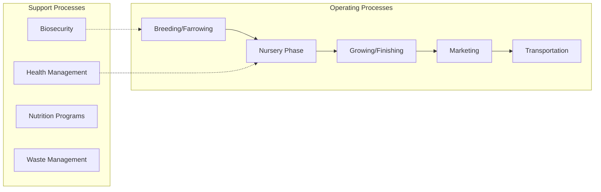

# Hog and Pig Farming

> Establishments primarily engaged in raising hogs and pigs for the production of pork and pork products, including breeding operations, farrow-to-finish farms, and specialized growing operations.

## Overview

Hog and pig farming is a major segment of U.S. animal agriculture focused on producing pigs for meat (pork). The industry has undergone dramatic consolidation and structural change over the past several decades, transforming from small diversified farm operations to large specialized commercial facilities. The U.S. maintains approximately 74 million hogs, with annual pork production exceeding 28 billion pounds, making it one of the world's largest pork producers.

Modern pork production operates through highly integrated supply chains, with large integrator companies contracting with independent growers. Operations are typically specialized by production phase: breeding/farrowing (producing piglets), nursery (weaning to 50 lbs), and finishing (growing to market weight of 280 lbs). This specialization allows for biosecurity management, optimized facilities, and production efficiency. The industry has achieved remarkable gains in feed efficiency and growth rates through genetic improvement, nutrition advances, and disease management.

## Market Context

| Metric | Value |
|--------|-------|
| U.S. Hog Inventory | 74 million head |
| Annual Pork Production | 28 billion pounds |
| Number of Operations | ~60,000 farms with hogs |
| Market Hog Price | $50-80 per hundredweight |
| Industry Revenue | $26 billion annually |
| U.S. Per Capita Consumption | 51 lbs pork annually |

Iowa, Minnesota, North Carolina, Illinois, and Indiana are the top hog-producing states, accounting for over 60% of national inventory. The industry exhibits high geographic concentration, with the Corn Belt states dominating due to access to feed grains.

## Industry Hierarchy

## Key Statistics

| Metric | Value |
|--------|-------|
| NAICS Code | 1122 |
| Level | Industry Group |
| Parent | [Animal Production](../) |
| Child Industries | 1 |

## Related Occupations

- [Farmers, Ranchers, and Other Agricultural Managers](/occupations/Management/FarmersRanchersAndOtherAgriculturalManagers) - Manage swine operations, coordinate with integrators, oversee production
- [Animal Breeders](/occupations/FarmingFishingAndForestry/AnimalBreeders) - Manage breeding programs and artificial insemination
- [Veterinarians](/occupations/Healthcare/Veterinarians) - Provide herd health services, disease diagnosis, and treatment protocols
- [Animal Scientists](/occupations/Science/AnimalScientists) - Research nutrition, genetics, and production systems
- [Farmworkers and Laborers](/occupations/FarmingFishingAndForestry/FarmworkersAndLaborers) - Perform daily animal care, feeding, and facility maintenance
- [Agricultural Inspectors](/occupations/FarmingFishingAndForestry/AgriculturalInspectors) - Conduct facility and animal welfare inspections

## Core Business Processes

### Breeding and Farrowing
Managing sow herds to produce piglets through controlled breeding programs and farrowing (birthing) management.

**Key Activities:**
- Sow breeding through artificial insemination or natural service
- Gestation management and nutrition
- Farrowing room preparation and supervision
- Piglet processing (teeth clipping, tail docking, castration)
- Lactation management and weaning

### Growing and Finishing
Raising weaned pigs to market weight (typically 280 lbs) through optimized nutrition and environment.

**Key Activities:**
- Pig flow management and grouping
- Feed delivery and consumption monitoring
- Growth rate and feed efficiency tracking
- Health monitoring and treatment
- Marketing decisions based on weight and market conditions

### Biosecurity Protocols
Implementing strict measures to prevent disease introduction and spread within and between facilities.

**Key Activities:**
- Facility access controls and visitor protocols
- Vehicle washing and disinfection
- All-in/all-out production systems
- Quarantine procedures for new animals
- Testing and surveillance programs

## Industry Value Chain

```mermaid
graph LR
    subgraph Inputs["Inputs"]
        I1["Breeding Stock/Genetics"]
        I2["Feed/Grain"]
        I3["Veterinary Products"]
        I4["Facilities/Equipment"]
    end

    subgraph Primary["Primary Activities"]
        A1["Breeding"]
        A2["Farrowing"]
        A3["Growing"]
        A4["Finishing"]
    end

    subgraph Outputs["Products/Services"]
        O1["Market Hogs"]
        O2["Breeding Stock"]
        O3["Cull Animals"]
        O4["Manure"]
    end

    subgraph Customers["Markets"]
        C1["Packers/Processors"]
        C2["Other Producers"]
        C3["Export Markets"]
        C4["Crop Farmers"]
    end

    Inputs --> Primary --> Outputs --> Customers
```

## Regulatory Environment

- **USDA Food Safety and Inspection Service (FSIS)** - Oversees meat safety and inspection at processing plants
- **USDA APHIS** - Manages swine disease programs including African Swine Fever prevention
- **EPA** - Regulates CAFO permits, manure management, and air quality
- **FDA Center for Veterinary Medicine** - Regulates feed additives and veterinary drugs
- **State Departments of Agriculture** - Enforce facility permits and animal health regulations

### Key Regulations
- Pork Quality Assurance Plus (PQA Plus) certification program
- Transport Quality Assurance (TQA) requirements
- Concentrated Animal Feeding Operation (CAFO) permits
- Veterinary Feed Directive (VFD) for antibiotics
- Nutrient management planning requirements
- Worker safety standards (OSHA regulations for confined spaces, air quality)

## Technology & Innovation

- **Electronic Sow Feeding (ESF)** - Individual sow feeding systems providing precise nutrition control
- **Environmental Controls** - Automated ventilation, heating, and cooling systems
- **Production Management Software** - Computer systems tracking inventory, growth, and health data
- **Precision Feeding** - Phase-feeding programs optimizing nutrition by growth stage
- **Genetic Improvement** - Genomic selection for growth rate, feed efficiency, and meat quality
- **Automated Sorting Systems** - Computer vision systems sorting pigs by weight for marketing

## Industry Challenges

- **Disease Threats** - African Swine Fever (ASF) remains a existential threat to the industry
- **Market Volatility** - Hog prices subject to significant cyclical and seasonal variation
- **Environmental Pressure** - Odor complaints and water quality concerns from large operations
- **Labor Availability** - Difficulty recruiting workers for physically demanding, rural positions
- **Public Perception** - Animal welfare concerns about confinement housing systems
- **Trade Uncertainty** - Export market access affected by disease status and trade policies

## Market Segments

### Integrated Production
Large companies owning or contracting for production across all phases, including genetics, feed mills, farms, and processing.

### Contract Growers
Independent farmers providing facilities and labor to raise integrator-owned pigs under production contracts.

### Independent Producers
Farmers owning pigs and selling on the open market, increasingly rare but present in specialty markets.

### Niche Markets
Organic, heritage breed, pasture-raised, and antibiotic-free production serving premium markets.

## Industry Outlook

The U.S. hog industry faces opportunities and challenges as it navigates evolving market conditions and societal expectations. Export growth, particularly to Asian markets, provides expansion potential, though disease status and trade agreements create uncertainty. Technology adoption continues to improve efficiency, with automation addressing labor constraints and precision management optimizing production. Environmental sustainability is becoming a competitive factor, with manure-to-energy systems and reduced antibiotic use gaining importance. Animal welfare expectations are driving facility investments in group sow housing and environmental enrichment. The industry's highly integrated structure enables rapid adoption of innovations but also creates concentration risk if major companies face financial or disease challenges.

---

*Source: NAICS 1122 - Hog and Pig Farming*
