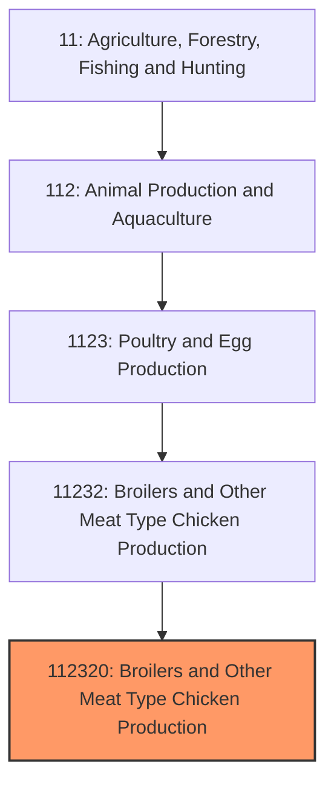
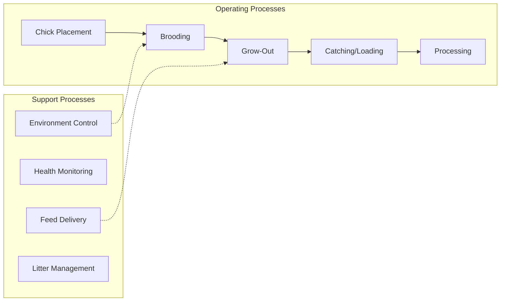

# Broilers and Other Meat Type Chicken Production

> Establishments primarily engaged in raising broilers, fryers, roasters, and other meat-type chickens for commercial processing.

## Overview

Broiler production is the largest segment of U.S. animal agriculture by volume, producing over 9 billion chickens annually for meat consumption. The industry operates through a highly integrated contract farming model where large integrators own the birds, provide feed and veterinary services, while contract growers provide housing and labor. This vertical integration has enabled remarkable efficiency gains, with modern broilers reaching market weight in approximately 6-7 weeks compared to 12+ weeks in the 1950s.

The industry is geographically concentrated in the Southeast (Georgia, Arkansas, Alabama, North Carolina) due to favorable climate, proximity to feed supplies, and established processing infrastructure. Five major integrators (Tyson Foods, Pilgrim's Pride, Sanderson Farms, Perdue, and Koch Foods) control approximately 60% of U.S. production. The contract grower model means most "farms" are capital-intensive operations focused on housing and bird care rather than traditional independent farming.

## Market Context

| Metric | Value |
|--------|-------|
| U.S. Broiler Production | 45+ billion pounds annually |
| Number of Broilers Produced | 9.2 billion birds |
| U.S. Per Capita Consumption | 98+ pounds/year |
| Export Volume | 7+ billion pounds |
| Industry Revenue | $65+ billion |

Chicken has become America's most consumed meat, surpassing beef. Growth is driven by health perceptions, lower relative prices, and product innovation. Export markets, particularly Mexico, China, and Canada, absorb significant production.

## Industry Hierarchy

## Key Statistics

| Metric | Value |
|--------|-------|
| NAICS Code | 112320 |
| Level | National Industry |
| Parent | [Poultry and Egg Production](../) |
| Child Industries | 0 |

## Related Occupations

- [Farmers, Ranchers, and Other Agricultural Managers](/occupations/Management/FarmersRanchersAndOtherAgriculturalManagers) - Manage broiler house operations and contract relationships
- [Agricultural Workers](/occupations/FarmingFishingAndForestry/AgriculturalWorkers) - Daily bird care, house management, and catch crews
- [Veterinarians](/occupations/Healthcare/Veterinarians) - Flock health, disease prevention, and treatment protocols
- [Agricultural Engineers](/occupations/Architecture/AgriculturalEngineers) - Design housing systems and environmental controls
- [Food Scientists](/occupations/Science/FoodScientistsAndTechnologists) - Develop feed formulations and processing methods
- [Industrial Production Managers](/occupations/Management/IndustrialProductionManagers) - Oversee integrator operations

## Core Business Processes

### Brooding Phase (Days 1-14)
Initial care of day-old chicks with elevated temperatures and intensive monitoring.

**Key Activities:**
- House preparation and pre-heating
- Chick placement and initial feeding
- Temperature management (90-95F reducing gradually)
- Monitoring chick behavior and distribution
- Early mortality assessment

### Grow-Out Phase (Days 15-42+)
Growth period where birds achieve market weight through optimized nutrition and environment.

**Key Activities:**
- Feed program management (starter, grower, finisher)
- Ventilation and temperature control
- Water quality monitoring
- Litter condition management
- Daily mortality removal

### Harvesting
Catching and transporting market-weight birds to processing facilities.

**Key Activities:**
- Feed withdrawal timing
- Catch crew coordination
- Loading for transport
- Live shrink management
- House cleanout preparation

## Industry Value Chain

```mermaid
graph LR
    subgraph Inputs["Inputs (Integrator Provided)"]
        I1["Day-Old Chicks"]
        I2["Feed"]
        I3["Veterinary Services"]
        I4["Technical Support"]
    end

    subgraph Primary["Grower Activities"]
        A1["Housing"]
        A2["Bird Care"]
        A3["Environment Mgmt"]
        A4["Harvest Support"]
    end

    subgraph Outputs["Products"]
        O1["Live Broilers"]
        O2["Litter/Manure"]
    end

    subgraph Markets["End Markets"]
        C1["Processing Plants"]
        C2["Retail"]
        C3["Foodservice"]
        C4["Export"]
    end

    Inputs --> Primary --> Outputs --> Markets
```

## Regulatory Environment

- **USDA Food Safety and Inspection Service (FSIS)** - Mandatory inspection of processing facilities and products
- **FDA** - Regulates feed additives, medications, and withdrawal periods
- **EPA** - Regulates air emissions, water discharge, and waste management
- **OSHA** - Workplace safety in contract growing operations
- **State Departments of Agriculture** - Environmental permits and animal health regulations

### Key Regulations
- HACCP requirements for processing
- Antibiotic use restrictions (no growth promotion antibiotics)
- National Poultry Improvement Plan (NPIP) for disease surveillance
- Concentrated Animal Feeding Operation (CAFO) permits
- Process verification for Salmonella and Campylobacter

## Technology & Innovation

- **Precision Environment Control** - Computer-controlled ventilation, heating, and cooling systems
- **Automated Feeding Systems** - Pan and tube feeders with computerized delivery
- **Health Monitoring** - Sensors for temperature, humidity, ammonia, and bird activity
- **LED Lighting** - Programmable lighting for growth optimization
- **Data Analytics** - Flock performance tracking and benchmarking
- **Genetic Improvement** - Breeding for growth rate, feed efficiency, and meat yield

## Contract Growing Model

### Integrator Responsibilities
- Supply day-old chicks from company hatcheries
- Provide feed, medications, and veterinary oversight
- Offer technical service and management guidance
- Coordinate catching and transportation
- Process and market the finished product

### Grower Responsibilities
- Construct and maintain broiler houses (capital investment $150,000-300,000 per house)
- Provide daily care and house management
- Maintain environmental control systems
- Dispose of mortality and manage litter
- Meet company standards for performance

### Payment Structure
Growers are paid based on performance metrics including feed conversion, livability, and average weight, typically receiving $0.05-0.08 per pound of live weight produced.

## Industry Challenges

- **Animal Welfare Pressure** - Growing consumer and regulatory focus on housing conditions
- **Disease Risk** - Avian influenza outbreaks can devastate flocks
- **Environmental Compliance** - Increasing scrutiny of ammonia emissions and nutrient runoff
- **Labor Availability** - Difficulty staffing processing plants and catch crews
- **Market Concentration** - Grower concerns about integrator market power
- **Input Costs** - Feed cost volatility affecting industry economics

## Industry Outlook

The broiler industry continues to grow driven by consumer preference for chicken as an affordable, versatile protein. Innovation focuses on meeting evolving consumer demands including antibiotic-free production, improved animal welfare standards, and product diversification. Automation in processing addresses labor challenges while improving food safety. Environmental sustainability initiatives address water use, emissions, and waste management. Export growth depends on trade policy and disease status. The industry's efficiency and adaptability position it for continued growth, though contract growers face ongoing challenges related to market concentration and capital requirements for house upgrades to meet evolving standards.

---

*Source: NAICS 112320 - Broilers and Other Meat Type Chicken Production*
