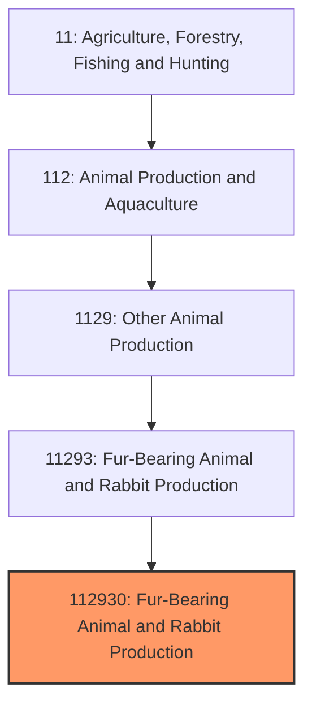
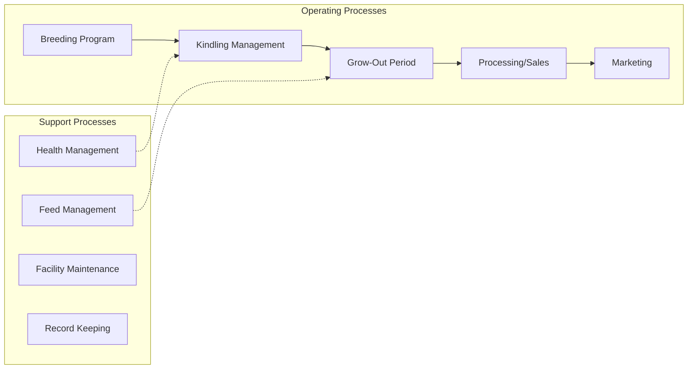

# Rabbit Production

> Establishments primarily engaged in raising domesticated rabbits for meat, fur, laboratory use, breeding stock, and pet markets.

## Overview

Rabbit production, also known as cuniculture, is a specialized animal husbandry sector focused on breeding and raising domestic rabbits for multiple end markets. The industry produces rabbits for meat consumption (the primary market), laboratory research, fur and fiber production (particularly Angora rabbits), breeding stock sales, and the pet industry. Rabbit meat is the sixth most consumed meat globally, though the U.S. market remains relatively small compared to Europe, China, and other regions where rabbit is a dietary staple.

The industry structure ranges from small-scale backyard operations selling to local markets to larger commercial farms producing for processors and distributors. Most U.S. rabbit production occurs on small farms, with the industry characterized by limited consolidation and significant direct-to-consumer sales through farmers markets and local restaurants seeking specialty proteins.

## Market Context

| Metric | Value |
|--------|-------|
| U.S. Rabbit Meat Production | ~8 million pounds annually |
| Number of U.S. Rabbitries | ~5,000 commercial operations |
| Global Rabbit Meat Production | 1.5 million metric tons |
| Average Market Price | $5-8/lb (whole rabbit) |
| Primary Markets | Restaurants, ethnic groceries, direct consumer |

China dominates global production with over 40% of world output, followed by European countries. The U.S. market represents a small fraction of global production but shows growth potential in specialty and sustainable protein markets.

## Industry Hierarchy

## Key Statistics

| Metric | Value |
|--------|-------|
| NAICS Code | 112930 |
| Level | National Industry |
| Parent | [Other Animal Production](../) |
| Child Industries | 0 |

## Related Occupations

- [Farmers, Ranchers, and Other Agricultural Managers](/occupations/Management/FarmersRanchersAndOtherAgriculturalManagers) - Manage rabbitry operations and business planning
- [Animal Breeders](/occupations/FarmingFishingAndForestry/AnimalBreeders) - Develop breeding programs for desired traits
- [Farmworkers and Laborers](/occupations/FarmingFishingAndForestry/FarmworkersAndLaborers) - Daily feeding, cage maintenance, and animal care
- [Veterinarians](/occupations/Healthcare/Veterinarians) - Provide health care and disease management
- [Food Scientists and Technologists](/occupations/Science/FoodScientistsAndTechnologists) - Develop processing methods and products
- [Butchers and Meat Cutters](/occupations/Production/ButchersAndMeatCutters) - Process rabbits for market

## Core Business Processes

### Breeding Program
Management of breeding does and bucks to maintain productive herds with desired characteristics for the target market.

**Key Activities:**
- Breed selection for market requirements (meat, fur, or pet)
- Breeding schedule management (does can produce 6-8 litters annually)
- Buck-to-doe ratio optimization
- Genetic record keeping
- Culling underperformers

### Kindling and Grow-Out
Care of pregnant does, newborn kits, and growing rabbits through market weight.

**Key Activities:**
- Nest box preparation and monitoring
- Kit survival management
- Weaning at 4-5 weeks
- Grow-out feeding program
- Weight monitoring and market timing

### Processing and Sales
Preparing rabbits for market through on-farm or commercial processing and distribution.

**Key Activities:**
- Humane slaughter and processing
- Carcass grading and packaging
- Cold chain management
- Market channel development
- Customer relationship management

## Industry Value Chain

```mermaid
graph LR
    subgraph Inputs["Inputs"]
        I1["Breeding Stock"]
        I2["Feed/Hay"]
        I3["Housing/Cages"]
        I4["Veterinary Supplies"]
    end

    subgraph Primary["Primary Activities"]
        A1["Breeding"]
        A2["Growing"]
        A3["Processing"]
        A4["Marketing"]
    end

    subgraph Outputs["Products/Services"]
        O1["Meat Rabbits"]
        O2["Breeding Stock"]
        O3["Fur/Fiber"]
        O4["Pet Rabbits"]
    end

    subgraph Customers["Markets"]
        C1["Restaurants"]
        C2["Ethnic Markets"]
        C3["Direct Consumers"]
        C4["Research Labs"]
    end

    Inputs --> Primary --> Outputs --> Customers
```

## Regulatory Environment

- **USDA Food Safety and Inspection Service (FSIS)** - Voluntary inspection for rabbit processors (not mandatory like beef/poultry)
- **State Departments of Agriculture** - License and inspect processing facilities
- **FDA** - Regulates rabbit as food when crossing state lines
- **USDA APHIS** - Monitors animal health and disease outbreaks
- **American Rabbit Breeders Association (ARBA)** - Sets breed standards and show regulations

### Key Regulations
- State-specific processing facility requirements
- Custom exemption rules for on-farm processing
- Labeling requirements for retail sale
- Animal welfare standards (varies by state)
- Health certificates for interstate movement of breeding stock

## Technology & Innovation

- **Climate-Controlled Housing** - Environmental management systems for optimal growth and reproduction
- **Automated Feeding Systems** - Timed feeders and watering systems reducing labor
- **Genetic Improvement** - Selection programs for growth rate, feed efficiency, and disease resistance
- **Mobile Processing Units** - USDA-inspected mobile slaughter units for small producers
- **Traceability Systems** - Record-keeping software for breeding, health, and sales tracking
- **Alternative Housing** - Colony and pasture-based systems for welfare-conscious markets

## Market Segments

### Meat Production
The primary market, producing fryer rabbits (4-5 lbs live weight at 8-12 weeks) for restaurants and retail.

### Laboratory Animals
New Zealand Whites and other breeds raised under strict protocols for medical and cosmetic research.

### Fur and Fiber
Rex rabbits for pelts and Angora breeds for wool production (primarily hobby/small-scale in U.S.).

### Pet and Show
Fancy breeds raised for pet stores, breeders, and show competition through ARBA-sanctioned events.

## Industry Challenges

- **Processing Access** - Limited USDA-inspected facilities for small producers
- **Market Development** - Rabbit meat unfamiliar to mainstream U.S. consumers
- **Disease Management** - Rabbit Hemorrhagic Disease Virus (RHDV2) emergence
- **Regulatory Inconsistency** - Varying state rules on processing and sales
- **Scale Economics** - Difficulty achieving profitability at small scale
- **Seasonal Demand** - Peak demand around holidays, especially Easter (live) and winter (meat)

## Industry Outlook

The rabbit production industry shows potential for growth driven by consumer interest in sustainable proteins, local food systems, and specialty meats. Rabbits offer environmental advantages including high feed conversion efficiency, low water requirements, and minimal land needs compared to traditional livestock. The farm-to-table movement and restaurant demand for unique proteins create market opportunities for small producers. However, infrastructure challenges, particularly processing access and market development, constrain growth. Emerging threats like RHDV2 require increased biosecurity awareness. The industry's future likely depends on developing processing infrastructure, consumer education about rabbit as a sustainable protein, and addressing the "Easter bunny" perception that limits mainstream acceptance.

---

*Source: NAICS 112930 - Fur-Bearing Animal and Rabbit Production*
