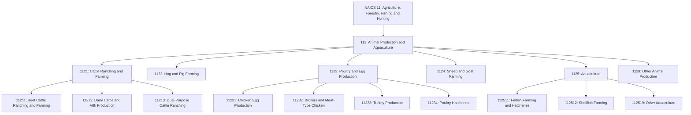

# Animal Production and Aquaculture

> Industries in the Animal Production and Aquaculture subsector raise or fatten animals for the sale of animals or animal products and/or raise aquatic plants and animals in controlled or selected aquatic environments.

## Overview

The Animal Production and Aquaculture subsector encompasses establishments engaged in raising animals for products such as meat, milk, eggs, wool, and other animal products, as well as aquaculture operations that farm fish, shellfish, and aquatic plants. These establishments are often described as ranches, farms, dairies, and hatcheries.

Establishments are classified in this subsector when animal production (i.e., value of animals and animal products for market) accounts for one-half or more of total agricultural production. The subsector distinguishes between operations that raise animals for slaughter, breeding, or for the production of animal products such as dairy and eggs.

## Industry Hierarchy

## Key Statistics

| Metric | Value |
|--------|-------|
| NAICS Code | 112 |
| Level | Subsector |
| Parent Sector | [Agriculture, Forestry, Fishing and Hunting](../) |
| Industry Groups | 6 |
| Industries | 13 |
| National Industries | 19 |

## Sub-Industries

| Industry Group | Code | Description |
|----------------|------|-------------|
| Cattle Ranching and Farming | 1121 | Raising cattle, dairy operations, and cattle feedlots |
| Hog and Pig Farming | 1122 | Raising hogs and pigs for sale or finishing |
| Poultry and Egg Production | 1123 | Breeding, hatching, and raising poultry for meat or eggs |
| Sheep and Goat Farming | 1124 | Raising sheep, lambs, and goats for wool, meat, or milk |
| Aquaculture | 1125 | Farm-raising finfish, shellfish, and other aquatic animals |
| Other Animal Production | 1129 | Apiculture, horses, fur-bearing animals, and other animals |

## Related Occupations

- [Farmers, Ranchers, and Other Agricultural Managers](/occupations/Management/FarmersRanchersAndOtherAgriculturalManagers) - Plan and direct livestock operations
- [Animal Breeders](/occupations/Agriculture/AnimalBreeders) - Select and breed animals for desired characteristics
- [Agricultural Workers, Animal](/occupations/AgriculturalWorkersAnimal) - Feed, water, and care for livestock
- [Veterinarians](/occupations/HealthcarePractitioners/Veterinarians) - Diagnose and treat animal health issues
- [Veterinary Technicians](/occupations/VeterinaryTechniciansAndTechnologists) - Assist with animal medical care

## Core Business Processes

```mermaid
flowchart LR
    subgraph Planning["Herd/Flock Management"]
        P1["Breeding Program"]
        P2["Nutrition Planning"]
        P3["Health Protocols"]
    end

    subgraph Operations["Daily Operations"]
        O1["Feeding"]
        O2["Health Monitoring"]
        O3["Housing Management"]
        O4["Waste Management"]
    end

    subgraph Production["Production"]
        R1["Breeding/Birthing"]
        R2["Growing/Fattening"]
        R3["Milking/Egg Collection"]
    end

    subgraph Market["Market Preparation"]
        M1["Sorting/Grading"]
        M2["Transport"]
        M3["Sales/Auction"]
    end

    Planning --> Operations --> Production --> Market
```

### Herd and Flock Management

Developing and maintaining healthy, productive animal populations through genetic selection and breeding programs.

**Key Activities:**
- Develop breeding programs and genetic improvement
- Plan nutrition and feeding schedules
- Establish health protocols and vaccination programs
- Manage animal identification and records
- Plan production cycles and market timing

### Daily Operations

Managing routine care and housing of animals to ensure health and productivity.

**Key Activities:**
- Feed and water animals according to schedules
- Monitor animal health and behavior
- Maintain housing facilities and equipment
- Manage manure and waste disposal
- Implement biosecurity measures

### Production Management

Overseeing the primary production activities that generate marketable products.

**Key Activities:**
- Manage breeding and birthing operations
- Oversee growing and finishing programs
- Operate milking or egg collection systems
- Monitor production metrics and yields
- Maintain product quality standards

## Industry Value Chain

```mermaid
graph LR
    subgraph Inputs["Inputs"]
        I1["Breeding Stock"]
        I2["Feed & Supplements"]
        I3["Veterinary Services"]
        I4["Facilities & Equipment"]
        I5["Labor"]
    end

    subgraph Primary["Primary Activities"]
        A1["Breeding"]
        A2["Raising/Growing"]
        A3["Health Management"]
        A4["Product Collection"]
    end

    subgraph Outputs["Products"]
        O1["Live Animals"]
        O2["Meat Products"]
        O3["Dairy Products"]
        O4["Eggs"]
        O5["Wool/Fiber"]
    end

    subgraph Customers["Markets"]
        C1["Meat Packers"]
        C2["Dairy Processors"]
        C3["Egg Distributors"]
        C4["Livestock Auctions"]
        C5["Direct Sales"]
    end

    Inputs --> Primary --> Outputs --> Customers
```

## Regulatory Environment

Animal production operations face comprehensive regulatory oversight:

- **USDA APHIS**: Animal health regulations, disease prevention, import/export controls
- **FDA**: Animal feed safety, drug residue testing, food safety standards
- **EPA**: Concentrated Animal Feeding Operation (CAFO) regulations, waste management, air quality
- **State Veterinarians**: Disease reporting, movement restrictions, health certificates
- **OSHA**: Worker safety in agricultural settings

Key compliance areas include:
- Animal identification and traceability programs
- Veterinary feed directives for antibiotics
- Manure management and nutrient plans
- Air emissions permits for large operations
- Humane handling requirements

## Technology & Innovation

The animal production industry continues to adopt advanced technologies:

- **Precision Livestock Farming**: Electronic ear tags and RFID tracking, automated weighing and sorting systems, behavioral monitoring sensors
- **Reproductive Technologies**: Artificial insemination, embryo transfer, genomic selection
- **Automated Systems**: Robotic milking parlors, automated feeding systems, climate-controlled housing
- **Health Monitoring**: Wearable sensors for vital signs, early disease detection algorithms, automated medication delivery
- **Data Management**: Herd management software, production analytics, market forecasting tools
- **Sustainability**: Methane capture systems, manure-to-energy conversion, feed efficiency optimization

## Related Industries

- [Crop Production](../CropProduction/) - Feed production and integrated farming operations
- [Support Activities for Agriculture](../AgriculturalSupport/) - Veterinary services and contract animal production
- [Food Manufacturing](/industries/Manufacturing/FoodManufacturing/) - Meat packing and dairy processing
- [Aquaculture](../Aquaculture/) - Specialized aquatic animal production

---

*Source: NAICS 112 - Animal Production and Aquaculture*
