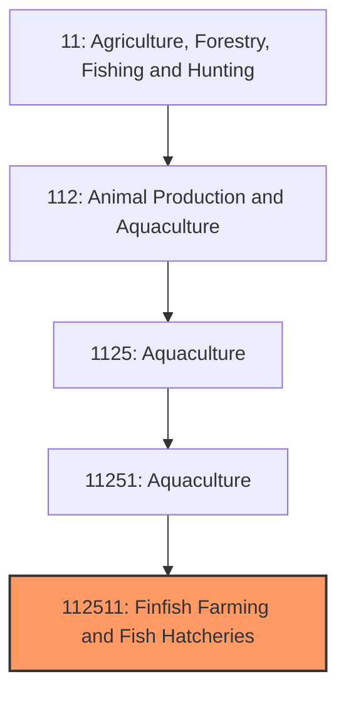
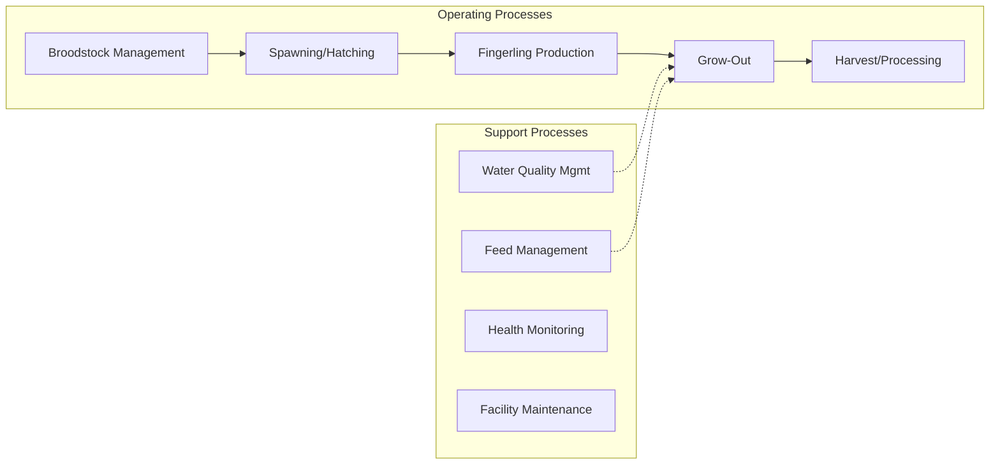

# Finfish Farming and Fish Hatcheries

> Establishments primarily engaged in farm raising finfish such as catfish, trout, tilapia, salmon, and ornamental fish, as well as operating fish hatcheries.

## Overview

Finfish farming (aquaculture) is a growing segment of U.S. agriculture that produces fish through controlled cultivation rather than wild capture. The industry encompasses both food fish production and hatchery operations supporting recreational fishing and aquaculture. The United States produces approximately 600 million pounds of farmed finfish annually, though this represents only a small fraction of domestic seafood consumption, which is predominantly met through imports.

Channel catfish farming in the Mississippi Delta region (Mississippi, Alabama, Arkansas) historically dominated U.S. production, though the industry has faced significant import competition. Trout farming is concentrated in Idaho's Magic Valley, while salmon farming exists on a limited scale in Washington and Maine. The ornamental fish segment (goldfish, koi, tropical fish) serves the aquarium trade. State and federal hatcheries produce billions of fish annually to stock recreational waters.

## Market Context

| Metric | Value |
|--------|-------|
| U.S. Farmed Finfish Production | ~600 million lbs |
| Industry Value | $1.5+ billion |
| Catfish Production | ~300 million lbs |
| Trout Production | ~55 million lbs |
| Import Competition | 90%+ of seafood consumed is imported |

The U.S. aquaculture industry faces significant competitive pressure from imported farmed fish, particularly catfish (Vietnam), tilapia (China, Latin America), and salmon (Chile, Norway). Domestic production focuses on freshwater species and niche markets.

## Industry Hierarchy

## Key Statistics

| Metric | Value |
|--------|-------|
| NAICS Code | 112511 |
| Level | National Industry |
| Parent | [Aquaculture](../) |
| Child Industries | 0 |

## Related Occupations

- [Aquacultural Managers](/occupations/Management/FarmersRanchersAndOtherAgriculturalManagers) - Manage fish farming operations
- [Fish Hatchery Workers](/occupations/FarmingFishingAndForestry/AgriculturalWorkers) - Feed, monitor, and care for fish
- [Aquatic Biologists](/occupations/Science/BiologicalScientists) - Research fish health and production
- [Veterinarians](/occupations/Healthcare/Veterinarians) - Diagnose and treat fish diseases
- [Water Quality Specialists](/occupations/Science/EnvironmentalScientists) - Monitor and manage water conditions
- [Food Scientists](/occupations/Science/FoodScientistsAndTechnologists) - Develop processing and quality protocols

## Core Business Processes

### Broodstock and Spawning
Managing breeding fish and producing eggs/fry for production.

**Key Activities:**
- Broodstock selection for growth and disease resistance
- Spawning induction (temperature, photoperiod, hormones)
- Egg collection and incubation
- Hatching and early fry care
- Genetic record keeping

### Fingerling Production
Growing fry to fingerling size for stocking or sale.

**Key Activities:**
- Pond or tank culture for fry
- Initial feeding with starter diets
- Grading by size
- Disease prevention protocols
- Sales to grow-out operations

### Grow-Out Operations
Raising fish to market size in ponds, raceways, or cages.

**Key Activities:**
- Stocking density management
- Feed program optimization
- Water quality maintenance
- Health monitoring and treatment
- Growth tracking and harvest planning

## Industry Value Chain

## Species Overview

### Channel Catfish
Dominant U.S. farmed species; raised in earthen ponds; marketed through processors for fillets; concentrated in Mississippi Delta.

### Rainbow Trout
Cold-water species raised in raceways; Idaho produces 70%+ of U.S. farm-raised trout; sold fresh, frozen, and smoked.

### Tilapia
Warm-water species with limited U.S. production; most domestic consumption from imports; recirculating aquaculture systems (RAS) growing.

### Ornamental Fish
Goldfish, koi, and tropical fish for aquarium trade; significant industry in Florida.

### Salmon
Limited U.S. production in net pens (Washington, Maine); Atlantic salmon dominant species; significant import competition.

## Regulatory Environment

- **USDA APHIS** - Aquatic animal health and disease regulations
- **FDA** - Drug approvals for aquaculture, food safety standards
- **EPA** - Discharge permits (NPDES) for aquaculture facilities
- **U.S. Fish and Wildlife Service** - Permits for certain species and locations
- **State Agencies** - Licensing, water rights, and environmental compliance

### Key Regulations
- Aquaculture drug approvals (limited options available)
- Effluent discharge limits for aquaculture operations
- Seafood HACCP requirements for processors
- Country of Origin Labeling (COOL) for fish
- Invasive species regulations for certain fish

## Technology & Innovation

- **Recirculating Aquaculture Systems (RAS)** - Indoor, water-reuse systems enabling production anywhere
- **Selective Breeding** - Genetic improvement for growth, disease resistance, and fillet yield
- **Automated Feeding** - Demand feeders and computer-controlled systems
- **Water Quality Monitoring** - Real-time sensors for dissolved oxygen, temperature, ammonia
- **Disease Diagnostics** - PCR testing and rapid disease identification
- **Alternative Feeds** - Plant-based proteins reducing fishmeal dependence

## Production Systems

### Earthen Ponds
Traditional catfish production; lower capital costs; larger land requirements; weather-dependent.

### Raceways
Flowing water systems for trout; continuous water exchange; high density production.

### Recirculating Systems (RAS)
Closed-loop systems with water treatment; location flexibility; high capital and energy costs.

### Net Pens/Cages
Open-water systems for salmon and some marine species; environmental scrutiny; limited U.S. application.

## Industry Challenges

- **Import Competition** - Lower-cost imports dominating U.S. market
- **Feed Costs** - Fishmeal and fish oil price volatility
- **Regulatory Burden** - Complex permitting for new facilities
- **Disease Management** - Limited FDA-approved therapeutics
- **Capital Requirements** - High investment for modern RAS systems
- **Market Development** - Consumer awareness of domestic farmed fish

## Industry Outlook

U.S. finfish aquaculture faces structural challenges from import competition but maintains niches in specialty markets, live fish, and regionally-branded products. Investment in recirculating aquaculture systems (RAS) is increasing, enabling production near consumption centers regardless of climate. Atlantic salmon RAS projects represent significant capital commitments targeting the premium fresh salmon market. The catfish industry continues consolidating as processors seek efficiency. Genetic improvement programs are enhancing growth rates and disease resistance. Long-term growth depends on technology advances reducing production costs, regulatory modernization enabling new facilities and therapeutics, and consumer demand for locally-produced, sustainable seafood. The industry's future may shift from commodity production toward premium, differentiated products competing on freshness, sustainability, and traceability rather than price.

---

*Source: NAICS 112511 - Finfish Farming and Fish Hatcheries*
