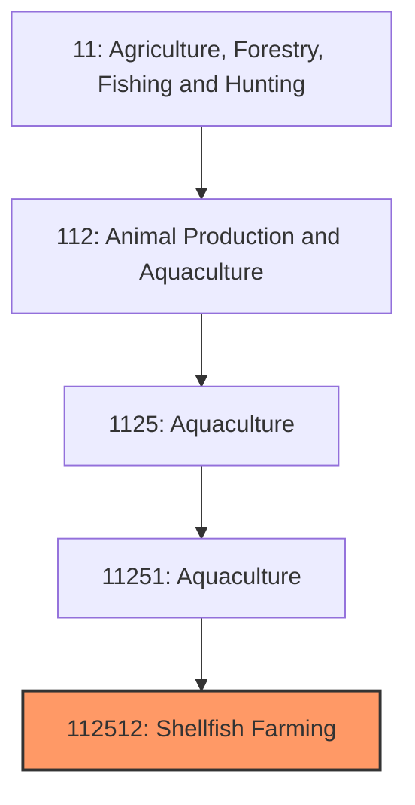
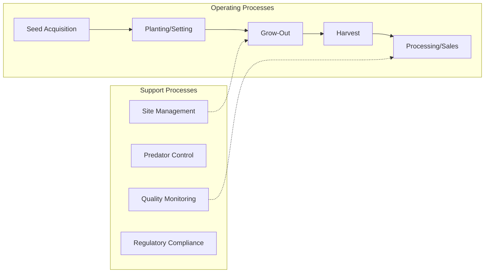

# Shellfish Farming

> Establishments primarily engaged in farm raising shellfish including oysters, clams, mussels, shrimp, crawfish, and other crustaceans and mollusks.

## Overview

Shellfish farming (mariculture for marine species and aquaculture for freshwater) represents a diverse and growing segment of U.S. aquaculture, producing oysters, clams, mussels, shrimp, crawfish, and other invertebrates through controlled cultivation. The industry has experienced significant growth as wild shellfish populations decline and consumer demand for sustainable seafood increases. Shellfish farming is notable for its environmental benefits, as filter-feeding bivalves (oysters, clams, mussels) improve water quality by removing nitrogen and particulates.

Production is geographically diverse, with oyster farming concentrated in Washington State (Pacific oysters), the Gulf Coast (Eastern oysters), and the Northeast (Atlantic oysters). Crawfish farming dominates Louisiana's aquaculture sector, while shrimp farming operates primarily in Texas and other Gulf states. Mussel farming occurs in Maine and Washington, and clam farming spans both coasts. The industry ranges from small artisanal operations to large commercial farms.

## Market Context

| Metric | Value |
|--------|-------|
| U.S. Farmed Shellfish Value | $400+ million |
| Oyster Production | 35+ million lbs (meat weight) |
| Crawfish Production | 150+ million lbs |
| Clam Production | 30+ million lbs |
| Shrimp Farming | Limited (~10 million lbs) |

The U.S. is a net importer of most shellfish, particularly shrimp, though domestic oyster and clam farming has grown significantly. Premium pricing for domestic, sustainably-farmed shellfish supports industry expansion despite import competition.

## Industry Hierarchy

## Key Statistics

| Metric | Value |
|--------|-------|
| NAICS Code | 112512 |
| Level | National Industry |
| Parent | [Aquaculture](../) |
| Child Industries | 0 |

## Related Occupations

- [Aquacultural Managers](/occupations/Management/FarmersRanchersAndOtherAgriculturalManagers) - Manage shellfish farming operations
- [Aquaculture Workers](/occupations/FarmingFishingAndForestry/AgriculturalWorkers) - Plant, tend, and harvest shellfish
- [Marine Biologists](/occupations/Science/BiologicalScientists) - Research shellfish health and production
- [Environmental Scientists](/occupations/Science/EnvironmentalScientists) - Monitor water quality and environmental impacts
- [Food Scientists](/occupations/Science/FoodScientistsAndTechnologists) - Ensure product safety and quality
- [Boat Operators](/occupations/TransportationAndMaterialMoving/CaptainsAndMates) - Operate vessels for shellfish operations

## Core Business Processes

### Seed Production and Acquisition
Obtaining juvenile shellfish for growing operations.

**Key Activities:**
- Hatchery production of larvae/spat
- Wild seed collection (where permitted)
- Nursery cultivation to plantable size
- Quality assessment and health certification
- Seasonal timing for optimal survival

### Grow-Out Operations
Cultivating shellfish from seed to market size.

**Key Activities:**
- Bottom culture planting (clams, some oysters)
- Off-bottom culture (cages, bags, long-lines)
- Tumbling and handling for shell shape (oysters)
- Predator management (crabs, rays, drills)
- Growth monitoring and inventory management

### Harvest and Marketing
Collecting market-size shellfish and preparing for sale.

**Key Activities:**
- Harvest timing based on size, season, and market demand
- Grading and sorting by size
- Depuration (for some species and markets)
- Cold chain management
- Direct sales and distributor relationships

## Industry Value Chain

```mermaid
graph LR
    subgraph Inputs["Inputs"]
        I1["Seed/Spat"]
        I2["Growing Equipment"]
        I3["Leases/Permits"]
        I4["Vessels"]
    end

    subgraph Primary["Primary Activities"]
        A1["Nursery"]
        A2["Growing"]
        A3["Harvesting"]
        A4["Marketing"]
    end

    subgraph Outputs["Products"]
        O1["Oysters"]
        O2["Clams"]
        O3["Mussels"]
        O4["Crawfish"]
    end

    subgraph Markets["End Markets"]
        C1["Restaurants"]
        C2["Retail/Grocery"]
        C3["Processors"]
        C4["Direct to Consumer"]
    end

    Inputs --> Primary --> Outputs --> Markets
```

## Species Categories

### Oysters
Eastern oysters (Atlantic/Gulf coasts), Pacific oysters (West Coast), and specialty varieties; grown in cages, bags, or on bottom; 2-4 year grow-out; premium pricing for half-shell market.

### Clams
Hard clams (quahogs), Manila clams, softshell clams, and geoducks; bottom-planted in netted beds; 2-5 year grow-out depending on species.

### Mussels
Blue mussels and Mediterranean mussels; grown on ropes or rafts; faster grow-out (1-2 years); primarily in New England and Pacific Northwest.

### Crawfish
Louisiana dominates U.S. production; grown in flooded rice fields or dedicated ponds; seasonal harvest; significant regional cuisine market.

### Shrimp
Limited U.S. production; Pacific white shrimp in ponds and intensive systems; import competition significant; niche fresh/local markets.

## Regulatory Environment

- **FDA** - Seafood safety standards, HACCP requirements
- **NOAA/NMFS** - Marine aquaculture permits in federal waters
- **EPA** - Discharge permits, water quality standards
- **Army Corps of Engineers** - Section 10 permits for structures in navigable waters
- **State Agencies** - Shellfish leases, growing area classifications, harvest permits

### Key Regulations
- National Shellfish Sanitation Program (NSSP) standards
- Growing area water quality classifications (Approved, Conditionally Approved, etc.)
- Vibrio control plans for warm-water harvests
- Shellfish tagging and traceability requirements
- Coastal zone management consistency

## Technology & Innovation

- **Hatchery Technology** - Controlled spawning, algae production, and larval rearing
- **Off-Bottom Culture** - Floating bags, cages, and adjustable long-line systems
- **Remote Sensing** - Monitoring environmental conditions and growing area status
- **Mechanization** - Automated grading, sorting, and handling equipment
- **Triploid Oysters** - Sterile oysters for year-round harvest quality
- **Selective Breeding** - Disease resistance and growth improvement programs

## Environmental Benefits

### Water Filtration
A single adult oyster can filter 50+ gallons of water per day, removing nitrogen, algae, and sediments.

### Habitat Creation
Shellfish structures provide habitat for fish, crabs, and other marine life.

### Carbon Sequestration
Shell material captures carbon; shells often recycled for reef restoration.

### Nutrient Trading
Some shellfish farms earn credits for nitrogen removal, supporting water quality goals.

## Industry Challenges

- **Water Quality Dependencies** - Harvest closures due to pollution or harmful algal blooms
- **Climate Change** - Ocean acidification affecting shell formation; temperature stress
- **Disease** - MSX, Dermo, and other pathogens affecting oysters
- **Regulatory Complexity** - Multiple permits from overlapping agencies
- **Coastal Use Conflicts** - Competition with recreation, navigation, and viewshed concerns
- **Labor Intensity** - Manual handling requirements, especially for premium products

## Industry Outlook

Shellfish farming is positioned for continued growth driven by strong consumer demand for sustainable, locally-sourced seafood and recognition of the industry's environmental benefits. Oyster farming in particular has expanded as restaurants embrace regional oyster varieties and farm-raised products offer year-round consistency. The industry benefits from growing interest in restorative aquaculture that improves water quality while producing food. Challenges include adapting to climate change impacts (ocean acidification, warming waters) and navigating complex permitting processes for new farm sites. Technology adoption, particularly mechanization and selective breeding, improves efficiency and disease resistance. The industry's future depends on maintaining high food safety standards, expanding market awareness, and working collaboratively with coastal communities to balance aquaculture growth with other coastal uses.

---

*Source: NAICS 112512 - Shellfish Farming*
