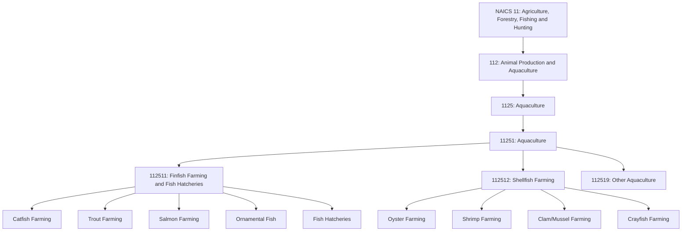

# Aquaculture

> Industries in the Aquaculture industry group raise aquatic plants and animals in controlled or selected aquatic environments for the sale of food, ornamental, or other purposes.

## Overview

Aquaculture, also known as aquafarming, involves the breeding, raising, and harvesting of fish, shellfish, and aquatic plants in controlled environments. Unlike wild-capture fishing, aquaculture operations maintain significant control over the growing environment, including water quality, feeding, breeding, and disease management.

This industry group is part of the Animal Production and Aquaculture subsector (112) and includes operations that farm finfish such as catfish, trout, and salmon; shellfish such as oysters, clams, and shrimp; and other aquatic species. Establishments may operate in freshwater ponds, tanks, raceways, or marine environments including ocean pens and coastal areas.

## Industry Hierarchy

## Key Statistics

| Metric | Value |
|--------|-------|
| NAICS Code | 1125 |
| Level | Industry Group |
| Parent Subsector | [Animal Production and Aquaculture](../AnimalProduction/) |
| Industries | 1 |
| National Industries | 3 |

## Sub-Industries

| National Industry | Code | Description |
|-------------------|------|-------------|
| Finfish Farming and Fish Hatcheries | 112511 | Farm-raising finfish and hatching fish of any kind |
| Shellfish Farming | 112512 | Farm-raising shellfish including shrimp, oysters, clams, and crayfish |
| Other Aquaculture | 112519 | Farm-raising other aquatic animals including alligators and frogs |

## Related Occupations

- [Aquaculture Farmers](/occupations/AquacultureFarmers) - Manage fish and shellfish farming operations
- [Farmers, Ranchers, and Other Agricultural Managers](/occupations/Management/FarmersRanchersAndOtherAgriculturalManagers) - Plan and direct aquaculture operations
- [Agricultural Workers, All Other](/occupations/AgriculturalWorkersAllOther) - Support aquaculture production activities
- [Biological Technicians](/occupations/Science/BiologicalTechnicians) - Monitor water quality and organism health
- [Fish and Game Wardens](/occupations/PublicSafety/FishAndGameWardens) - Enforce aquaculture regulations

## Core Business Processes

```mermaid
flowchart LR
    subgraph Hatchery["Hatchery Operations"]
        H1["Broodstock Management"]
        H2["Spawning"]
        H3["Larval Rearing"]
        H4["Fingerling Production"]
    end

    subgraph Growout["Grow-out Operations"]
        G1["Stocking"]
        G2["Feeding Management"]
        G3["Water Quality Control"]
        G4["Health Monitoring"]
    end

    subgraph Harvest["Harvest & Processing"]
        P1["Harvesting"]
        P2["Grading/Sorting"]
        P3["Processing"]
        P4["Packaging"]
    end

    subgraph Market["Marketing"]
        M1["Quality Control"]
        M2["Distribution"]
        M3["Sales"]
    end

    Hatchery --> Growout --> Harvest --> Market
```

### Hatchery Operations

Managing the reproduction and early life stages of aquatic organisms.

**Key Activities:**
- Select and maintain broodstock for genetic quality
- Induce spawning through environmental or hormonal methods
- Rear larvae through critical early development stages
- Produce fingerlings or juveniles for stocking

### Grow-out Management

Raising organisms from juveniles to market size in controlled environments.

**Key Activities:**
- Stock ponds, tanks, or cages at appropriate densities
- Manage feeding schedules and nutrition
- Monitor and maintain water quality parameters
- Implement disease prevention and treatment protocols

### Harvest and Processing

Collecting market-ready organisms and preparing them for sale.

**Key Activities:**
- Time harvest for optimal size and market conditions
- Use appropriate harvesting methods to minimize stress
- Grade and sort products by size and quality
- Process and package for various market channels

## Industry Value Chain

```mermaid
graph LR
    subgraph Inputs["Inputs"]
        I1["Broodstock/Seed"]
        I2["Feed"]
        I3["Water/Facilities"]
        I4["Equipment"]
        I5["Labor"]
    end

    subgraph Primary["Primary Activities"]
        A1["Hatchery"]
        A2["Nursery"]
        A3["Grow-out"]
        A4["Harvest"]
    end

    subgraph Outputs["Products"]
        O1["Food Fish"]
        O2["Shellfish"]
        O3["Ornamental Fish"]
        O4["Baitfish"]
        O5["Stocking Fish"]
    end

    subgraph Customers["Markets"]
        C1["Seafood Processors"]
        C2["Restaurants"]
        C3["Retail/Grocery"]
        C4["Pet Stores"]
        C5["Government Stocking"]
    end

    Inputs --> Primary --> Outputs --> Customers
```

## Regulatory Environment

Aquaculture operations are subject to multi-agency regulatory oversight:

- **USDA APHIS**: Disease prevention, import/export of aquatic species
- **FDA**: Seafood safety, drug and feed regulations
- **EPA**: Water discharge permits, effluent guidelines, wetland protection
- **NOAA/NMFS**: Marine aquaculture permits in federal waters
- **Army Corps of Engineers**: Permits for structures in navigable waters
- **State Agencies**: Water use permits, coastal zone management, species permits

Key compliance areas include:
- Aquatic animal health certification
- National Pollutant Discharge Elimination System (NPDES) permits
- Coastal zone consistency determinations
- Invasive species prevention
- Drug and chemical use records

## Technology & Innovation

The aquaculture industry is rapidly adopting new technologies:

- **Recirculating Aquaculture Systems (RAS)**: Land-based closed-loop systems, water treatment and reuse technology, indoor controlled environments
- **Precision Aquaculture**: Automated feeding systems, underwater cameras and sensors, real-time water quality monitoring
- **Genetics and Breeding**: Selective breeding programs, genetic improvement for growth and disease resistance, all-female and triploid fish production
- **Feed Innovation**: Alternative protein sources, insect-based feeds, algae supplements
- **Offshore Aquaculture**: Submersible cages, exposed ocean sites, integrated multi-trophic systems
- **Data Analytics**: Growth prediction models, feed conversion optimization, market timing analysis

## Related Industries

- [Animal Production](../AnimalProduction/) - Parent subsector for all animal agriculture
- [Fishing](../FishingAndHunting/) - Wild-capture complement to farm-raised products
- [Food Manufacturing](/industries/Manufacturing/FoodManufacturing/) - Seafood processing and value-added products
- [Support Activities for Agriculture](../AgriculturalSupport/) - Technical and veterinary services

---

*Source: NAICS 1125 - Aquaculture*
