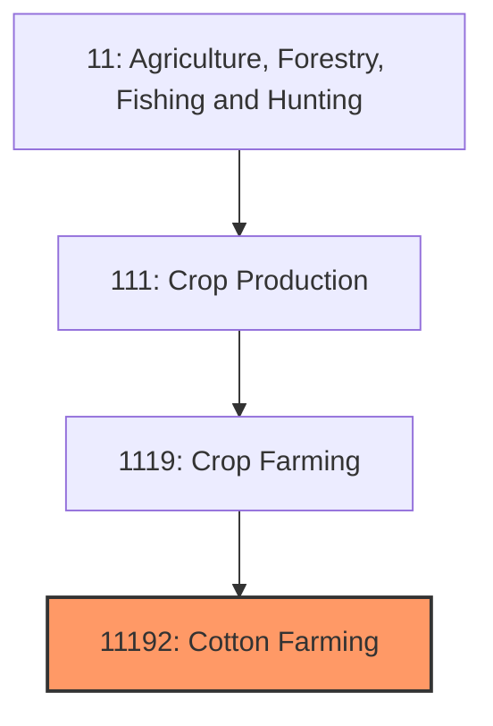
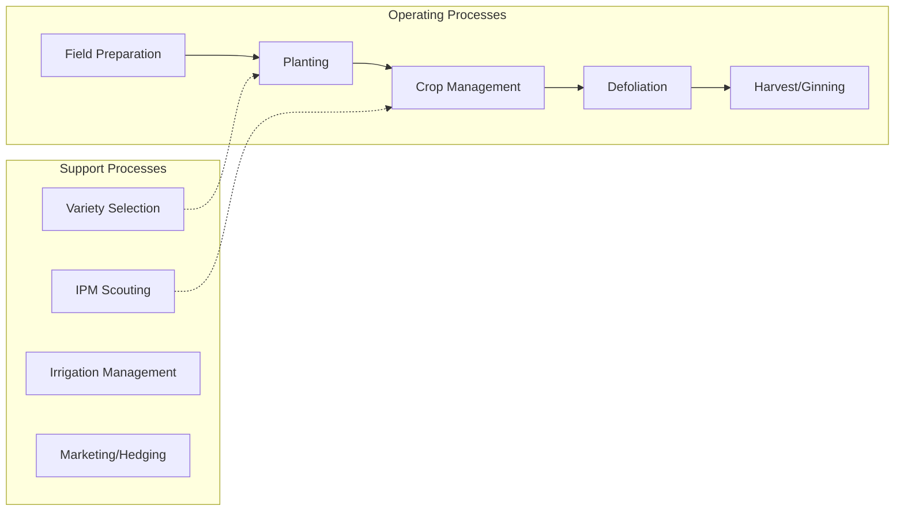

# Cotton Farming

> Establishments primarily engaged in growing upland cotton, pima cotton, and other cotton varieties for fiber, seed, and cottonseed products.

## Overview

Cotton farming is one of America's most historic and economically significant agricultural industries, with U.S. production typically ranging from 15-20 million bales (480-lb bales) across 10-12 million planted acres. The United States ranks as the world's third-largest cotton producer and the leading exporter, with approximately 80% of the crop shipped to international markets. Cotton Belt production spans from the Carolinas through the Deep South and Texas, extending into the irrigated Southwest including Arizona and California.

The industry underwent dramatic transformation through mechanization in the mid-20th century and biotech adoption since the 1990s, with Bt cotton (insect-resistant) and herbicide-tolerant varieties now representing over 90% of planted acres. Cotton is unique among crops in producing both fiber and seed products, with cottonseed oil, meal, and hulls creating additional revenue streams. The industry is heavily influenced by global supply and demand dynamics, particularly production in China, India, Brazil, and Pakistan.

## Market Context

| Metric | Value |
|--------|-------|
| U.S. Cotton Production | 15-18 million bales |
| Planted Acres | 10-12 million |
| Average Yield | 800-900 lbs lint/acre |
| Production Value | $5-7 billion |
| Export Share | 75-85% of production |

Cotton prices are determined by the ICE Futures U.S. exchange (CT), with basis adjustments for quality and location. Extra-long staple (Pima) cotton commands significant premiums over upland cotton. Major export destinations include Vietnam, China, Pakistan, Turkey, Bangladesh, and Indonesia. Domestic mill consumption continues declining but specialty textile manufacturing persists.

## Industry Hierarchy

## Key Statistics

| Metric | Value |
|--------|-------|
| NAICS Code | 11192 |
| Level | Industry |
| Parent | [Crop Farming](./) |
| National Industry | 111920 (Cotton Farming) |

## Related Occupations

- [Farmers, Ranchers, and Other Agricultural Managers](/occupations/Management/FarmersRanchersAndOtherAgriculturalManagers) - Manage cotton production operations
- [Agricultural Equipment Operators](/occupations/FarmingFishingAndForestry/AgriculturalEquipmentOperators) - Operate planters, sprayers, and cotton pickers
- [Agricultural Technicians](/occupations/Science/AgriculturalTechnicians) - Scout for pests and monitor crop development
- [Agricultural Inspectors](/occupations/FarmingFishingAndForestry/AgriculturalInspectors) - Class cotton for quality attributes
- [Cotton Gin Operators](/occupations/Production/TextileMachineSettersOperatorsAndTenders) - Process seed cotton into lint
- [Farm Equipment Mechanics](/occupations/Installation/FarmEquipmentMechanics) - Maintain harvesters and equipment

## Core Business Processes

### Planting Operations
Establishing cotton stands in spring when soil temperatures reach 65F minimum.

**Key Activities:**
- Seedbed preparation and pre-plant herbicide application
- Variety selection (Bt, herbicide-tolerant, stacked traits)
- Planter calibration for proper seed spacing (3-4 seeds/ft row)
- Starter fertilizer and in-furrow treatments
- Seed treatment selection for early-season pest management

### Crop Management
Managing cotton through the 140-180 day growing season.

**Key Activities:**
- Herbicide applications (glyphosate/dicamba/glufosinate programs)
- Nitrogen sidedress applications (80-120 lbs N/acre)
- Plant growth regulator (PGR) applications for canopy management
- Insect monitoring (bollworm, stink bugs, aphids, spider mites)
- Irrigation scheduling (peak water demand at bloom)
- Boll opening monitoring for harvest timing

### Harvest Operations
Defoliating, picking, and module building for gin delivery.

**Key Activities:**
- Defoliant application timing (60%+ open bolls)
- Harvest-aid materials (ethephon, tribufos, thidiazuron)
- Cotton picker operation and adjustment
- Module building (round bales or traditional modules)
- Gin scheduling and delivery logistics
- Classing and marketing of lint bales

## Industry Value Chain

```mermaid
graph LR
    subgraph Inputs["Inputs"]
        I1["Seed/Technology"]
        I2["Fertilizer"]
        I3["Crop Protection"]
        I4["Equipment"]
    end

    subgraph Primary["Primary Activities"]
        A1["Growing"]
        A2["Harvesting"]
        A3["Ginning"]
        A4["Marketing"]
    end

    subgraph Outputs["Products"]
        O1["Lint Cotton"]
        O2["Cottonseed"]
        O3["Cotton Linters"]
        O4["Seed Products"]
    end

    subgraph Markets["End Markets"]
        C1["Textile Mills"]
        C2["Oil Mills"]
        C3["Feed Industry"]
        C4["Export"]
    end

    Inputs --> Primary --> Outputs --> Markets
```

## Cotton Types and Uses

### Upland Cotton
Comprises 97% of U.S. production; staple lengths 1-1.25 inches; versatile fiber for apparel, home textiles, and industrial applications.

### Pima (Extra-Long Staple)
Premium cotton grown primarily in Arizona and California; 1.5+ inch staple length; used for fine shirting, luxury linens, and high-end apparel.

### Cottonseed Products
Ginning produces 400-500 lbs seed per bale of lint. Cottonseed is crushed for oil (cooking oil, snack foods), meal (dairy cattle protein), and hulls (roughage feed).

## Regulatory Environment

- **USDA Farm Service Agency** - Cotton program administration, LDPs, and MAL
- **USDA AMS Cotton and Tobacco Program** - Official cotton classing
- **EPA** - Pesticide registration, including dicamba volatility restrictions
- **State Departments of Agriculture** - Boll weevil eradication programs
- **Texas Boll Weevil Eradication Foundation** - Regional pest management

### Key Programs and Regulations
- Seed Cotton PLC and ARC programs
- Marketing Assistance Loans (loan rate basis)
- Cotton Ginning Cost-Share Program
- STAX crop insurance (Stacked Income Protection)
- Dicamba application restrictions (cutoff dates, wind speed limits)
- EPA Worker Protection Standards

## Technology & Innovation

- **Biotech Traits** - Bt cotton, herbicide tolerance (Xtend, Enlist, XtendFlex)
- **Precision Agriculture** - Variable-rate planting, yield monitors, prescription mapping
- **On-Board Module Builders** - Round module pickers for improved harvest efficiency
- **RFID Tracking** - Module identification and gin throughput management
- **Automated Classing** - HVI (High Volume Instrument) cotton classification
- **Precision Irrigation** - LEPA, pivot systems, and subsurface drip irrigation

## Regional Characteristics

### Texas (Southern High Plains, Rolling Plains, Coastal Bend)
Largest cotton-producing state with 5+ million acres; mix of dryland and irrigated; Ogallala Aquifer irrigation declining.

### Mid-South (Mississippi, Arkansas, Louisiana, Tennessee)
Irrigated production in Delta regions; competing with corn, soybeans, rice; high yield potential on alluvial soils.

### Southeast (Georgia, Alabama, North Carolina)
Expanding acreage as boll weevil eradication succeeded; rainfed production; rotation with peanuts.

### Southwest (Arizona, California)
Irrigated Pima and upland production; premium quality focus; water availability challenges.

### West Texas
Largest contiguous cotton region; highly variable rainfall; center pivot irrigation from Ogallala; wind erosion risk.

## Industry Challenges

- **Trade Policy** - Export dependence creates sensitivity to trade disputes
- **Input Costs** - Biotech seed costs, fertilizer, and fuel expenses rising
- **Water Availability** - Ogallala Aquifer depletion; irrigation cost increases
- **Herbicide Resistance** - Palmer amaranth resistance to multiple herbicide modes
- **Price Volatility** - Global supply-demand imbalances create income uncertainty
- **Labor/Equipment** - Harvester availability; mechanic shortages for complex equipment

## Industry Outlook

U.S. cotton farming's future depends on maintaining competitiveness in global fiber markets while managing rising production costs and resource constraints. The industry's heavy export orientation means trade policy and currency relationships significantly impact profitability. Water availability in the Texas High Plains and Arizona presents long-term sustainability challenges, driving interest in drought-tolerant varieties and water-efficient irrigation. Herbicide-resistant weeds, particularly Palmer amaranth, require increasingly complex and costly weed management programs. Consolidation continues as cotton's capital intensity favors larger operations. Premiums for sustainable and traceable cotton (BCI, organic, U.S. Cotton Trust Protocol) offer differentiation opportunities. Domestic textile manufacturing continues declining, but reshoring trends and specialty applications may stabilize some domestic demand. The industry's success hinges on technology adoption, cost management, and capturing quality premiums in export markets.

---

*Source: NAICS 11192 - Cotton Farming*
