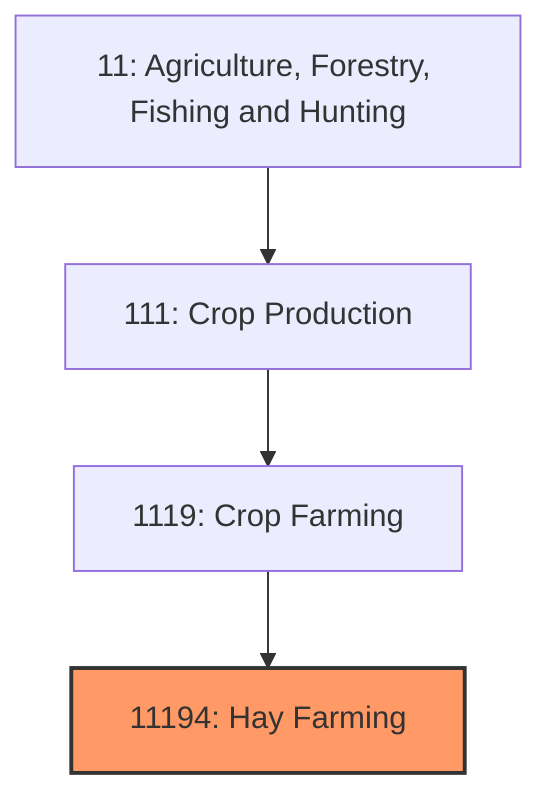
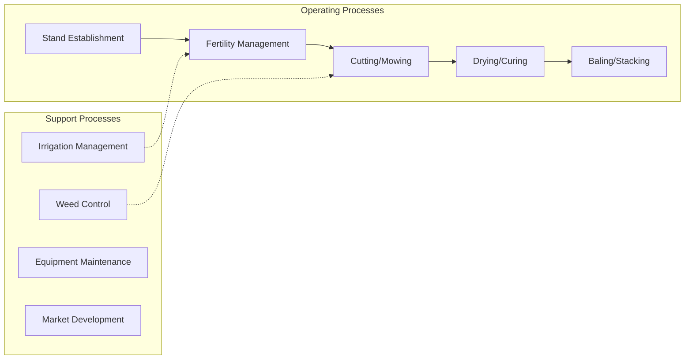

# Hay Farming

> Establishments primarily engaged in growing hay, alfalfa, clover, and other forage crops for livestock feed.

## Overview

Hay farming is a cornerstone of American agriculture, producing the primary feed source for cattle, horses, and other livestock. The United States produces approximately 120-130 million tons of hay annually across 50-55 million harvested acres, making it one of the most widely grown crops by acreage. Hay production is geographically diverse, occurring in nearly every state with significant livestock populations, from the irrigated alfalfa fields of the West to the mixed grass hays of the Great Plains and the timothy meadows of the Northeast.

The industry is characterized by its close integration with livestock production, with most hay consumed within 50 miles of where it is produced due to high transportation costs relative to value. Alfalfa leads commercial hay production due to its high protein content and multiple-cutting potential (3-7 cuttings per season depending on region), while grass hays (timothy, orchardgrass, bromegrass) and mixed hays serve different market segments including the premium horse hay market.

## Market Context

| Metric | Value |
|--------|-------|
| U.S. Hay Production | 120-130 million tons |
| Harvested Acres | 50-55 million |
| Average Yield | 2.4 tons/acre |
| Production Value | $17-20 billion |
| Leading States | Texas, Kansas, California, Montana, Nebraska |

Hay prices fluctuate significantly based on regional drought conditions, livestock inventories, and feed competition with corn and other grains. The Western U.S. experiences the most price volatility due to irrigation water availability and wildfire risks. Premium alfalfa for dairy can command $200-300/ton, while grass hay for beef cattle typically ranges $80-150/ton.

## Industry Hierarchy

## Key Statistics

| Metric | Value |
|--------|-------|
| NAICS Code | 11194 |
| Level | Industry |
| Parent | [Crop Farming](./) |
| National Industry | 111940 (Hay Farming) |

## Related Occupations

- [Farmers, Ranchers, and Other Agricultural Managers](/occupations/Management/FarmersRanchersAndOtherAgriculturalManagers) - Manage hay production operations and marketing
- [Agricultural Equipment Operators](/occupations/FarmingFishingAndForestry/AgriculturalEquipmentOperators) - Operate mowers, rakes, balers, and stackers
- [Farmworkers and Laborers, Crop](/occupations/FarmingFishingAndForestry/FarmworkersAndLaborersCrop) - Assist with hay baling and loading
- [Agricultural Technicians](/occupations/Science/AgriculturalTechnicians) - Conduct forage quality testing
- [Farm Equipment Mechanics](/occupations/Installation/FarmEquipmentMechanics) - Maintain harvesting equipment
- [Truck Drivers, Heavy and Tractor-Trailer](/occupations/TransportationAndMaterialMoving/TruckDriversHeavyAndTractorTrailer) - Transport hay to markets

## Core Business Processes

### Stand Establishment
Establishing productive hay stands for long-term production.

**Key Activities:**
- Soil testing and pH correction (alfalfa requires pH 6.5+)
- Seed inoculation for legumes (rhizobium bacteria)
- Planting date optimization by region
- Nurse crop management (oat companion planting)
- Stand density assessment (25+ plants/sq ft for alfalfa)

### Harvest Operations
Timing and executing hay cutting for optimal quality and yield.

**Key Activities:**
- Cutting at proper maturity stage (10% bloom for alfalfa)
- Swathing/mowing for uniform windrow formation
- Tedding for faster drying in humid conditions
- Raking for baler pickup
- Moisture monitoring (15-18% for dry hay)
- Baling (small square, large square, or round bales)

### Post-Harvest Handling
Storing and marketing hay while maintaining quality.

**Key Activities:**
- Barn storage vs. outdoor storage decisions
- Bale wrapping for high-moisture silage
- Quality testing (RFV, protein, ADF, NDF)
- Market channel selection (direct, auction, broker)
- Transportation logistics to buyers

## Industry Value Chain

```mermaid
graph LR
    subgraph Inputs["Inputs"]
        I1["Seed"]
        I2["Fertilizer"]
        I3["Irrigation"]
        I4["Equipment"]
    end

    subgraph Primary["Primary Activities"]
        A1["Growing"]
        A2["Harvesting"]
        A3["Curing"]
        A4["Storage"]
    end

    subgraph Outputs["Products"]
        O1["Alfalfa Hay"]
        O2["Grass Hay"]
        O3["Mixed Hay"]
        O4["Hay Cubes/Pellets"]
    end

    subgraph Markets["End Markets"]
        C1["Dairy Farms"]
        C2["Beef Operations"]
        C3["Horse Industry"]
        C4["Export Markets"]
    end

    Inputs --> Primary --> Outputs --> Markets
```

## Hay Types and Markets

### Alfalfa Hay
The "Queen of Forages" with 16-22% protein, serving primarily dairy and premium horse markets. High-quality dairy alfalfa commands top prices for low ADF and high RFV values.

### Timothy Hay
Premium grass hay for horse industry, particularly show horses and rabbits. Pacific Northwest and Northeast production areas dominate this specialty market.

### Grass Hay (Orchardgrass, Bromegrass, Fescue)
Lower-cost option for beef cattle, horses, and livestock maintenance. Widely produced across the U.S. with more regional varieties.

### Mixed Hay (Grass-Legume)
Combines alfalfa or clover with grasses for balanced nutrition. Common in the Midwest and Northeast for beef and horse operations.

## Regulatory Environment

- **USDA Risk Management Agency** - Crop insurance programs for hay production
- **USDA Agricultural Marketing Service** - Hay grading standards and testing
- **EPA** - Pesticide regulations for hay crops (pre-harvest intervals)
- **State Departments of Agriculture** - Noxious weed seed laws, hay certification
- **BLM/Forest Service** - Regulations for certified weed-free hay on public lands

### Key Programs and Regulations
- Noninsured Crop Disaster Assistance (NAP) for hay
- Livestock Forage Disaster Program (LFP)
- NRCS EQIP for irrigation improvements
- State noxious weed certification programs
- Weed-free forage requirements for national parks/forests

## Technology & Innovation

- **Precision Irrigation** - Center pivot and drip systems for alfalfa production
- **Near-Infrared (NIR) Testing** - Real-time hay quality analysis at baling
- **GPS Yield Mapping** - Track productivity across fields for input optimization
- **Moisture Sensors** - Bale moisture probes to prevent spoilage
- **Preservatives** - Propionic acid applications for baling at higher moisture
- **Satellite Imagery** - Monitor stand health and irrigation uniformity

## Regional Characteristics

### Western States (California, Idaho, Arizona)
Irrigated alfalfa production dominates; high yields (8-10 tons/acre) but dependent on water availability and costs. Exports to Asia significant.

### Great Plains (Kansas, Nebraska, South Dakota)
Mix of dryland and irrigated alfalfa; grass hay production tied to cattle grazing operations. Drought risk significant.

### Midwest (Wisconsin, Minnesota, Iowa)
Alfalfa in dairy rotations with corn; 3-4 cuttings typical. Quality focus for dairy market.

### Pacific Northwest (Oregon, Washington)
Timothy hay for export to Japan and Korea; premium prices for horse hay markets.

### Northeast/Appalachia
Mixed grass-legume hay for local horse and beef markets; humid conditions challenge curing.

## Industry Challenges

- **Weather Dependency** - Rain during curing causes significant quality losses
- **Labor Availability** - Seasonal peaks for baling create labor shortages
- **Water Costs** - Rising irrigation costs in Western states
- **Equipment Investment** - High capital costs for modern haying equipment
- **Storage Losses** - Fire and spoilage risks for stored hay
- **Price Volatility** - Regional drought creates boom-bust cycles

## Industry Outlook

Hay farming remains essential to U.S. livestock production but faces increasing pressure from water constraints in Western irrigated production and labor shortages for harvesting operations. The industry is adapting through larger equipment, improved storage methods, and precision agriculture technologies. Export markets for compressed hay and cubes continue growing, particularly in Asia and the Middle East. The premium horse hay market offers stable demand and higher margins for quality producers. Climate variability increases the importance of drought-tolerant varieties and efficient irrigation. Vertical integration with livestock operations and contract production arrangements are increasing to reduce price volatility and ensure supply security for large dairy and beef operations.

---

*Source: NAICS 11194 - Hay Farming*
