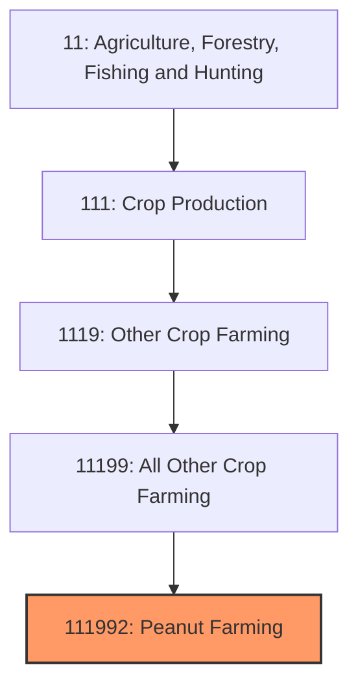
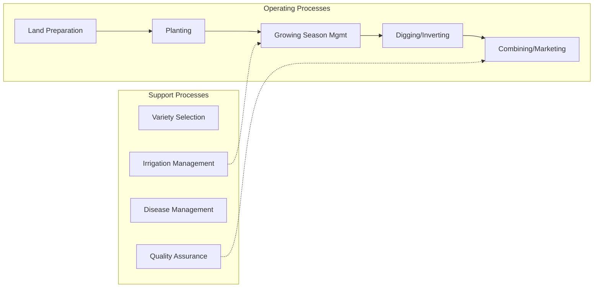

# Peanut Farming

> Establishments primarily engaged in growing peanuts for food processing, peanut butter, oil extraction, and confectionery applications.

## Overview

Peanut farming is a specialized segment of U.S. agriculture producing approximately 6 billion pounds of peanuts (in-shell basis) annually across 1.4-1.6 million acres. Despite the name, peanuts are legumes rather than true nuts, growing underground and fixing atmospheric nitrogen like other legume crops. The United States ranks as the world's fourth-largest peanut producer behind China, India, and Nigeria, with a reputation for producing high-quality peanuts under stringent food safety standards.

Production is concentrated in the Southeast (Georgia, Alabama, Florida) and Southwest (Texas, Oklahoma), with smaller production in Virginia/Carolinas and New Mexico. Georgia alone accounts for approximately 50% of U.S. production. The crop's primary end use is peanut butter manufacturing (approximately 50% of domestic consumption), followed by snack peanuts, confectionery, and peanut oil. Contract production with shellers is the dominant marketing structure.

## Market Context

| Metric | Value |
|--------|-------|
| U.S. Peanut Production | 6+ billion lbs (in-shell) |
| Planted Acres | 1.4-1.6 million |
| Average Yield | 4,000+ lbs/acre |
| Farm Value | $1.5+ billion |
| Per Capita Consumption | 7+ lbs/year |

The U.S. peanut industry benefits from strong domestic demand, with peanut butter being a staple food item. Export markets include Europe, Canada, and Mexico, though aflatoxin concerns require rigorous testing and segregation programs.

## Industry Hierarchy

## Key Statistics

| Metric | Value |
|--------|-------|
| NAICS Code | 111992 |
| Level | National Industry |
| Parent | [All Other Crop Farming](../) |
| Child Industries | 0 |

## Related Occupations

- [Farmers, Ranchers, and Other Agricultural Managers](/occupations/Management/FarmersRanchersAndOtherAgriculturalManagers) - Manage peanut production operations
- [Agricultural Equipment Operators](/occupations/FarmingFishingAndForestry/AgriculturalEquipmentOperators) - Operate specialized peanut equipment
- [Agricultural Technicians](/occupations/Science/AgriculturalTechnicians) - Conduct soil testing and crop scouting
- [Food Scientists](/occupations/Science/FoodScientistsAndTechnologists) - Ensure food safety and quality
- [Agricultural Inspectors](/occupations/FarmingFishingAndForestry/AgriculturalInspectors) - Grade peanuts and inspect for aflatoxin
- [Pesticide Handlers](/occupations/FarmingFishingAndForestry/PesticideHandlersSprayers) - Apply crop protection products

## Core Business Processes

### Planting Operations
Establishing peanut stands during optimal windows (April-May).

**Key Activities:**
- Seed treatment with fungicides and inoculants
- Planting depth management (2-3 inches)
- Row spacing (36-38 inch rows standard)
- Seeding rate optimization (5-6 seed per foot)
- Pre-emergence herbicide application

### Growing Season Management
Managing the 140-160 day growing season for optimal yield and quality.

**Key Activities:**
- Calcium application at pegging (gypsum)
- Fungicide programs for leaf spot and soil-borne diseases
- Irrigation scheduling during pegging and pod fill
- Tomato spotted wilt virus management
- Pod maturity assessment using hull scrape method

### Harvest Operations
Unique two-stage harvest process for peanuts.

**Key Activities:**
- Digging and inverting at optimal maturity
- Curing in the windrow (3-7 days depending on weather)
- Combining to separate pods from vines
- Drying at buying points or on-farm (to 10% moisture)
- Grading and segregation by type and quality

## Industry Value Chain

## Peanut Types

### Runner Peanuts
Dominant variety (~80% of U.S. production); uniform kernel size ideal for peanut butter; grown primarily in Georgia, Alabama, and Florida.

### Virginia Peanuts
Largest kernel size; premium for in-shell roasting and gourmet products; grown in Virginia/Carolina region.

### Spanish Peanuts
Smaller kernels with higher oil content; used in candy bars and peanut oil; grown in Texas and Oklahoma.

### Valencia Peanuts
Sweet flavor; sold roasted in-shell or used in all-natural peanut butter; limited production in New Mexico.

## Regulatory Environment

- **USDA Farm Service Agency** - Peanut marketing quota and loan programs
- **USDA Agricultural Marketing Service** - Grading and quality standards
- **FDA** - Aflatoxin testing requirements and food safety standards
- **EPA** - Pesticide registration and use regulations
- **USDA APHIS** - Export certification and pest management

### Key Programs and Regulations
- Peanut Marketing Loan Program
- Price Loss Coverage (PLC) for peanuts
- Aflatoxin testing requirements (20 ppb limit for food)
- Seg 2 and Seg 3 segregation for quality
- FSMA compliance for food manufacturers

## Technology & Innovation

- **High-Oleic Varieties** - Extended shelf life and improved nutrition profile
- **Precision Agriculture** - GPS-guided equipment, variable-rate gypsum
- **Irrigation Technology** - Center pivot and sub-surface drip systems
- **Disease-Resistant Varieties** - Tomato spotted wilt and leaf spot resistance
- **Maturity Testing** - Hull scrape boards and pod blasting for harvest timing
- **Aflatoxin Prevention** - Irrigation management and storage protocols

## Production Challenges

### Aflatoxin Management
Fungal contamination producing carcinogenic aflatoxins requires careful management through drought stress prevention, timely harvest, and proper drying/storage.

### Disease Complex
Multiple diseases including tomato spotted wilt virus, leaf spots, and soil-borne pathogens require integrated management strategies.

### Rotation Requirements
Peanuts require 2-3 year rotations with non-host crops to manage soil-borne diseases, limiting planting flexibility.

## Industry Challenges

- **Aflatoxin Risk** - Drought stress and harvest timing critical for food safety
- **Disease Pressure** - Multiple pathogens requiring intensive fungicide programs
- **Input Costs** - High fungicide and gypsum costs
- **Weather Dependence** - Sensitivity to drought and excessive rainfall
- **Import Competition** - Low-cost peanuts from Argentina and Brazil
- **Rotation Constraints** - Need for 2-3 year rotations limits acreage flexibility

## Industry Outlook

The U.S. peanut industry benefits from strong domestic demand anchored by peanut butter's role as an affordable protein source. High-oleic variety adoption is expanding, offering processors improved product stability and consumers healthier fat profiles. Export growth depends on maintaining quality advantages and navigating aflatoxin concerns in international trade. The industry's research investment through peanut board checkoff programs supports continued variety improvement and disease management advances. Challenges include managing production costs while maintaining quality standards required for food applications. Climate variability affecting aflatoxin risk requires adaptive management strategies. The industry's vertically integrated structure through sheller contracts provides market stability for producers while ensuring quality control through the supply chain.

---

*Source: NAICS 111992 - Peanut Farming*
