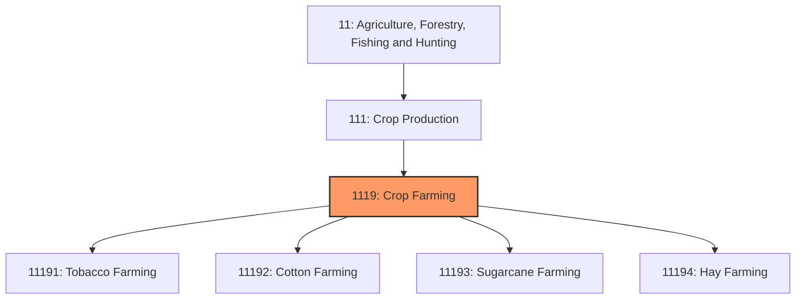
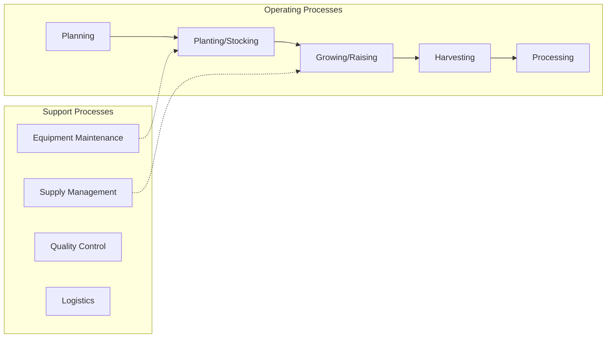

# Crop Farming

> This industry group comprises establishments primarily engaged in (1) growing crops (except oilseed and/or grain; vegetable and/or melon; fruit and tree nut; and greenhouse, nursery, and/or floriculture products), such as tobacco, cotton, sugarcane, hay, sugar beets, peanuts, agave, herbs and spices, and hay and grass seeds, or (2) growing a combination of crops (except a combination of oilseed(s) and grain(s) and a combination of fruit(s) and tree nut(s)).

## Overview

Crop Farming represents an important category within the Agriculture, Forestry, Fishing and Hunting sector (NAICS 11). This industry group encompasses establishments primarily engaged in crop farming.

This industry group comprises establishments primarily engaged in (1) growing crops (except oilseed and/or grain; vegetable and/or melon; fruit and tree nut; and greenhouse, nursery, and/or floriculture products), such as tobacco, cotton, sugarcane, hay, sugar beets, peanuts, agave, herbs and spices, and hay and grass seeds, or (2) growing a combination of crops (except a combination of oilseed(s) and grain(s) and a combination of fruit(s) and tree nut(s)).

## Industry Hierarchy

## Key Statistics

| Metric | Value |
|--------|-------|
| NAICS Code | 1119 |
| Level | Industry Group |
| Parent | [Crop Production](../) |
| Child Industries | 4 |

## Sub-Industries

| Industry | Code | Description |
|----------|------|-------------|
| [Tobacco Farming](./TobaccoFarming/) | 11191 | See industry description for 111910 |
| [Cotton Farming](./CottonFarming/) | 11192 | See industry description for 111920 |
| [Sugarcane Farming](./SugarcaneFarming/) | 11193 | See industry description for 111930 |
| [Hay Farming](./HayFarming/) | 11194 | See industry description for 111940 |

## Core Business Processes

## Industry Value Chain

```mermaid
graph LR
    subgraph Inputs["Inputs"]
        I1["Seeds/Stock"]
        I2["Equipment"]
        I3["Fertilizers"]
        I4["Labor"]
    end

    subgraph Primary["Primary Activities"]
        A1["Inbound Logistics"]
        A2["Core Operations"]
        A3["Quality Assurance"]
        A4["Outbound/Delivery"]
    end

    subgraph Outputs["Products/Services"]
        O1["Crops"]
        O2["Livestock"]
        O3["Raw Materials"]
    end

    subgraph Customers["Markets"]
        C1["Processors"]
        C2["Distributors"]
        C3["Retailers"]
        C4["Export Markets"]
    end

    Inputs --> Primary --> Outputs --> Customers
```

---

*Source: NAICS 1119 - Crop Farming*
