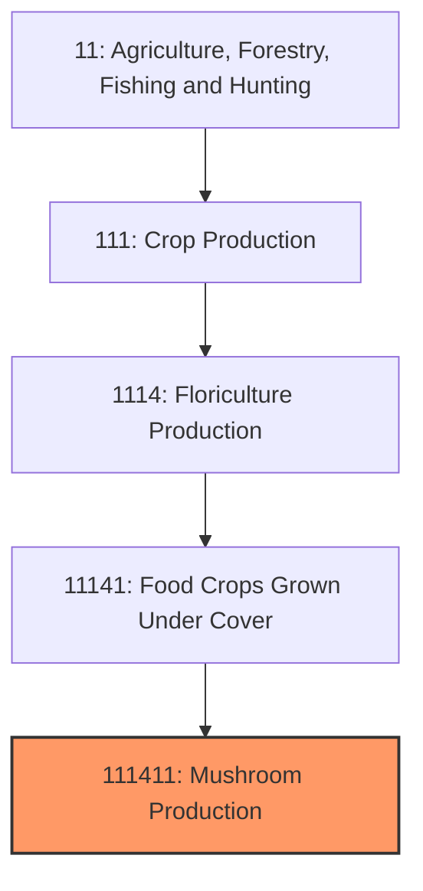
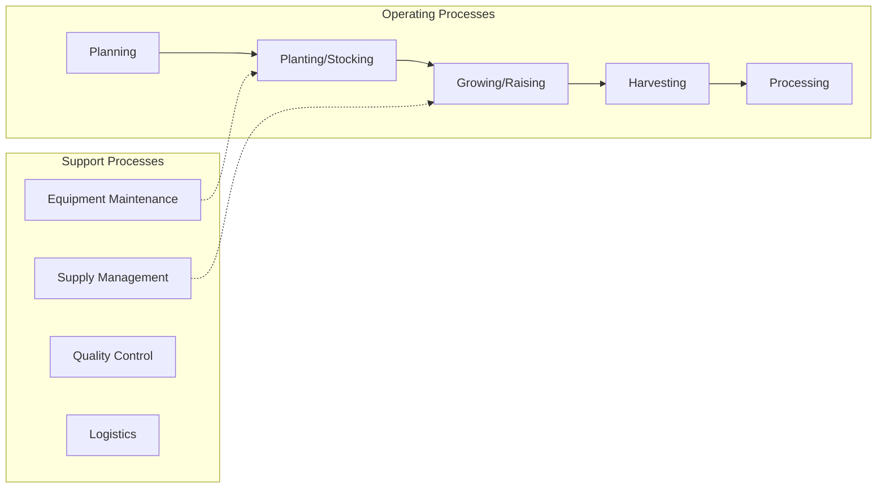

# Mushroom Production

> This U.S. industry comprises establishments primarily engaged in growing mushrooms under cover in mines underground, or in other controlled environments.
## Overview

Mushroom Production represents a specialized segment within the Agriculture, Forestry, Fishing and Hunting sector (NAICS 11). This national industry encompasses establishments primarily engaged in mushroom production.

This U.S. industry comprises establishments primarily engaged in growing mushrooms under cover in mines underground, or in other controlled environments.

## Industry Hierarchy

## Key Statistics

| Metric | Value |
|--------|-------|
| NAICS Code | 111411 |
| Level | National Industry |
| Parent | [Food Crops Grown Under Cover](../) |
| Child Industries | 0 |

## Core Business Processes

## Industry Value Chain

```mermaid
graph LR
    subgraph Inputs["Inputs"]
        I1["Seeds/Stock"]
        I2["Equipment"]
        I3["Fertilizers"]
        I4["Labor"]
    end

    subgraph Primary["Primary Activities"]
        A1["Inbound Logistics"]
        A2["Core Operations"]
        A3["Quality Assurance"]
        A4["Outbound/Delivery"]
    end

    subgraph Outputs["Products/Services"]
        O1["Crops"]
        O2["Livestock"]
        O3["Raw Materials"]
    end

    subgraph Customers["Markets"]
        C1["Processors"]
        C2["Distributors"]
        C3["Retailers"]
        C4["Export Markets"]
    end

    Inputs --> Primary --> Outputs --> Customers
```

---

*Source: NAICS 111411 - Mushroom Production*
