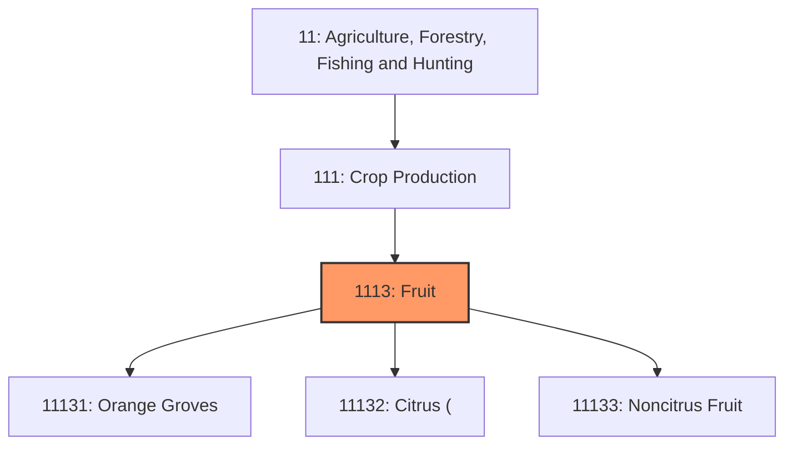
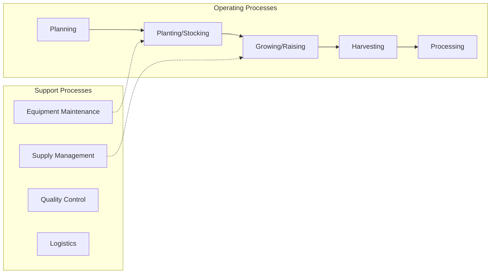

# Fruit

> This industry group comprises establishments primarily engaged in growing fruit and/or tree nut crops.

## Overview

Fruit represents an important category within the Agriculture, Forestry, Fishing and Hunting sector (NAICS 11).

This industry group comprises establishments primarily engaged in growing fruit and/or tree nut crops. The crops included in this industry group are generally not grown from seeds and have a perennial life cycle.

## Industry Hierarchy

## Key Statistics

| Metric | Value |
|--------|-------|
| NAICS Code | 1113 |
| Level | Industry Group |
| Parent | [Crop Production](../) |
| Child Industries | 3 |

## Sub-Industries

| Industry | Code | Description |
|----------|------|-------------|
| [Orange Groves](./OrangeGroves/) | 11131 | See industry description for 111310 |
| [Citrus (](./Citrus/) | 11132 | See industry description for 111320 |
| [Noncitrus Fruit](./NoncitrusFruit/) | 11133 | This industry comprises establishments primarily engaged in one or more of the f |

## Related Occupations

- [Farmers, Ranchers, and Other Agricultural Managers](/occupations/Management/FarmersRanchersAndOtherAgriculturalManagers) - Plan, direct, or coordinate farm operations
- [Agricultural Engineers](/occupations/Architecture/AgriculturalEngineers) - Apply engineering principles to agriculture
- [Agricultural Technicians](/occupations/Science/AgriculturalTechnicians) - Food and fiber production and management
- [Farm Equipment Mechanics](/occupations/FarmEquipmentMechanics) - Maintain and repair agricultural equipment

## Core Business Processes

## Industry Value Chain

```mermaid
graph LR
    subgraph Inputs["Inputs"]
        I1["Seeds/Stock"]
        I2["Equipment"]
        I3["Fertilizers"]
        I4["Labor"]
    end

    subgraph Primary["Primary Activities"]
        A1["Inbound Logistics"]
        A2["Core Operations"]
        A3["Quality Assurance"]
        A4["Outbound/Delivery"]
    end

    subgraph Outputs["Products/Services"]
        O1["Crops"]
        O2["Livestock"]
        O3["Raw Materials"]
    end

    subgraph Customers["Markets"]
        C1["Processors"]
        C2["Distributors"]
        C3["Retailers"]
        C4["Export Markets"]
    end

    Inputs --> Primary --> Outputs --> Customers
```

## Regulatory Environment

- **USDA** (United States Department of Agriculture) - Oversees agricultural practices, food safety, and farm subsidies
- **EPA** (Environmental Protection Agency) - Regulates pesticide use, water quality, and environmental impact
- **FDA** (Food and Drug Administration) - Ensures safety of agricultural food products
- **State Departments of Agriculture** - Enforce local farming regulations and licensing

## Technology & Innovation

- **Precision Agriculture** - GPS-guided equipment, drone monitoring, and variable-rate application technologies
- **Agricultural Biotechnology** - Genetically modified crops, CRISPR gene editing, and disease-resistant varieties
- **IoT and Smart Farming** - Sensor networks for soil moisture, weather monitoring, and automated irrigation
- **Autonomous Equipment** - Self-driving tractors, robotic harvesters, and AI-powered crop management

## Industry Outlook

The agriculture sector continues to evolve with growing global food demand, climate adaptation challenges, and rapid technology adoption. Precision agriculture and sustainable farming practices are driving productivity gains while reducing environmental impact. The sector faces workforce challenges as traditional farming communities age, but technology-enabled farming is attracting new entrants and investment.

---

*Source: NAICS 1113 - Fruit*
