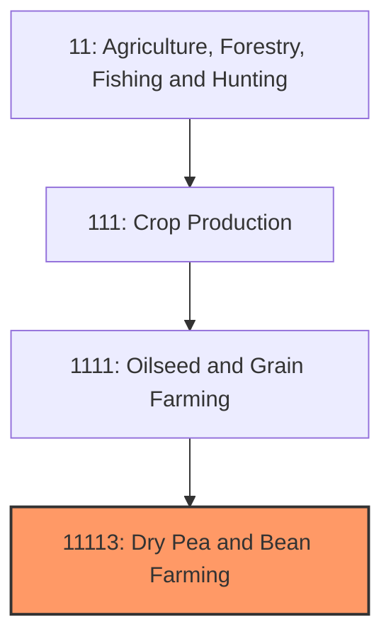
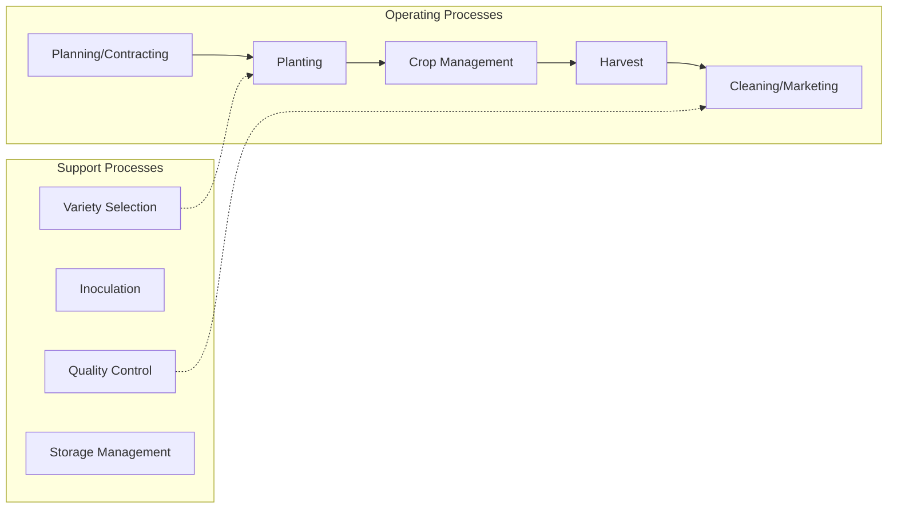

# Dry Pea and Bean Farming

> Establishments primarily engaged in growing dry peas, dry beans, lentils, chickpeas, and other pulse crops for food, feed, and seed markets.

## Overview

Dry pea and bean farming encompasses the production of edible pulse crops including dry beans (pinto, navy, black, kidney, great northern, and others), dry peas (green and yellow), lentils, and chickpeas (garbanzo beans). The United States produces approximately 3-4 million acres of pulse crops annually, with production concentrated in distinct geographic regions based on climate suitability and market access. These crops serve dual roles as human food (direct consumption and processed foods) and rotation crops that fix atmospheric nitrogen, improving soil health.

North Dakota leads national production, particularly for dry peas and lentils, followed by Montana, Idaho, Washington, and Michigan (for dry beans). The industry includes both commodity production for major food processors and identity-preserved production for specific bean varieties commanding premium prices. Pulses have gained market attention due to their high protein content, sustainability benefits, and alignment with plant-based diet trends.

## Market Context

| Metric | Value |
|--------|-------|
| U.S. Dry Bean Production | 25-30 million cwt |
| U.S. Dry Pea Production | 35-40 million cwt |
| Total Planted Acres | 3-4 million |
| Cash Receipts | $1.5-2 billion |
| Export Volume | 30-40% of production |

The U.S. is a leading pulse exporter, with significant shipments to Mexico (dry beans), India and China (lentils and peas), and various other markets. Domestic consumption has grown with increased interest in plant-based proteins and Mediterranean diets.

## Industry Hierarchy

## Key Statistics

| Metric | Value |
|--------|-------|
| NAICS Code | 11113 |
| Level | Industry |
| Parent | [Oilseed and Grain Farming](../) |
| Child Industries | 111130 (Dry Pea and Bean Farming) |

## Related Occupations

- [Farmers, Ranchers, and Other Agricultural Managers](/occupations/Management/FarmersRanchersAndOtherAgriculturalManagers) - Manage pulse crop operations
- [Agricultural Equipment Operators](/occupations/FarmingFishingAndForestry/AgriculturalEquipmentOperators) - Operate planting and harvesting equipment
- [Agricultural Technicians](/occupations/Science/AgriculturalTechnicians) - Conduct soil testing and crop scouting
- [Agricultural Inspectors](/occupations/FarmingFishingAndForestry/AgriculturalInspectors) - Grade beans for quality factors
- [Seed Technologists](/occupations/Science/BiologicalTechnicians) - Develop and certify seed varieties
- [Food Scientists](/occupations/Science/FoodScientistsAndTechnologists) - Develop pulse-based food products

## Core Business Processes

### Pre-Season Planning
Variety selection and market positioning decisions.

**Key Activities:**
- Market research and contract development
- Variety selection based on market specifications
- Inoculant sourcing for nitrogen fixation
- Rotation planning with small grains and oilseeds
- Input budgeting and procurement

### Planting Operations
Seeding pulse crops during optimal windows.

**Key Activities:**
- Seed inoculation with Rhizobium bacteria
- Drill or planter calibration
- Seeding depth management (1.5-3 inches)
- Row spacing decisions based on variety
- Population rate optimization

### Growing Season Management
Crop protection and monitoring through maturity.

**Key Activities:**
- Herbicide applications (limited post-emergence options)
- Disease monitoring (white mold, root rot, Ascochyta)
- Insect scouting (pea aphid, weevils)
- Fungicide timing decisions
- Desiccation/pre-harvest timing

### Harvest and Marketing
Combining, cleaning, and marketing harvested pulse crops.

**Key Activities:**
- Combine settings for minimal damage
- Direct harvest vs. swathing decisions
- Cleaning and grading for market specifications
- Identity preservation for specialty markets
- Contract fulfillment or spot market sales

## Industry Value Chain

## Crop Categories

### Dry Beans
Pinto, navy, black, kidney, great northern, pink, small red, and others; each variety serves specific culinary markets with varying price premiums.

### Dry Peas
Yellow and green peas; used for human food (split peas, pea protein), animal feed, and as a rotation crop; grown primarily in Northern Plains and Pacific Northwest.

### Lentils
Green, red, and specialty varieties; high protein content; growing export demand; concentrated in Palouse region of Pacific Northwest.

### Chickpeas (Garbanzo Beans)
Kabuli (large seeded) and Desi (small seeded) types; growing domestic market for hummus and Mediterranean foods.

## Regulatory Environment

- **USDA Farm Service Agency** - Commodity programs and disaster assistance
- **USDA Risk Management Agency** - Crop insurance for pulse crops
- **FDA** - Food safety standards for human consumption
- **EPA** - Pesticide registration and use regulations
- **State Crop Improvement Associations** - Seed certification programs

### Key Programs and Regulations
- Price Loss Coverage (PLC) program
- Federal Crop Insurance (Yield Protection, Revenue Protection)
- Food safety and traceability requirements
- Export phytosanitary certificates
- Organic certification standards

## Technology & Innovation

- **Variety Development** - Disease resistance, improved agronomics, and specialty traits
- **Precision Planting** - Variable-rate seeding and GPS guidance
- **Inoculant Technology** - Improved Rhizobium strains for nitrogen fixation
- **Direct Harvest Systems** - Equipment and varieties enabling direct combining
- **Optical Sorting** - Color sorting equipment for quality segregation
- **Plant-Based Protein Processing** - Pea protein isolate production technology

## Production Regions

### Northern Plains (North Dakota, Montana)
Primary dry pea and lentil region; short growing season; dryland production; significant infrastructure for cleaning and export.

### Pacific Northwest (Idaho, Washington)
Lentils, chickpeas, and dry peas in the Palouse; both dryland and irrigated; proximity to Pacific export ports.

### Great Lakes (Michigan, Wisconsin, Minnesota)
Dry bean production, particularly navy and black beans; historically significant canning industry.

### Western Irrigated
Kidney beans, pintos, and other dry beans under irrigation; high yields but water availability concerns.

## Industry Challenges

- **Disease Pressure** - White mold, root rots, and foliar diseases
- **Limited Herbicide Options** - Fewer post-emergence weed control tools
- **Price Volatility** - Smaller markets with greater price swings
- **Quality Requirements** - Strict specifications for canning and export
- **Weather Sensitivity** - Rain damage at harvest affecting quality
- **Market Access** - Trade barriers in key export destinations

## Industry Outlook

The dry pea and bean industry benefits from multiple favorable trends including growing consumer interest in plant-based proteins, sustainability recognition for nitrogen-fixing crops, and expanding export markets. Pea protein demand for meat alternatives and protein supplements has driven significant investment in processing capacity. The crops' fit in sustainable rotations with small grains supports adoption in Northern Plains systems. Challenges include disease management, particularly white mold in beans, and the development of herbicide-tolerant varieties to improve weed control options. The industry's future growth depends on continued product innovation in plant-based foods, maintaining export market access, and variety improvement for yield and disease resistance.

---

*Source: NAICS 11113 - Dry Pea and Bean Farming*
