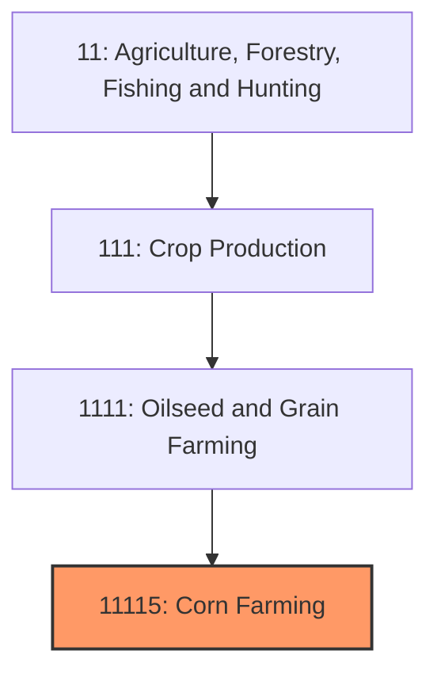
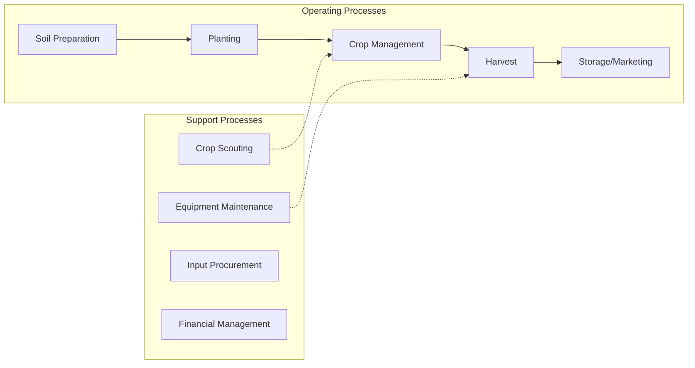

# Corn Farming

> Establishments primarily engaged in growing corn (except sweet corn) for grain or seed, including field corn, popcorn, and Indian corn.

## Overview

Corn farming is the largest and most economically significant crop sector in U.S. agriculture, with production exceeding 14 billion bushels annually across approximately 90 million acres. The United States produces roughly 35% of the world's corn, making it the dominant global producer and exporter. Modern corn production is highly mechanized and capital-intensive, with average yields exceeding 175 bushels per acre through advances in genetics, precision agriculture, and crop management practices.

The "Corn Belt" spanning Iowa, Illinois, Nebraska, Minnesota, and Indiana accounts for the majority of production, with these states benefiting from ideal soil conditions, growing degree days, and established infrastructure. Corn serves multiple end markets including animal feed (approximately 40% of production), ethanol production (35%), exports (15%), and food/industrial uses (10%).

## Market Context

| Metric | Value |
|--------|-------|
| U.S. Corn Production | 14+ billion bushels |
| Planted Acres | ~90 million |
| Average Yield | 175+ bushels/acre |
| Cash Receipts | $65+ billion |
| Export Volume | 2+ billion bushels |

Corn prices are heavily influenced by ethanol mandates, export demand (particularly from China and Mexico), and weather conditions during the growing season. The crop insurance and federal commodity programs provide significant risk management support to producers.

## Industry Hierarchy

## Key Statistics

| Metric | Value |
|--------|-------|
| NAICS Code | 11115 |
| Level | Industry |
| Parent | [Oilseed and Grain Farming](../) |
| Child Industries | 111150 (Corn Farming) |

## Related Occupations

- [Farmers, Ranchers, and Other Agricultural Managers](/occupations/Management/FarmersRanchersAndOtherAgriculturalManagers) - Plan and manage crop production operations
- [Agricultural Equipment Operators](/occupations/FarmingFishingAndForestry/AgriculturalEquipmentOperators) - Operate tractors, planters, combines, and sprayers
- [Agricultural Technicians](/occupations/Science/AgriculturalTechnicians) - Assist with soil testing, scouting, and precision ag
- [Agricultural Engineers](/occupations/Architecture/AgriculturalEngineers) - Design equipment and production systems
- [Agricultural Inspectors](/occupations/FarmingFishingAndForestry/AgriculturalInspectors) - Grade and inspect grain quality
- [Farm Equipment Mechanics](/occupations/InstallationMaintenanceAndRepair/FarmEquipmentMechanics) - Maintain and repair machinery

## Core Business Processes

### Soil Preparation and Planning
Pre-season activities including tillage, soil testing, seed selection, and input planning.

**Key Activities:**
- Soil sampling and nutrient analysis
- Hybrid selection based on maturity and traits
- Tillage or no-till field preparation
- Fertilizer application (nitrogen, phosphorus, potassium)
- Crop rotation planning (corn-soybean rotation common)

### Planting
Precision seed placement during the critical spring planting window.

**Key Activities:**
- Planter calibration and setup
- Variable-rate seeding based on yield maps
- Starter fertilizer application
- Depth and spacing optimization
- Replanting decisions for stand issues

### Crop Management
In-season management of the growing crop through harvest.

**Key Activities:**
- Herbicide application (pre and post-emergence)
- Nitrogen sidedress application
- Pest and disease scouting
- Irrigation management (where applicable)
- Crop insurance documentation

### Harvest and Marketing
Grain removal, storage, and sale decisions.

**Key Activities:**
- Combine operation and optimization
- Grain cart logistics and field transport
- Drying and storage management
- Basis monitoring and forward contracting
- Delivery and settlement

## Industry Value Chain

## Regulatory Environment

- **USDA Farm Service Agency (FSA)** - Administers commodity programs, crop insurance, and conservation compliance
- **USDA Risk Management Agency (RMA)** - Oversees federal crop insurance program
- **EPA** - Regulates pesticide registration and use, water quality standards
- **State Departments of Agriculture** - Seed certification, weights and measures, grain licensing
- **FDA** - Food safety standards for corn entering food supply

### Key Programs and Regulations
- Agricultural Risk Coverage (ARC) and Price Loss Coverage (PLC)
- Federal Crop Insurance Program (Revenue Protection policies)
- Conservation Compliance requirements
- Renewable Fuel Standard (RFS) mandating ethanol blending
- Waters of the United States (WOTUS) regulations

## Technology & Innovation

- **Precision Agriculture** - GPS guidance, variable-rate application, yield mapping
- **Seed Technology** - Bt traits for insect resistance, herbicide tolerance (Roundup Ready, LibertyLink)
- **Sensor Technology** - Drone imagery, satellite monitoring, in-field sensors
- **Data Analytics** - Predictive modeling, farm management software, yield prediction
- **Equipment Technology** - Automated section control, combine yield monitors, grain carts with scales
- **Biological Products** - Microbial seed treatments, nitrogen-fixing biologicals

## Production Practices

### Conventional Production
Standard practices using GMO hybrids with herbicide tolerance and insect resistance traits, synthetic fertilizers, and chemical pest control.

### Non-GMO Production
Identity-preserved production for premium markets avoiding genetically modified traits, often commanding $0.50-1.00/bushel premiums.

### Organic Corn
USDA certified organic production without synthetic inputs, requiring 3-year transition, with premiums of $2-4/bushel above conventional.

## Industry Challenges

- **Input Cost Inflation** - Rising costs for fertilizer, seed, and fuel
- **Weather Volatility** - Drought, flooding, and late planting affecting yields
- **Trade Uncertainty** - Export demand fluctuations due to trade policy
- **Ethanol Policy** - RFS changes impacting domestic demand
- **Environmental Pressure** - Nutrient runoff concerns, sustainability requirements
- **Land Costs** - High cash rent and land prices affecting profitability

## Industry Outlook

Corn farming remains foundational to U.S. agriculture with stable long-term demand from feed, fuel, and export markets. Growth in ethanol demand has plateaued with the RFS, shifting focus to export growth and industrial uses. Climate variability drives increasing adoption of drought-tolerant genetics and conservation practices. Precision agriculture continues advancing yield potential while optimizing input use efficiency. Sustainability initiatives from food companies create both challenges (documentation requirements) and opportunities (premium markets). The industry's capital intensity and scale requirements continue driving farm consolidation, though family farming remains predominant. Long-term prospects depend on export competitiveness, biofuel policy evolution, and continued technology adoption.

---

*Source: NAICS 11115 - Corn Farming*
