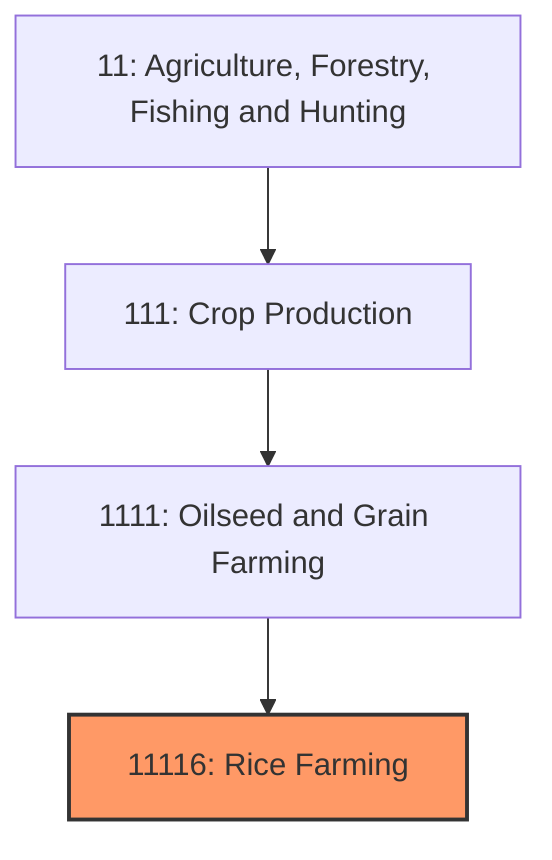
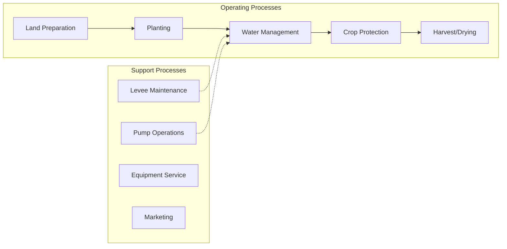

# Rice Farming

> Establishments primarily engaged in growing rice, including long-grain, medium-grain, and short-grain varieties for food and industrial uses.

## Overview

Rice farming is a specialized segment of U.S. agriculture concentrated in a limited number of states with suitable climates, soils, and water resources for flooded paddy production. The United States produces approximately 200 million hundredweight (cwt) of rice annually, ranking as the world's fifth-largest rice exporter despite accounting for less than 2% of global production. The industry is highly mechanized compared to labor-intensive Asian production systems, making U.S. rice among the most efficiently produced globally.

Production is concentrated in six states: Arkansas (leading producer with ~50% of U.S. production), California, Louisiana, Mississippi, Missouri, and Texas. The Gulf Coast and Mid-South regions predominantly grow long-grain rice varieties for domestic and export markets, while California specializes in medium and short-grain varieties, particularly for Asian cuisine applications. Rice is one of the most water-intensive row crops, requiring flooded conditions during much of the growing season.

## Market Context

| Metric | Value |
|--------|-------|
| U.S. Rice Production | ~200 million cwt |
| Planted Acres | 2.5-3 million |
| Average Yield | 7,500+ lbs/acre |
| Cash Receipts | $2.5-3 billion |
| Export Volume | ~50% of production |

The U.S. exports approximately half of its rice production, with major markets including Mexico, Haiti, Japan (for medium-grain), and Central American countries. Domestic consumption is driven by changing demographics and growing Asian and Hispanic populations.

## Industry Hierarchy

## Key Statistics

| Metric | Value |
|--------|-------|
| NAICS Code | 11116 |
| Level | Industry |
| Parent | [Oilseed and Grain Farming](../) |
| Child Industries | 111160 (Rice Farming) |

## Related Occupations

- [Farmers, Ranchers, and Other Agricultural Managers](/occupations/Management/FarmersRanchersAndOtherAgriculturalManagers) - Manage rice production operations
- [Agricultural Equipment Operators](/occupations/FarmingFishingAndForestry/AgriculturalEquipmentOperators) - Operate specialized rice planting and harvesting equipment
- [Irrigation Specialists](/occupations/FarmingFishingAndForestry/AgriculturalWorkers) - Manage water delivery and flood systems
- [Agricultural Engineers](/occupations/Architecture/AgriculturalEngineers) - Design levee systems and irrigation infrastructure
- [Agricultural Inspectors](/occupations/FarmingFishingAndForestry/AgriculturalInspectors) - Grade rice for milling quality
- [Crop Consultants](/occupations/Science/AgriculturalTechnicians) - Provide agronomic recommendations

## Core Business Processes

### Land Preparation
Preparing fields for rice production including levee construction and seedbed preparation.

**Key Activities:**
- Precision land leveling (laser-guided)
- Levee construction and maintenance
- Seedbed preparation and fertilizer incorporation
- Irrigation system setup
- Stale seedbed weed management

### Planting Operations
Establishing rice stands through drill-seeding or water-seeding methods.

**Key Activities:**
- Variety selection (long-grain, medium-grain, specialty)
- Drill seeding into dry soil
- Water seeding into flooded fields (aerial)
- Seeding rate optimization (60-120 lbs/acre)
- Seed treatment applications

### Water Management
Maintaining optimal flood levels throughout the growing season.

**Key Activities:**
- Initial flush for germination
- Permanent flood establishment (4-6 inches depth)
- Levee management to maintain uniform depth
- Mid-season drain for fertilizer application (some systems)
- Pre-harvest drain timing

### Harvest and Drying
Combining mature rice and reducing moisture for storage.

**Key Activities:**
- Monitoring grain moisture (18-24% at harvest)
- Combine operation and header management
- Field transport to drying facilities
- On-farm or commercial drying (to 12-13% moisture)
- Bin storage or delivery to mills

## Industry Value Chain

## Rice Types and Markets

### Long-Grain Rice
Fluffy texture when cooked; separates easily; dominant U.S. variety (~70% of production); used for table rice, parboiled rice, and brewing.

### Medium-Grain Rice
Moist, tender texture; used for risotto, sushi, and Asian cuisines; California specialization; higher value than long-grain.

### Short-Grain Rice
Sticky texture when cooked; niche production for Japanese cuisine; premium pricing.

### Specialty Varieties
Aromatic rice (Jasmine, Basmati-type), colored rice, and organic varieties commanding premium prices.

## Regulatory Environment

- **USDA Farm Service Agency** - Rice commodity programs and marketing loans
- **USDA Risk Management Agency** - Rice crop insurance programs
- **EPA** - Pesticide regulation and water quality standards
- **State Rice Commissions** - Research and promotion funding
- **U.S. Rice Federation** - Industry advocacy and trade policy

### Key Programs and Regulations
- Rice Marketing Loan Program
- Price Loss Coverage (PLC) for rice
- Federal Crop Insurance (Revenue Protection)
- Clean Water Act permitting for rice fields
- Methane emissions reporting requirements

## Technology & Innovation

- **Precision Leveling** - Laser-guided land leveling for uniform water depth
- **Aerial Application** - Seeding, fertilizing, and spraying by aircraft
- **Variety Development** - High-yielding, disease-resistant, and specialty varieties
- **Alternate Wetting/Drying** - Water-saving irrigation techniques
- **Nitrogen Management** - Timing and placement optimization
- **Remote Sensing** - Satellite and drone monitoring for crop health

## Regional Characteristics

### Mid-South (Arkansas, Mississippi, Missouri, Louisiana)
Long-grain production; clay soils retaining water; rice-soybean rotation common; significant infrastructure for milling and storage.

### Texas Gulf Coast
Long-grain production; first-crop/ratoon system; coastal challenges including hurricanes.

### California Central Valley
Medium and short-grain production; specialized milling for Asian markets; highest yields nationally; premium prices but higher production costs.

## Industry Challenges

- **Water Availability** - Groundwater depletion and irrigation costs
- **Environmental Scrutiny** - Methane emissions and water use concerns
- **Import Competition** - Lower-cost Asian rice in domestic markets
- **Weather Risks** - Hurricane exposure in Gulf Coast; drought in California
- **Input Costs** - Fertilizer, fuel, and water pumping expenses
- **Consolidation Pressure** - Capital requirements favoring larger operations

## Industry Outlook

U.S. rice farming maintains competitive advantages in mechanization efficiency and quality consistency despite higher production costs than Asian competitors. Domestic consumption growth driven by demographic changes supports stable demand. Export competitiveness depends on trade policy and currency dynamics, with Mexico remaining the critical market. Water availability concerns in both the Mid-South (groundwater depletion) and California (drought and competing uses) present long-term challenges. Sustainability initiatives including alternate wetting and drying irrigation reduce water use and methane emissions. The industry benefits from strong producer organizations supporting research, promotion, and trade advocacy. Growth opportunities exist in organic production, specialty varieties, and value-added products targeting premium markets.

---

*Source: NAICS 11116 - Rice Farming*
