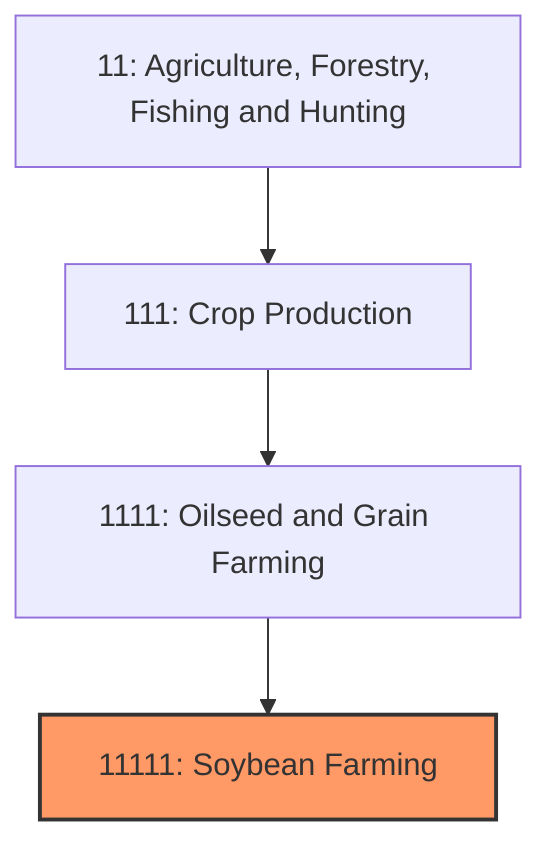
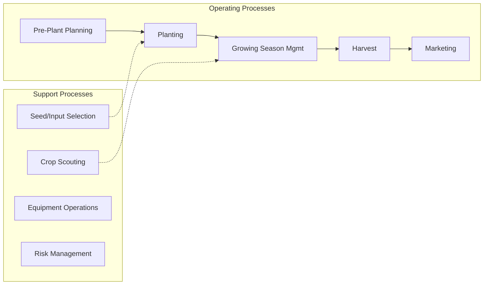

# Soybean Farming

> Establishments primarily engaged in growing soybeans for oil, meal, food products, and industrial applications.

## Overview

Soybean farming represents the second-largest crop sector in U.S. agriculture, with production typically exceeding 4 billion bushels annually across approximately 87 million planted acres. The United States ranks as the world's second-largest soybean producer behind Brazil and is a leading exporter to global markets. Soybeans serve as a cornerstone crop due to their nitrogen-fixing properties (reducing fertilizer needs), role in crop rotation, and diverse end-market applications spanning animal feed, vegetable oil, biodiesel, and food products.

The primary production region overlaps significantly with the Corn Belt, with Illinois, Iowa, Minnesota, Indiana, and Nebraska leading production. The crop's flexibility in planting windows and lower input costs compared to corn make it an attractive rotation option. Approximately 70% of U.S. soybeans are crushed domestically to produce soybean meal (high-protein animal feed) and soybean oil, while the remainder is exported as whole beans.

## Market Context

| Metric | Value |
|--------|-------|
| U.S. Soybean Production | 4.3 billion bushels |
| Planted Acres | ~87 million |
| Average Yield | 50+ bushels/acre |
| Cash Receipts | $40+ billion |
| Export Volume | 2+ billion bushels |

China historically has been the dominant export market, purchasing 60%+ of U.S. exports, making soybean prices particularly sensitive to U.S.-China trade relations. Domestic crushing and biodiesel production provide alternative demand channels.

## Industry Hierarchy

## Key Statistics

| Metric | Value |
|--------|-------|
| NAICS Code | 11111 |
| Level | Industry |
| Parent | [Oilseed and Grain Farming](../) |
| Child Industries | 111110 (Soybean Farming) |

## Related Occupations

- [Farmers, Ranchers, and Other Agricultural Managers](/occupations/Management/FarmersRanchersAndOtherAgriculturalManagers) - Manage crop production and marketing decisions
- [Agricultural Equipment Operators](/occupations/FarmingFishingAndForestry/AgriculturalEquipmentOperators) - Operate planting and harvesting equipment
- [Agricultural Technicians](/occupations/Science/AgriculturalTechnicians) - Conduct soil testing and crop scouting
- [Agricultural Engineers](/occupations/Architecture/AgriculturalEngineers) - Design and optimize production systems
- [Agricultural Inspectors](/occupations/FarmingFishingAndForestry/AgriculturalInspectors) - Grade soybeans for quality factors
- [Purchasing Agents](/occupations/Business/PurchasingAgents) - Manage grain merchandising and procurement

## Core Business Processes

### Pre-Plant Planning
Decision-making on varieties, field allocation, and agronomic practices.

**Key Activities:**
- Variety selection (maturity group, traits, yield potential)
- Field assignment for rotation planning
- Inoculant decisions for nitrogen fixation
- Seed treatment options
- Budget development and input purchasing

### Planting Operations
Seed placement during optimal planting windows (late April through early June).

**Key Activities:**
- Planter setup and calibration
- Row spacing decisions (15", 20", or 30")
- Population rate management (100,000-140,000 seeds/acre)
- Depth adjustment for soil conditions
- Burndown herbicide timing

### Growing Season Management
Crop protection and health management through harvest maturity.

**Key Activities:**
- Post-emergence herbicide application
- Fungicide decisions based on disease pressure
- Insect scouting (soybean aphid, bean leaf beetle)
- Irrigation scheduling (where applicable)
- Yield estimations and marketing decisions

### Harvest and Marketing
Combining, storage, and sale of harvested grain.

**Key Activities:**
- Combine operation (header, speed, settings optimization)
- Moisture monitoring (13% optimal storage moisture)
- Quality segregation (damage, foreign material)
- Basis evaluation and contract execution
- Storage versus immediate sale decisions

## Industry Value Chain

## Regulatory Environment

- **USDA Farm Service Agency** - Commodity programs (ARC/PLC), conservation compliance
- **USDA Risk Management Agency** - Crop insurance administration
- **EPA** - Pesticide registration and use regulations
- **State Grain Inspection Services** - Grade and quality standards
- **FDA** - Food safety for soybeans entering food supply

### Key Programs and Regulations
- Agricultural Risk Coverage (ARC) / Price Loss Coverage (PLC)
- Federal Crop Insurance (Revenue Protection, Yield Protection)
- Conservation Reserve Program (CRP) and EQIP
- Clean Water Act compliance
- Dicamba herbicide application requirements and cutoff dates

## Technology & Innovation

- **Herbicide-Tolerant Varieties** - Roundup Ready, Xtend (dicamba), Enlist (2,4-D) systems
- **Precision Planting** - Variable-rate seeding, automated section control
- **Sensor Technology** - Aerial imagery, NDVI monitoring, yield mapping
- **Genetic Improvement** - High-oleic varieties, disease resistance packages
- **Digital Agriculture** - Farm management platforms, satellite-based field monitoring
- **Biologicals** - Advanced inoculants, biological seed treatments

## Production Systems

### Conventional (GMO)
Standard production using herbicide-tolerant and trait-stacked varieties with synthetic inputs.

### Non-GMO/Identity Preserved
Segregated production for food markets, often commanding $1-2/bushel premiums over commodity prices.

### Organic
Certified organic production without synthetic pesticides or GMO seed, with premiums of $4-8/bushel.

### Food-Grade
Production of specific varieties for tofu, edamame, natto, and other human food applications.

## Industry Challenges

- **Trade Volatility** - Heavy dependence on Chinese export demand
- **Herbicide Resistance** - Palmer amaranth and waterhemp resistance spreading
- **Disease Pressure** - Sudden death syndrome, white mold, soybean cyst nematode
- **Input Cost Management** - Seed technology costs and trait packages
- **Weather Risk** - Drought sensitivity during reproductive stages
- **Basis Volatility** - Transportation and logistics affecting local prices

## Industry Outlook

Soybean farming maintains strong fundamentals driven by global protein demand for animal agriculture and expanding biofuel applications. Renewable diesel production growth creates new domestic demand offsetting traditional biodiesel. Export diversification beyond China reduces trade vulnerability, though that market remains significant. Continued yield improvement through genetics and management practices supports production growth. Sustainability documentation demands from food companies require more on-farm data capture. The industry benefits from soybeans' role in sustainable rotations as a nitrogen-fixing crop. Long-term growth depends on maintaining export competitiveness with South American producers, expanding domestic processing capacity, and developing new high-value markets including high-oleic oil for industrial applications.

---

*Source: NAICS 11111 - Soybean Farming*
