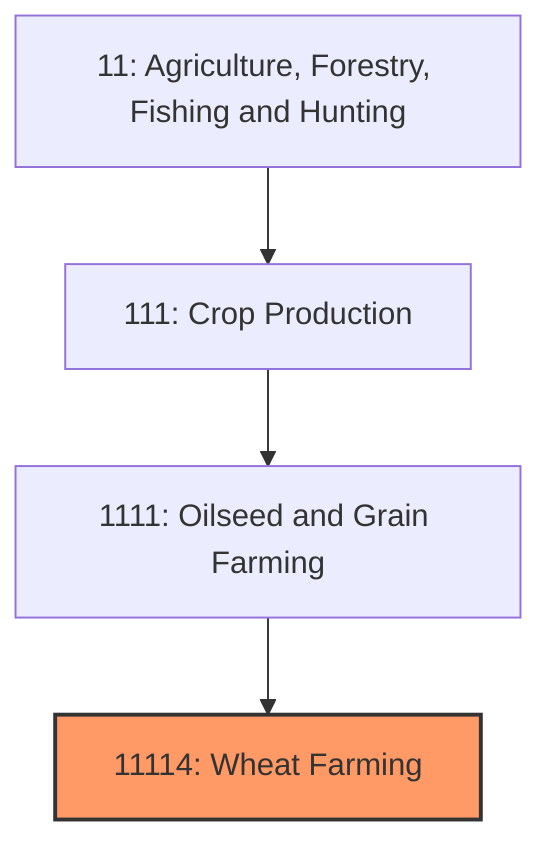
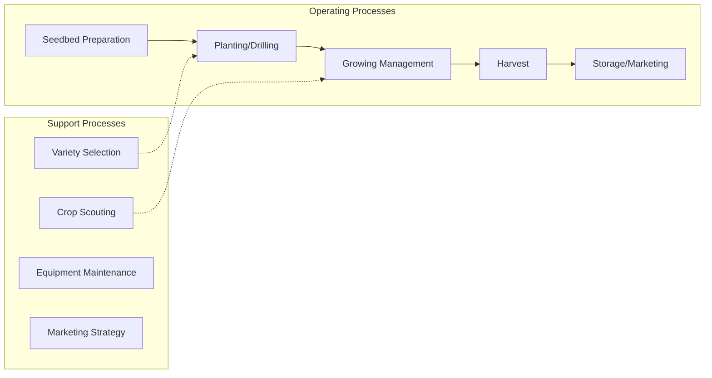

# Wheat Farming

> Establishments primarily engaged in growing wheat for food, feed, seed, and industrial applications.

## Overview

Wheat farming is one of America's oldest and most geographically diverse crop production sectors, with annual production typically ranging from 1.7 to 2.0 billion bushels across 45-50 million planted acres. The United States ranks as the world's fourth-largest wheat producer and a major exporter to global markets. Unlike corn and soybeans concentrated in the Midwest, wheat production spans distinct geographic regions with different classes of wheat adapted to local climates and markets.

The primary wheat classes include Hard Red Winter (Kansas, Oklahoma, Texas Panhandle), Hard Red Spring (Northern Great Plains), Soft Red Winter (Eastern U.S.), White Wheat (Pacific Northwest), and Durum (North Dakota, Montana). Each class serves different end-use markets from bread flour to pasta, creating a diverse market structure. Wheat's role as a global food staple and its drought tolerance make it essential for U.S. food security and export earnings.

## Market Context

| Metric | Value |
|--------|-------|
| U.S. Wheat Production | 1.8-2.0 billion bushels |
| Planted Acres | 45-50 million |
| Average Yield | 45-50 bushels/acre |
| Cash Receipts | $9-11 billion |
| Export Volume | 800+ million bushels |

The U.S. exports approximately 50% of wheat production, making prices sensitive to global supply/demand dynamics. Major export destinations include Mexico, Japan, Philippines, Nigeria, and various Asian markets. Domestic food use remains stable while feed use varies with relative corn prices.

## Industry Hierarchy

## Key Statistics

| Metric | Value |
|--------|-------|
| NAICS Code | 11114 |
| Level | Industry |
| Parent | [Oilseed and Grain Farming](../) |
| Child Industries | 111140 (Wheat Farming) |

## Related Occupations

- [Farmers, Ranchers, and Other Agricultural Managers](/occupations/Management/FarmersRanchersAndOtherAgriculturalManagers) - Manage wheat production operations
- [Agricultural Equipment Operators](/occupations/FarmingFishingAndForestry/AgriculturalEquipmentOperators) - Operate drills, sprayers, and combines
- [Agricultural Technicians](/occupations/Science/AgriculturalTechnicians) - Conduct soil testing and crop scouting
- [Agricultural Inspectors](/occupations/FarmingFishingAndForestry/AgriculturalInspectors) - Grade wheat for protein and quality
- [Grain Elevator Operators](/occupations/TransportationAndMaterialMoving/IndustrialTruckAndTractorOperators) - Handle and store wheat
- [Agricultural Engineers](/occupations/Architecture/AgriculturalEngineers) - Design equipment and irrigation systems

## Core Business Processes

### Planting Operations
Seeding wheat during optimal planting windows varies by wheat class.

**Key Activities:**
- Winter wheat: September-November planting for June-July harvest
- Spring wheat: April-May planting for August-September harvest
- Drill calibration for desired seeding rate (60-120 lbs/acre)
- Seed depth management (1-2 inches)
- Starter fertilizer application

### Growing Season Management
Crop protection and nutrition management through maturity.

**Key Activities:**
- Fall/spring nitrogen application
- Herbicide applications for weed control
- Fungicide for disease management (stripe rust, Fusarium head blight)
- Insect monitoring (aphids, Hessian fly)
- Growth regulator applications where appropriate

### Harvest Operations
Combining mature wheat and managing grain quality.

**Key Activities:**
- Monitoring grain moisture (13.5% optimal)
- Combine settings for minimal damage and dockage
- Test weight and protein assessment
- Blending strategies for quality optimization
- Timely harvest to avoid weather damage

## Industry Value Chain

## Wheat Classes and Uses

### Hard Red Winter (HRW)
Grown primarily in the Southern Great Plains; used for bread flour due to high protein content (10-14%).

### Hard Red Spring (HRS)
Grown in Northern Great Plains; highest protein content (12-15%) for specialty breads and blending.

### Soft Red Winter (SRW)
Grown in Eastern U.S.; lower protein (8-11%) for cookies, crackers, pastries, and Asian noodles.

### White Wheat
Grown in Pacific Northwest and Michigan; used for noodles, flat breads, and breakfast cereals.

### Durum
Grown in North Dakota and Montana; used exclusively for pasta and couscous production.

## Regulatory Environment

- **USDA Farm Service Agency** - Administers commodity programs and crop insurance
- **USDA Grain Inspection, Packers and Stockyards (GIPSA)** - Official grain standards and inspection
- **EPA** - Pesticide registration and residue tolerances
- **State Wheat Commissions** - Research funding and market development
- **Federal Grain Inspection Service (FGIS)** - Export certification

### Key Programs and Regulations
- Price Loss Coverage (PLC) wheat program
- Federal Crop Insurance (APH, Revenue Protection)
- Official grain grading standards (test weight, protein, dockage)
- Maximum residue limits (MRLs) for export markets
- Organic certification standards

## Technology & Innovation

- **Precision Agriculture** - GPS-guided planters, variable-rate fertilization
- **Disease-Resistant Varieties** - Genetic resistance to rust, Fusarium, and other diseases
- **Hybrid Wheat Development** - Emerging technology for yield improvement
- **Satellite Monitoring** - NDVI imaging for crop health assessment
- **NIR Protein Testing** - Rapid quality analysis at harvest
- **Reduced Tillage Systems** - No-till and minimum-till for moisture conservation

## Regional Characteristics

### Southern Plains (Texas, Oklahoma, Kansas)
Hard red winter wheat in dryland production; significant double-crop with soybeans or grain sorghum; challenged by drought and heat stress.

### Northern Plains (Montana, North Dakota, South Dakota)
Spring wheat and durum production; short growing season; high protein potential; frost and early snow risks.

### Pacific Northwest (Washington, Idaho, Oregon)
White wheat production; mix of dryland and irrigated; export-oriented through Pacific ports.

### Eastern Soft Wheat Region
Soft red winter wheat; rotation with corn and soybeans; disease pressure from humid conditions.

## Industry Challenges

- **Acreage Competition** - Corn and soybeans more profitable in many regions
- **Export Market Access** - Trade barriers and currency fluctuations
- **Quality Variability** - Weather impacts on protein and test weight
- **Disease Pressure** - Fusarium head blight (scab) and rust diseases
- **Climate Variability** - Drought in Plains, excessive moisture in East
- **Input Cost Management** - Fertilizer and fuel cost volatility

## Industry Outlook

Wheat farming faces structural challenges from competition with more profitable crops in traditional growing regions, leading to acreage decline. However, wheat remains essential for domestic food security and export earnings. Global population growth and dietary changes in developing countries support long-term demand. Climate adaptation through drought-tolerant varieties and improved agronomics is critical for the drought-prone Great Plains. Quality premiums for high-protein spring wheat and specialty varieties create opportunities for producers meeting market specifications. The industry's future depends on improving per-acre profitability through yield gains, quality premiums, and cost management while maintaining competitiveness in global markets against low-cost producers.

---

*Source: NAICS 11114 - Wheat Farming*
