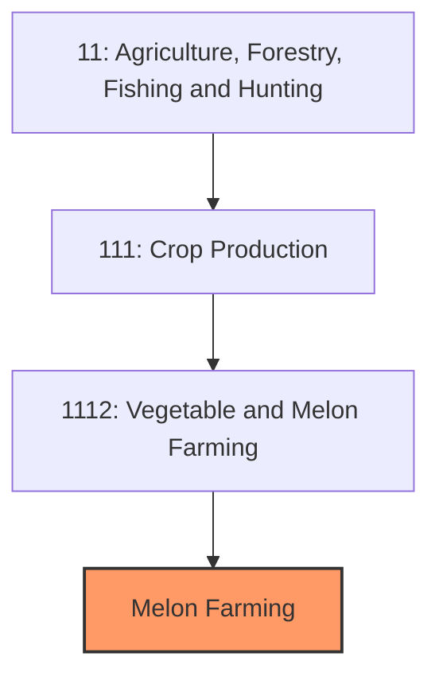
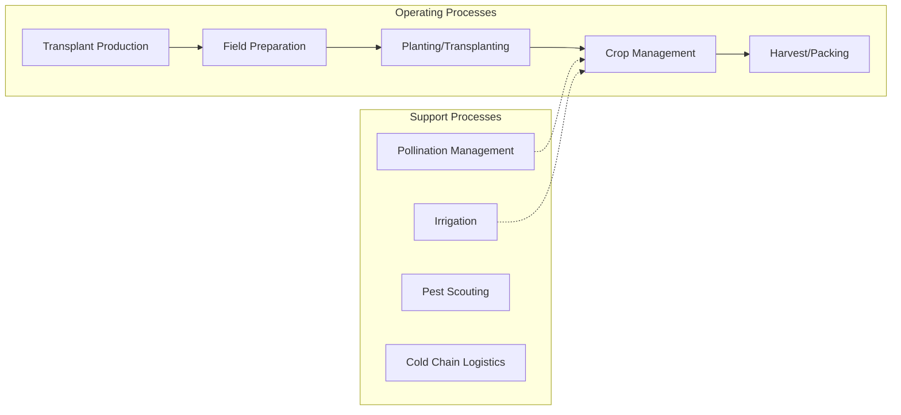

# Melon Farming

> Establishments primarily engaged in growing watermelons, cantaloupes, honeydews, and other melon varieties for fresh market and processing.

## Overview

Melon farming is a significant specialty crop sector in U.S. agriculture, producing approximately 3.5-4 billion pounds of melons annually across 150,000+ harvested acres. The industry is concentrated in warm-climate states with long growing seasons, with California, Texas, Arizona, Georgia, and Florida dominating production. Watermelons account for the largest volume, followed by cantaloupes (muskmelons), honeydews, and specialty varieties such as Crenshaw, Casaba, and Santa Claus melons.

The industry is characterized by labor-intensive hand harvesting, perishability requiring rapid movement to market, and increasing import competition from Mexico and Central America during off-season months. Melon farming has experienced significant consolidation, with larger operations dominating wholesale markets while smaller farms serve direct-to-consumer channels including farmers markets, roadside stands, and u-pick operations.

## Market Context

| Metric | Value |
|--------|-------|
| U.S. Watermelon Production | 3.6 billion lbs |
| U.S. Cantaloupe Production | 600+ million lbs |
| Total Harvested Acres | 150,000+ |
| Production Value | $700+ million |
| Leading States | California, Texas, Georgia, Florida, Arizona |

Melon consumption peaks during summer months, with significant price premiums for early-season domestic production before peak supplies arrive. The seedless watermelon market has grown significantly, now representing over 85% of watermelon sales. Imported melons from Mexico fill winter market demand, creating year-round consumer availability but limiting domestic off-season production opportunities.

## Industry Hierarchy

## Key Statistics

| Metric | Value |
|--------|-------|
| NAICS Code | 1112 |
| Level | Industry Group |
| Parent | [Crop Production](../) |
| Related Industries | Vegetable Farming, Pumpkin/Squash |

## Related Occupations

- [Farmers, Ranchers, and Other Agricultural Managers](/occupations/Management/FarmersRanchersAndOtherAgriculturalManagers) - Manage melon production and marketing
- [Farmworkers and Laborers, Crop](/occupations/FarmingFishingAndForestry/FarmworkersAndLaborersCrop) - Hand harvest melons at maturity
- [Agricultural Equipment Operators](/occupations/FarmingFishingAndForestry/AgriculturalEquipmentOperators) - Operate transplanting and cultivation equipment
- [Agricultural Inspectors](/occupations/FarmingFishingAndForestry/AgriculturalInspectors) - Conduct food safety audits and grading
- [First-Line Supervisors of Farming Workers](/occupations/FarmingFishingAndForestry/FirstLineSupervisorsOfFarmingFishingAndForestryWorkers) - Supervise harvest crews
- [Graders and Sorters, Agricultural Products](/occupations/FarmingFishingAndForestry/GradersAndSortersAgriculturalProducts) - Grade melons by size and quality

## Core Business Processes

### Planting Operations
Establishing melon crops for optimal production timing.

**Key Activities:**
- Transplant production in greenhouses (4-6 week lead time)
- Soil preparation and plastic mulch installation
- Drip irrigation tape installation under mulch
- Transplanting or direct seeding timing for market windows
- Variety selection (seeded vs. seedless watermelon, cantaloupe types)

### Crop Management
Managing crop development through maturity.

**Key Activities:**
- Pollinator (bee) placement for fruit set (1-2 hives/acre)
- Fertigation through drip irrigation systems
- Vine training and runner management
- Disease management (powdery mildew, downy mildew, fusarium)
- Pest control (aphids, cucumber beetles, spider mites)

### Harvest Operations
Hand harvesting and rapid movement to market.

**Key Activities:**
- Maturity assessment (netting, ground spot, tendril dry-down)
- Hand harvesting into field bins
- Field packing or transport to packing shed
- Hydrocooling or forced-air cooling
- Quality grading and sizing
- Palletizing and loading for shipment

## Industry Value Chain

## Melon Types and Markets

### Watermelons
Largest melon category with seedless varieties dominating retail. Mini watermelons (personal-size) growing in popularity. Peak season May-September with steady retail demand.

### Cantaloupes (Muskmelons)
Eastern-type (netted) cantaloupes for domestic markets. Higher per-unit value than watermelon. Subject to strict food safety requirements after listeria outbreaks.

### Honeydew Melons
Smooth-skinned winter melons with longer shelf life. California dominates production. Popular in foodservice and fruit salad markets.

### Specialty Melons
Crenshaw, Casaba, Canary, Galia, and heirloom varieties serve premium and ethnic markets. Higher value but limited volume.

## Regulatory Environment

- **FDA Food Safety Modernization Act (FSMA)** - Produce Safety Rule requirements
- **USDA Agricultural Marketing Service** - Voluntary grading standards
- **EPA** - Pesticide registration and maximum residue limits
- **State Departments of Agriculture** - Phytosanitary requirements and inspections
- **LGMA/Harmonized GAPs** - Buyer-required food safety certifications

### Key Programs and Regulations
- Produce Safety Rule compliance (Subpart E - Agricultural Water)
- Traceability requirements (one step forward, one step back)
- Cantaloupe-specific food safety guidance (industry response to outbreaks)
- Water quality testing requirements
- Worker safety standards (EPA WPS, OSHA)

## Technology & Innovation

- **Grafted Transplants** - Disease resistance and improved yield for cucurbits
- **Reflective Mulches** - Pest management through visual disruption
- **Precision Irrigation** - Soil moisture sensors and automated fertigation
- **Machine Vision Grading** - Automated quality assessment and sizing
- **Seedless Variety Development** - Improved triploid watermelon genetics
- **Pollinator Optimization** - Managed bumble bee and honeybee programs

## Regional Characteristics

### California (San Joaquin Valley, Imperial Valley)
Largest cantaloupe producer; year-round production capability; advanced irrigation; export capability to Canada and Pacific Rim.

### Texas (South Texas, Panhandle)
Major watermelon producer; early-season market focus; cooperative marketing organizations; increasing cantaloupe production.

### Georgia/Florida
Significant watermelon volume; summer production window; proximity to Eastern Seaboard population centers.

### Arizona (Yuma)
Winter and early spring cantaloupe production; desert production overlapping with Mexico imports; high water efficiency focus.

### Mid-Atlantic/Northeast
Local market production for roadside and farmers market sales; shorter season; premium pricing for local produce.

## Industry Challenges

- **Food Safety Risks** - Cantaloupe-associated outbreaks create ongoing liability concerns
- **Labor Availability** - Hand harvest requires reliable seasonal labor force
- **Import Competition** - Mexican melons compete during shoulder seasons
- **Weather Variability** - Frost, rain, and extreme heat affect quality and yield
- **Perishability** - Short shelf life requires rapid cold chain execution
- **Water Access** - Irrigation water availability and cost in Western production

## Industry Outlook

Melon farming faces both opportunities and challenges in the coming years. Consumer demand for convenient, healthy produce supports market growth, particularly for mini and personal-sized melons. However, food safety requirements continue increasing compliance costs, especially for cantaloupe producers. Labor availability remains the industry's most critical challenge, driving interest in mechanization research though hand harvest remains necessary for quality reasons. Import competition from Mexico is intensifying, particularly during shoulder seasons, pushing domestic production toward peak summer windows and local/regional markets. Climate adaptation through heat-tolerant varieties and water-efficient irrigation is increasingly important in major production regions. Direct-to-consumer marketing offers higher margins for smaller operations, while wholesale market consolidation favors larger, multi-season shippers with strong food safety programs and retail relationships.

---

*Source: NAICS 1112 - Vegetable and Melon Farming*
