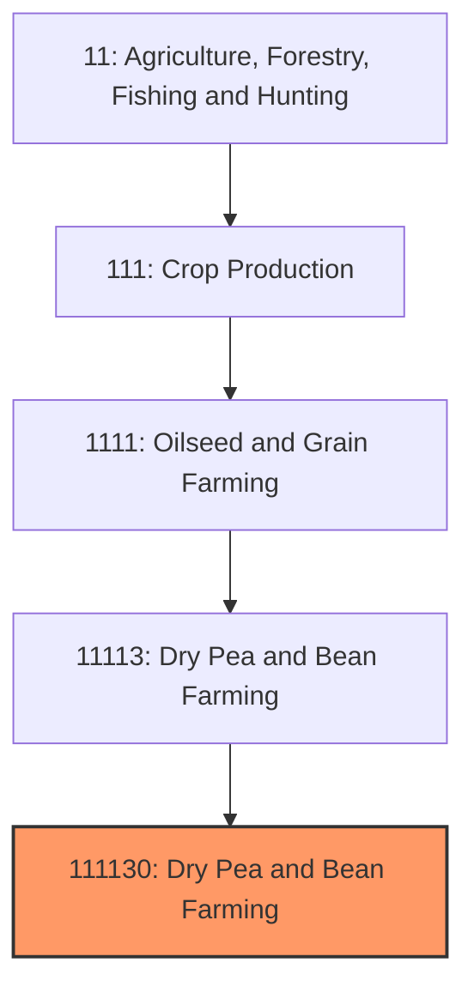
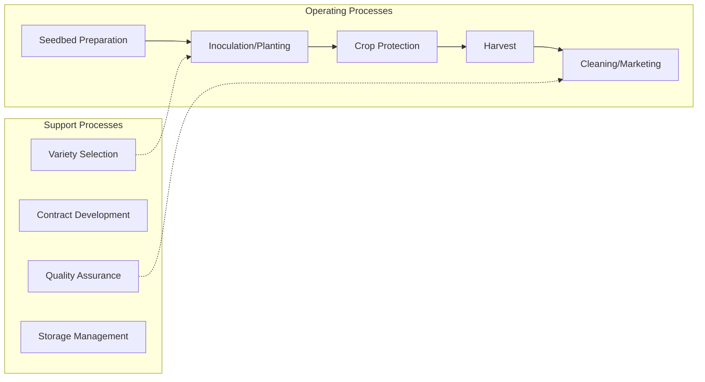

# Dry Pea and Lentil Farming

> Establishments primarily engaged in growing dry peas, lentils, and related pulse crops for food, feed, protein extraction, and seed markets.

## Overview

Dry pea and lentil farming has emerged as one of the fastest-growing segments of U.S. crop production, driven by expanding demand for plant-based proteins and the agronomic benefits of pulse crops in sustainable farming rotations. The United States has become the world's third-largest dry pea producer and a significant lentil producer, with combined production exceeding 70 million hundredweight annually. These nitrogen-fixing legumes provide soil health benefits while producing high-protein crops for human food and animal feed markets.

Production is concentrated in the Northern Great Plains and Pacific Northwest, where short growing seasons and limited precipitation favor these drought-tolerant crops. North Dakota leads national production, followed by Montana, Washington, and Idaho. The industry has grown substantially since 2010 as processors invested in pea protein extraction facilities and export markets expanded to South Asia and the Middle East.

## Market Context

| Metric | Value |
|--------|-------|
| U.S. Dry Pea Production | 50+ million cwt |
| U.S. Lentil Production | 10-15 million cwt |
| Planted Acres | 3+ million combined |
| Cash Receipts | $800+ million |
| Pea Protein Market Value | $500+ million |

The pea protein industry has transformed market dynamics, with processors extracting protein isolates for meat alternatives, protein supplements, and food ingredients. This creates premium pricing opportunities for food-grade peas beyond traditional split pea and export markets.

## Industry Hierarchy

## Key Statistics

| Metric | Value |
|--------|-------|
| NAICS Code | 111130 |
| Level | National Industry |
| Parent | [Dry Pea and Bean Farming](../) |
| Child Industries | 0 |

## Related Occupations

- [Farmers, Ranchers, and Other Agricultural Managers](/occupations/Management/FarmersRanchersAndOtherAgriculturalManagers) - Manage pulse crop production operations
- [Agricultural Equipment Operators](/occupations/FarmingFishingAndForestry/AgriculturalEquipmentOperators) - Operate planting and harvesting equipment
- [Agricultural Technicians](/occupations/Science/AgriculturalTechnicians) - Conduct soil testing and crop scouting
- [Food Scientists](/occupations/Science/FoodScientistsAndTechnologists) - Develop pea protein applications
- [Agricultural Inspectors](/occupations/FarmingFishingAndForestry/AgriculturalInspectors) - Grade pulses for quality
- [Plant Scientists](/occupations/Science/AgriculturalAndFoodScientists) - Develop improved varieties

## Core Business Processes

### Planting and Establishment
Seeding dry peas and lentils during early spring for fall harvest.

**Key Activities:**
- Seed inoculation with Rhizobium leguminosarum
- Air drill seeding at 1.5-2.5 inch depth
- Seeding rates (150-350 lbs/acre depending on crop and market)
- Row spacing optimization (6-12 inch rows)
- Pre-emergence herbicide application

### Growing Season Management
Crop protection during the relatively short growing season.

**Key Activities:**
- Post-emergence weed control (limited herbicide options)
- Disease monitoring (Ascochyta blight, root rots)
- Aphid and weevil scouting
- Fungicide applications if needed
- Crop staging assessment for harvest timing

### Harvest Operations
Combining mature crops while preserving quality.

**Key Activities:**
- Swathing vs. direct combining decisions
- Desiccation timing for direct harvest
- Combine adjustments to minimize splits and damage
- Moisture management (14% target)
- Segregation by variety and quality

## Industry Value Chain

## Crop Types

### Yellow Peas
Dominant variety for protein extraction; neutral flavor profile; used in split peas, protein isolates, and animal feed.

### Green Peas
Premium pricing for human food markets; split peas for soup; whole peas for canning and dry pack.

### Red Lentils
Dehulled and split for quick cooking; major export to South Asia; used in dals and soups.

### Green Lentils
French-style and Laird varieties; hold shape when cooked; premium pricing for salads and prepared foods.

## Regulatory Environment

- **USDA Farm Service Agency** - Commodity programs and loan rates
- **USDA Risk Management Agency** - Crop insurance for pulse crops
- **EPA** - Pesticide registration and use regulations
- **FDA** - Food safety standards for human consumption
- **Export Certification Services** - Phytosanitary requirements for export

### Key Programs and Regulations
- Agricultural Marketing Service grade standards
- Crop insurance (Yield Protection, Revenue Protection)
- Conservation program eligibility for rotation benefits
- Food safety compliance for protein ingredients
- Organic certification requirements

## Technology & Innovation

- **Pea Protein Extraction** - Wet and dry fractionation for protein isolates (80%+ protein)
- **Variety Development** - High-protein, disease-resistant, and specialty varieties
- **Precision Agriculture** - GPS-guided seeding and variable-rate application
- **Direct Harvest Technology** - Desiccation and combine modifications for direct cutting
- **Air Classification** - Separation of protein, starch, and fiber fractions
- **Nitrogen Fixation Enhancement** - Improved inoculant technologies

## Market Segments

### Pea Protein Industry
Rapidly growing segment extracting protein concentrates and isolates for meat alternatives, sports nutrition, and food fortification.

### Human Food (Traditional)
Split peas for soup, whole peas for canning, lentils for direct consumption and prepared foods.

### Export Markets
Significant shipments to India (yellow peas), Bangladesh, Turkey, and Middle Eastern markets for traditional cuisines.

### Animal Feed
Lower grades and splits used in swine and poultry rations as protein source.

## Industry Challenges

- **Disease Pressure** - Ascochyta blight, Aphanomyces root rot limiting consistent yields
- **Limited Herbicide Options** - Difficulty controlling weeds in-season
- **Price Volatility** - Smaller market with significant price swings
- **Infrastructure** - Processing capacity constraints for protein extraction
- **Export Competition** - Canada as dominant competitor in global markets
- **Quality Variability** - Weather impacts on protein content and splits

## Industry Outlook

The dry pea and lentil industry is positioned for continued growth driven by the plant-based protein revolution. Investment in pea protein extraction capacity has created new premium markets beyond traditional food uses. The crops' nitrogen-fixing ability aligns with sustainability goals and reduces input costs in rotation systems. Challenges include developing disease-resistant varieties, particularly for Aphanomyces root rot, and expanding herbicide-tolerant options for better weed management. Export competitiveness with Canada depends on logistics and quality consistency. The industry benefits from growing consumer demand for plant-based proteins and recognition of pulses' environmental benefits. Long-term success requires continued investment in processing infrastructure, variety improvement, and market development for pea protein applications.

---

*Source: NAICS 111130 - Dry Pea and Bean Farming*
