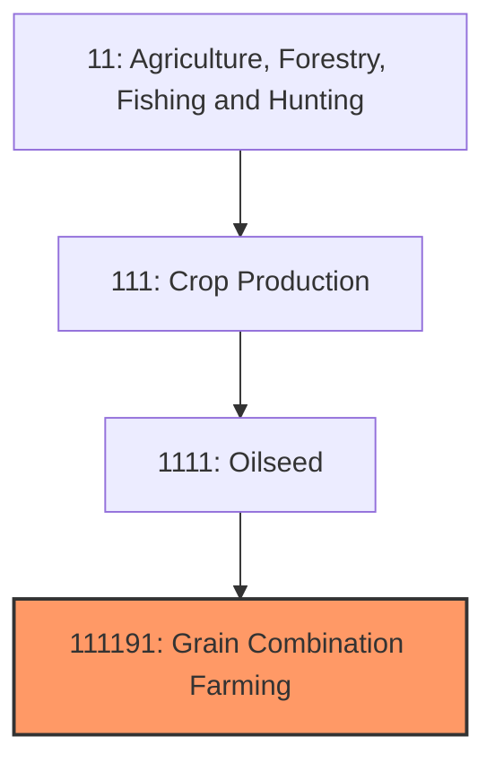
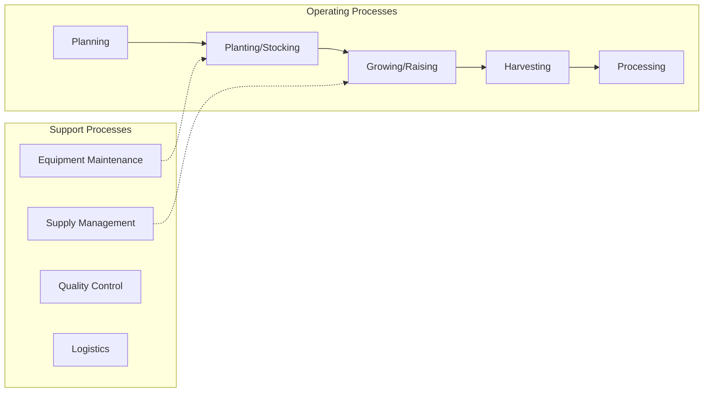

# Grain Combination Farming

> This U.

## Overview

Grain Combination Farming represents a specialized segment within the Agriculture, Forestry, Fishing and Hunting sector (NAICS 11).

This U.S. industry comprises establishments engaged in growing a combination of oilseed(s) and grain(s) with no one oilseed (or family of oilseeds) or grain (or family of grains) accounting for one-half of the establishment's agricultural production (value of crops for market). These establishments may produce oilseed(s) and grain(s) seeds and/or grow oilseed(s) and grain(s). Cross-References.

## Industry Hierarchy

## Key Statistics

| Metric | Value |
|--------|-------|
| NAICS Code | 111191 |
| Level | National Industry |
| Child Industries | 0 |

## Related Occupations

See the [occupations directory](/occupations) for roles commonly found in this industry.

## Core Business Processes

## Industry Value Chain

```mermaid
graph LR
    subgraph Inputs["Inputs"]
        I1["Seeds/Stock"]
        I2["Equipment"]
        I3["Fertilizers"]
        I4["Labor"]
    end

    subgraph Primary["Primary Activities"]
        A1["Inbound Logistics"]
        A2["Core Operations"]
        A3["Quality Assurance"]
        A4["Outbound/Delivery"]
    end

    subgraph Outputs["Products/Services"]
        O1["Crops"]
        O2["Livestock"]
        O3["Raw Materials"]
    end

    subgraph Customers["Markets"]
        C1["Processors"]
        C2["Distributors"]
        C3["Retailers"]
        C4["Export Markets"]
    end

    Inputs --> Primary --> Outputs --> Customers
```

---

*Source: NAICS 111191 - Grain Combination Farming*
