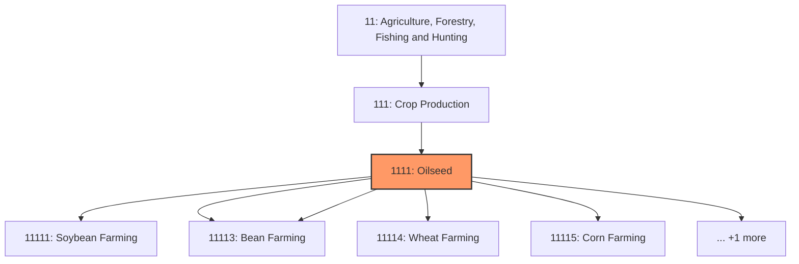
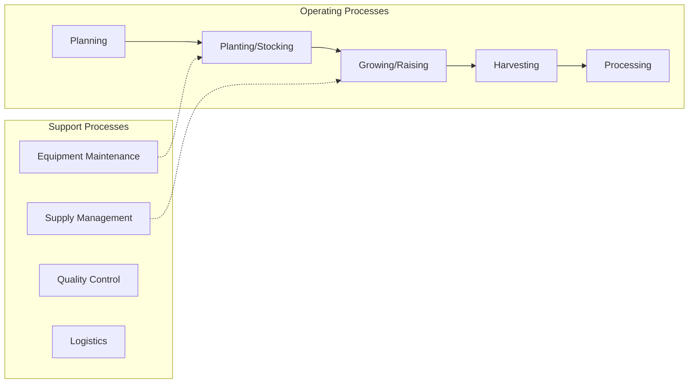

# Oilseed

> This industry group comprises establishments primarily engaged in (1) growing oilseed and/or grain crops and/or (2) producing oilseed and grain seeds.

## Overview

Oilseed represents an important category within the Agriculture, Forestry, Fishing and Hunting sector (NAICS 11).

This industry group comprises establishments primarily engaged in (1) growing oilseed and/or grain crops and/or (2) producing oilseed and grain seeds. These crops have an annual life cycle and are typically grown in open fields.

## Industry Hierarchy

## Key Statistics

| Metric | Value |
|--------|-------|
| NAICS Code | 1111 |
| Level | Industry Group |
| Parent | [Crop Production](../) |
| Child Industries | 6 |

## Sub-Industries

| Industry | Code | Description |
|----------|------|-------------|
| [Soybean Farming](./SoybeanFarming/) | 11111 | See industry description for 111110 |
| [Dry Pea](./DryPea/) | 11113 | See industry description for 111130 |
| [Bean Farming](./BeanFarming/) | 11113 | See industry description for 111130 |
| [Wheat Farming](./WheatFarming/) | 11114 | See industry description for 111140 |
| [Corn Farming](./CornFarming/) | 11115 | See industry description for 111150 |
| [Rice Farming](./RiceFarming/) | 11116 | See industry description for 111160 |

## Related Occupations

See the [occupations directory](/occupations) for roles commonly found in this industry.

## Core Business Processes

## Industry Value Chain

```mermaid
graph LR
    subgraph Inputs["Inputs"]
        I1["Seeds/Stock"]
        I2["Equipment"]
        I3["Fertilizers"]
        I4["Labor"]
    end

    subgraph Primary["Primary Activities"]
        A1["Inbound Logistics"]
        A2["Core Operations"]
        A3["Quality Assurance"]
        A4["Outbound/Delivery"]
    end

    subgraph Outputs["Products/Services"]
        O1["Crops"]
        O2["Livestock"]
        O3["Raw Materials"]
    end

    subgraph Customers["Markets"]
        C1["Processors"]
        C2["Distributors"]
        C3["Retailers"]
        C4["Export Markets"]
    end

    Inputs --> Primary --> Outputs --> Customers
```

## Market Context

Agricultural production forms the foundation of the food supply chain, with increasing emphasis on sustainable practices, precision farming, and technology adoption.

| Aspect | Details |
|--------|---------|
| Industry Sector | Agriculture |
| NAICS/SIC Code | 1111 |
| Market Segment | Oilseed |

## Key Business Processes

- Planting and cultivation
- Harvesting and processing
- Quality control and grading
- Storage and distribution
- Marketing and sales

## Common Occupations

- [Agricultural Managers](/occupations/Management/FarmersRanchersAndOtherAgriculturalManagers)
- [Agricultural Workers](/occupations/Agriculture/AgriculturalWorkers)
- [Agricultural Equipment Operators](/occupations/Agriculture/AgriculturalEquipmentOperators)
- [Agricultural Inspectors](/occupations/Agriculture/AgriculturalInspectors)

## Regulations and Standards

- USDA Food Safety and Inspection Service (FSIS)
- EPA Agricultural Regulations
- State Department of Agriculture requirements
- Food Safety Modernization Act (FSMA)
- Worker Protection Standard (WPS)

## Technology and Tools

- Precision agriculture and GPS guidance
- Automated irrigation systems
- Farm management software
- Crop monitoring drones
- Livestock tracking systems

## Industry Trends

- Digital transformation and automation adoption
- Sustainability and environmental compliance focus
- Workforce development and skills training
- Supply chain resilience and optimization
- Customer experience enhancement

---

*Source: NAICS 1111 - Oilseed*
