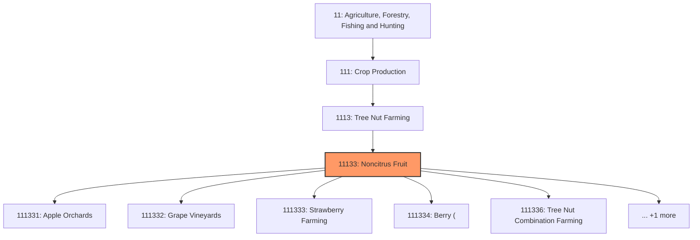
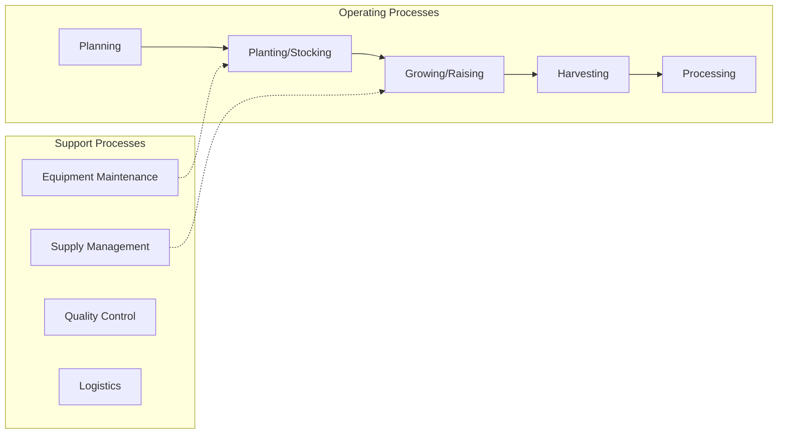

# Noncitrus Fruit

> This industry comprises establishments primarily engaged in one or more of the following: (1) growing noncitrus fruits (e.

## Overview

Noncitrus Fruit represents an important category within the Agriculture, Forestry, Fishing and Hunting sector (NAICS 11). This industry encompasses establishments primarily engaged in noncitrus fruit.

This industry comprises establishments primarily engaged in one or more of the following: (1) growing noncitrus fruits (e.g., apples, grapes, berries, peaches); (2) growing tree nuts (e.g., pecans, almonds, pistachios); or (3) growing a combination of fruit(s) and tree nut(s) with no one fruit (or family of fruit) or family of tree nuts accounting for one-half of the establishment's agricultural production (i.e., value of crops for market). Cross-References. Establishments primarily engaged in--

## Industry Hierarchy

## Key Statistics

| Metric | Value |
|--------|-------|
| NAICS Code | 11133 |
| Level | Industry |
| Parent | [Tree Nut Farming](../) |
| Child Industries | 6 |

## Sub-Industries

| Industry | Code | Description |
|----------|------|-------------|
| [Apple Orchards](./AppleOrchards.mdx) | 111331 | This U |
| [Grape Vineyards](./GrapeVineyards.mdx) | 111332 | This U |
| [Strawberry Farming](./StrawberryFarming.mdx) | 111333 | This U |
| [Berry (](./Berry.mdx) | 111334 | This U |
| [Tree Nut Combination Farming](./TreeNutCombinationFarming.mdx) | 111336 | This U |
| [Noncitrus Fruit Farming](./NoncitrusFruitFarming.mdx) | 111339 | This U |

## Core Business Processes

## Industry Value Chain

```mermaid
graph LR
    subgraph Inputs["Inputs"]
        I1["Seeds/Stock"]
        I2["Equipment"]
        I3["Fertilizers"]
        I4["Labor"]
    end

    subgraph Primary["Primary Activities"]
        A1["Inbound Logistics"]
        A2["Core Operations"]
        A3["Quality Assurance"]
        A4["Outbound/Delivery"]
    end

    subgraph Outputs["Products/Services"]
        O1["Crops"]
        O2["Livestock"]
        O3["Raw Materials"]
    end

    subgraph Customers["Markets"]
        C1["Processors"]
        C2["Distributors"]
        C3["Retailers"]
        C4["Export Markets"]
    end

    Inputs --> Primary --> Outputs --> Customers
```

---

*Source: NAICS 11133 - Noncitrus Fruit*
