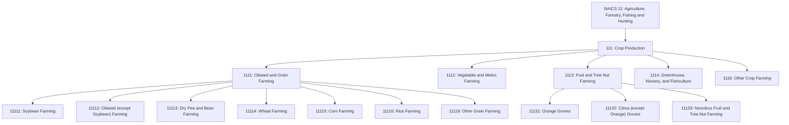

# Crop Production

> Industries in the Crop Production subsector grow crops mainly for food and fiber. The subsector comprises establishments, such as farms, orchards, groves, greenhouses, and nurseries, primarily engaged in growing crops, plants, vines, or trees and their seeds.

## Overview

Crop Production represents the foundational subsector of American agriculture, encompassing a wide range of establishments engaged in growing plants for food, fiber, and other uses. The industries in this subsector are grouped by similarity of production activity, including biological and physiological characteristics, economic requirements, length of growing season, degree of crop rotation, extent of input specialization, labor requirements, and capital demands.

The production process is typically completed when the raw product or commodity grown reaches the "farm gate" for market - the point of first sale or price determination. Establishments are classified in this subsector when crop production accounts for one-half or more of total agricultural production.

## Industry Hierarchy

## Key Statistics

| Metric | Value |
|--------|-------|
| NAICS Code | 111 |
| Level | Subsector |
| Parent Sector | [Agriculture, Forestry, Fishing and Hunting](../) |
| Industry Groups | 5 |
| Industries | 10+ |
| National Industries | 20+ |

## Sub-Industries

| Industry Group | Code | Description |
|----------------|------|-------------|
| Oilseed and Grain Farming | 1111 | Growing oilseed and grain crops with annual life cycles in open fields |
| Vegetable and Melon Farming | 1112 | Growing vegetables and melons for fresh and processed markets |
| Fruit and Tree Nut Farming | 1113 | Growing perennial fruit and tree nut crops |
| Greenhouse, Nursery, and Floriculture | 1114 | Growing crops under protective cover and nursery operations |
| Other Crop Farming | 1119 | Tobacco, cotton, sugarcane, hay, and specialty crops |

## Related Occupations

- [Farmers, Ranchers, and Other Agricultural Managers](/occupations/Management/FarmersRanchersAndOtherAgriculturalManagers) - Plan, direct, or coordinate farm operations
- [Agricultural Workers](/occupations/Agriculture/AgriculturalWorkers) - Crop cultivation and harvesting
- [First-Line Supervisors of Farming Workers](/occupations/Agriculture/FirstLineSupervisorsOfFarmingFishingAndForestryWorkers) - Supervise farm labor
- [Farm Equipment Mechanics](/occupations/FarmEquipmentMechanics) - Maintain and repair agricultural equipment
- [Agricultural Inspectors](/occupations/Agriculture/AgriculturalInspectors) - Inspect agricultural products and operations

## Core Business Processes

```mermaid
flowchart LR
    subgraph Planning["Production Planning"]
        P1["Crop Selection"]
        P2["Resource Planning"]
        P3["Schedule Development"]
    end

    subgraph Preparation["Land Preparation"]
        L1["Soil Testing"]
        L2["Tillage"]
        L3["Fertilization"]
    end

    subgraph Growing["Growing Operations"]
        G1["Planting"]
        G2["Irrigation"]
        G3["Pest Management"]
        G4["Crop Monitoring"]
    end

    subgraph Harvest["Harvest & Post-Harvest"]
        H1["Harvesting"]
        H2["Grading/Sorting"]
        H3["Storage"]
        H4["Transport to Market"]
    end

    Planning --> Preparation --> Growing --> Harvest
```

### Production Planning

Developing comprehensive plans for the growing season based on market demand, soil conditions, weather patterns, and resource availability.

**Key Activities:**
- Analyze market conditions and commodity prices
- Select appropriate crop varieties
- Plan crop rotation schedules
- Secure seeds, fertilizers, and other inputs
- Arrange financing and insurance

### Field Operations

Managing day-to-day cultivation activities throughout the growing season.

**Key Activities:**
- Prepare fields and seedbeds
- Plant crops using appropriate techniques
- Apply irrigation and nutrients
- Monitor crop health and pest pressure
- Implement integrated pest management

### Harvest Operations

Collecting mature crops and preparing them for market or storage.

**Key Activities:**
- Determine optimal harvest timing
- Operate harvesting equipment
- Transport crops from field
- Grade and sort products
- Manage post-harvest storage

## Industry Value Chain

## Regulatory Environment

Crop production operations are subject to extensive federal, state, and local regulations:

- **USDA Programs**: Commodity programs, crop insurance, conservation compliance
- **EPA Regulations**: Pesticide registration and use, water quality standards, Clean Water Act compliance
- **FDA Requirements**: Food safety standards for produce under FSMA
- **State Agriculture Departments**: Seed certification, pest quarantines, marketing orders
- **Labor Regulations**: H-2A visa program, worker safety (OSHA), wage and hour laws

Key compliance areas include:
- Pesticide applicator licensing
- Worker Protection Standard (WPS)
- Food safety plans (for covered produce)
- Nutrient management plans
- Endangered species protections

## Technology & Innovation

The crop production industry is undergoing significant technological transformation:

- **Precision Agriculture**: GPS-guided tractors and planters, variable rate application technology, yield mapping and monitoring
- **Digital Farming**: Farm management software, satellite and drone imagery, IoT sensors for soil and weather monitoring
- **Biotechnology**: Genetically modified crops, CRISPR gene editing, enhanced seed traits for yield and resistance
- **Automation**: Autonomous tractors, robotic weeding systems, automated irrigation
- **Data Analytics**: Predictive yield modeling, machine learning for pest detection, market price forecasting
- **Sustainable Practices**: Cover cropping, no-till farming, integrated pest management, carbon sequestration programs

## Related Industries

- [Animal Production](../AnimalProduction/) - Livestock operations often integrated with crop farming
- [Support Activities for Agriculture](../AgriculturalSupport/) - Contract services for crop production
- [Food Manufacturing](/industries/Manufacturing/FoodManufacturing/) - Primary customers for crop products

---

*Source: NAICS 111 - Crop Production*
