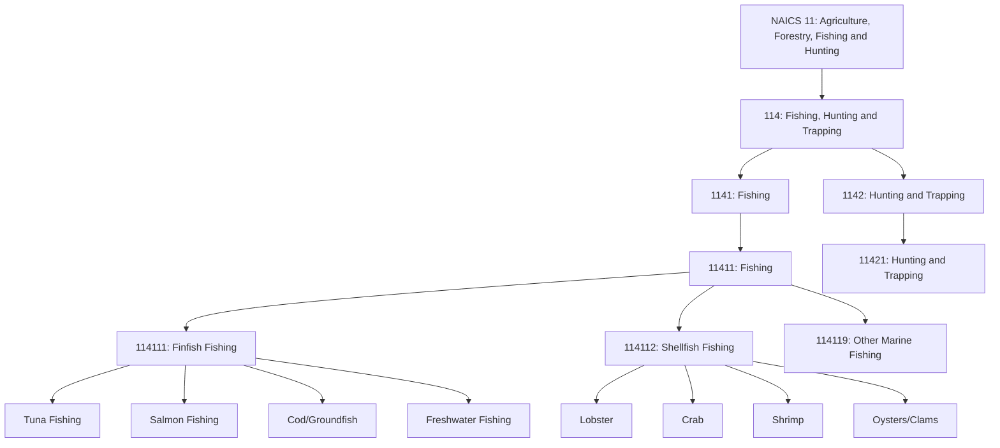

# Fishing, Hunting and Trapping

> Industries in the Fishing, Hunting and Trapping subsector harvest fish and other wild animals from their natural habitats and are dependent upon a continued supply of the natural resource.

## Overview

The Fishing, Hunting and Trapping subsector encompasses establishments engaged in harvesting fish, shellfish, and other wild animals from their natural habitats. Unlike aquaculture or animal production, these industries depend on wild populations and natural resources, requiring sustainable harvest practices to maintain long-term viability.

This subsector includes commercial fishing operations that harvest finfish, shellfish, and other marine animals for sale, as well as commercial hunting and trapping operations. The establishments in this subsector operate in marine, freshwater, and terrestrial environments, using various methods and equipment suited to their target species and operating conditions.

## Industry Hierarchy

## Key Statistics

| Metric | Value |
|--------|-------|
| NAICS Code | 114 |
| Level | Subsector |
| Parent Sector | [Agriculture, Forestry, Fishing and Hunting](../) |
| Industry Groups | 2 |
| Industries | 2 |
| National Industries | 4 |

## Sub-Industries

| Industry Group | Code | Description |
|----------------|------|-------------|
| Fishing | 1141 | Commercial catching or taking of finfish, shellfish, and other marine animals |
| Hunting and Trapping | 1142 | Commercial hunting and trapping of wild animals |

## Fishing Methods

| Method | Description | Target Species |
|--------|-------------|----------------|
| Trawling | Dragging nets through the water | Groundfish, shrimp |
| Longlining | Setting long lines with baited hooks | Tuna, swordfish, halibut |
| Purse Seining | Encircling schools with nets | Tuna, sardines, anchovies |
| Gillnetting | Setting nets that entangle fish | Salmon, herring |
| Pot/Trap Fishing | Setting baited traps | Crab, lobster |
| Dredging | Dragging collection devices on bottom | Scallops, oysters |

## Related Occupations

- [Fishers and Related Fishing Workers](/occupations/FishersAndRelatedFishingWorkers) - Catch and gather fish and other aquatic life
- [Captains, Mates, and Pilots of Water Vessels](/occupations/Transportation/CaptainsMatesAndPilotsOfWaterVessels) - Command and navigate fishing vessels
- [Fish and Game Wardens](/occupations/PublicSafety/FishAndGameWardens) - Enforce fishing and hunting regulations
- [Hunters and Trappers](/occupations/HuntersAndTrappers) - Harvest wild game and fur-bearing animals
- [Deckhands and Fishing Vessel Operators](/occupations/DeckhandsAndFishingVesselOperators) - Operate equipment on fishing vessels

## Core Business Processes

```mermaid
flowchart LR
    subgraph Planning["Trip Planning"]
        P1["Market Assessment"]
        P2["Permit/License Check"]
        P3["Weather Analysis"]
        P4["Gear Preparation"]
    end

    subgraph Harvest["Harvest Operations"]
        H1["Transit to Grounds"]
        H2["Setting Gear"]
        H3["Harvesting"]
        H4["Onboard Processing"]
    end

    subgraph Landing["Landing Operations"]
        L1["Return to Port"]
        L2["Offloading"]
        L3["Grading/Sorting"]
        L4["Documentation"]
    end

    subgraph Market["Marketing"]
        M1["Sales/Auction"]
        M2["Distribution"]
        M3["Settlement"]
    end

    Planning --> Harvest --> Landing --> Market
```

### Trip Planning

Preparing for fishing or hunting operations based on market conditions and resource availability.

**Key Activities:**
- Assess market demand and pricing
- Verify permits, licenses, and quota allocations
- Analyze weather and ocean conditions
- Prepare and maintain gear and equipment
- Provision vessel with supplies and fuel

### Harvest Operations

Conducting fishing or hunting activities in compliance with regulations.

**Key Activities:**
- Navigate to productive fishing grounds or hunting areas
- Deploy fishing gear or hunting equipment
- Monitor catch composition and size
- Process and preserve catch onboard
- Maintain catch records and logbooks

### Landing and Sales

Bringing catch to market and completing required documentation.

**Key Activities:**
- Transport catch to landing facilities
- Offload and weigh catch
- Grade and sort products by species and quality
- Complete landing reports and quota accounting
- Negotiate sales or participate in auctions

## Industry Value Chain

```mermaid
graph LR
    subgraph Inputs["Inputs"]
        I1["Vessels"]
        I2["Gear/Equipment"]
        I3["Permits/Quota"]
        I4["Fuel/Supplies"]
        I5["Labor"]
    end

    subgraph Primary["Primary Activities"]
        A1["Locating Resources"]
        A2["Harvesting"]
        A3["Onboard Handling"]
        A4["Landing"]
    end

    subgraph Outputs["Products"]
        O1["Fresh Fish"]
        O2["Frozen Fish"]
        O3["Shellfish"]
        O4["Bycatch Products"]
        O5["Furs/Pelts"]
    end

    subgraph Customers["Markets"]
        C1["Seafood Processors"]
        C2["Fresh Markets"]
        C3["Restaurants"]
        C4["Export Markets"]
        C5["Fur Buyers"]
    end

    Inputs --> Primary --> Outputs --> Customers
```

## Regulatory Environment

Fishing and hunting operations are subject to comprehensive regulation to ensure resource sustainability:

- **NOAA Fisheries (NMFS)**: Federal fishery management, catch limits, marine mammal protection
- **U.S. Coast Guard**: Vessel safety, documentation, crew licensing
- **Regional Fishery Management Councils**: Regional fishery management plans, quotas, seasons
- **U.S. Fish and Wildlife Service**: Migratory bird and wildlife regulations
- **State Agencies**: State waters management, licensing, enforcement

Key compliance areas include:
- Fishing permits and licenses
- Catch quotas and allocations
- Gear restrictions and closed areas
- Observer and monitoring requirements
- Vessel safety and inspection
- Protected species avoidance

## Technology & Innovation

The fishing and hunting industries are adopting new technologies for efficiency and sustainability:

- **Vessel Technology**: Electronic monitoring systems, vessel monitoring systems (VMS), fuel-efficient hull designs
- **Fish Finding**: Advanced sonar and fish finders, satellite ocean data, sea surface temperature mapping
- **Gear Technology**: Bycatch reduction devices, selective fishing gear, biodegradable materials
- **Catch Handling**: Onboard refrigeration and freezing, quality preservation systems, automated sorting
- **Safety Systems**: Emergency position indicating radio beacons (EPIRB), personal locator beacons, man-overboard systems
- **Data Management**: Electronic logbooks, catch reporting apps, traceability systems

## Sustainability Considerations

The long-term viability of this subsector depends on sustainable resource management:

- **Stock Assessments**: Scientific evaluation of fish populations
- **Catch Limits**: Quotas set to prevent overfishing
- **Marine Protected Areas**: Closures to protect spawning and juvenile habitat
- **Ecosystem-Based Management**: Considering broader ecosystem impacts
- **Certification Programs**: Marine Stewardship Council (MSC), responsible fisheries certification

## Related Industries

- [Aquaculture](../Aquaculture/) - Farm-raised alternative to wild-caught products
- [Support Activities for Agriculture](../AgriculturalSupport/) - Services supporting fishing operations
- [Food Manufacturing](/industries/Manufacturing/FoodManufacturing/) - Seafood processing
- [Water Transportation](/industries/Transportation/WaterTransportation/) - Maritime logistics

---

*Source: NAICS 114 - Fishing, Hunting and Trapping*
