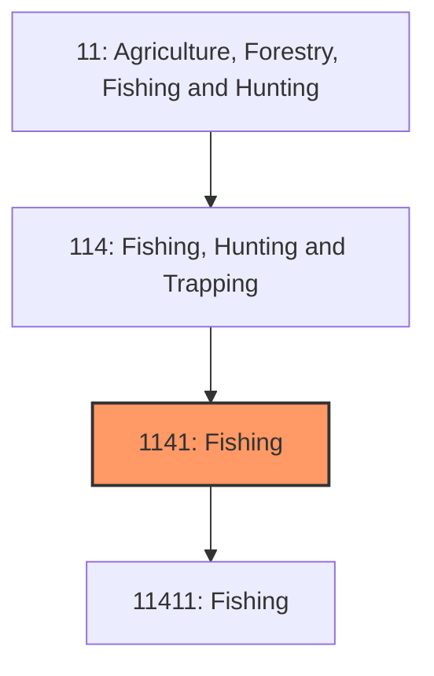
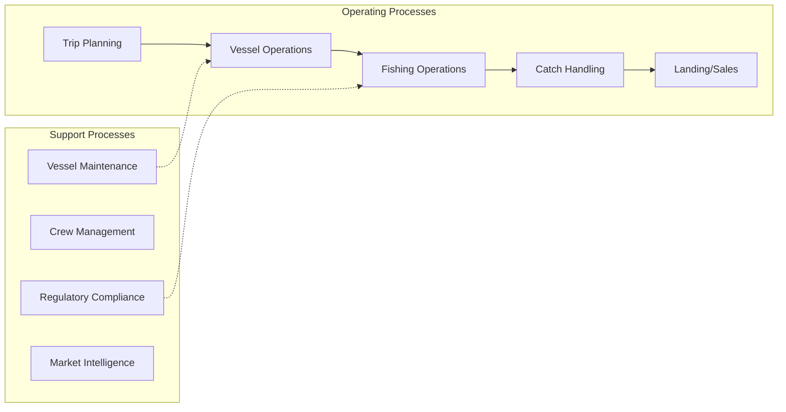

# Commercial Fishing

> Establishments primarily engaged in the commercial catching or taking of finfish, shellfish, and other marine animals from their natural habitats for sale.

## Overview

Commercial fishing encompasses the harvest of wild fish, shellfish, and other aquatic organisms from oceans, estuaries, and freshwater bodies for commercial sale. The United States maintains one of the world's largest Exclusive Economic Zones (EEZ), providing access to diverse fisheries across the Atlantic, Pacific, Gulf of Mexico, and Alaskan waters. U.S. commercial fisheries land approximately 9-10 billion pounds of seafood annually, valued at over $6 billion at the dock level, supporting coastal communities and seafood supply chains nationwide.

The industry operates across diverse fisheries and vessel types, from small day-boats fishing nearshore waters to large factory trawlers processing catches at sea in remote Alaskan fisheries. Major fisheries include Alaska pollock (the largest U.S. fishery by volume), Gulf shrimp, Atlantic sea scallops, Pacific salmon, lobster, crab, and tuna. The industry is highly regulated through science-based fishery management plans designed to maintain sustainable harvest levels while supporting fishing communities.

## Market Context

| Metric | Value |
|--------|-------|
| U.S. Commercial Landings | 9-10 billion lbs annually |
| Dockside Value | $6+ billion |
| Number of Fishing Vessels | ~75,000 |
| Top Ports by Value | New Bedford, Dutch Harbor, Kodiak |
| Import Dependency | ~90% of U.S. seafood consumed is imported |

Despite significant domestic production, the U.S. imports approximately 90% of seafood consumed due to consumer preference for species not abundant domestically (shrimp, salmon) and lower processing costs abroad.

## Industry Hierarchy

## Key Statistics

| Metric | Value |
|--------|-------|
| NAICS Code | 1141 |
| Level | Industry Group |
| Parent | [Fishing, Hunting and Trapping](../) |
| Child Industries | 114111 (Finfish), 114112 (Shellfish) |

## Related Occupations

- [Fishing Boat Captains](/occupations/TransportationAndMaterialMoving/CaptainsAndMates) - Navigate vessels and direct fishing operations
- [Fishers and Related Fishing Workers](/occupations/FarmingFishingAndForestry/FishersAndRelatedFishingWorkers) - Operate fishing gear and handle catch
- [Fish Cutters and Trimmers](/occupations/Production/ButchersAndMeatCutters) - Process catch on vessels and shore
- [Marine Engineers](/occupations/Architecture/MarineEngineersAndNavalArchitects) - Maintain vessel propulsion systems
- [Fish and Game Wardens](/occupations/ProtectiveService/FishAndGameWardens) - Enforce fishing regulations
- [Environmental Scientists](/occupations/Science/EnvironmentalScientists) - Conduct fishery assessments

## Core Business Processes

### Trip Planning
Preparing for fishing trips including quota allocation, crew, and supplies.

**Key Activities:**
- Quota/permit verification
- Crew assembly and safety briefings
- Fuel, ice, and provision loading
- Weather assessment
- Target species and location selection

### Fishing Operations
Deploying gear and harvesting target species.

**Key Activities:**
- Navigation to fishing grounds
- Gear deployment (nets, lines, traps, dredges)
- Gear retrieval and catch sorting
- Bycatch handling and release
- Observer protocol compliance

### Catch Handling and Sales
Preserving quality and marketing harvested seafood.

**Key Activities:**
- On-board icing, refrigeration, or processing
- Species identification and grading
- Landing reporting and documentation
- Auction or direct sales
- Settlement with crew (share system)

## Industry Value Chain

```mermaid
graph LR
    subgraph Inputs["Inputs"]
        I1["Vessels"]
        I2["Permits/Quota"]
        I3["Gear/Equipment"]
        I4["Fuel/Supplies"]
    end

    subgraph Primary["Primary Activities"]
        A1["Harvesting"]
        A2["Handling"]
        A3["Landing"]
        A4["First Sale"]
    end

    subgraph Outputs["Products"]
        O1["Finfish"]
        O2["Shellfish"]
        O3["Other Species"]
    end

    subgraph Markets["End Markets"]
        C1["Processors"]
        C2["Distributors"]
        C3["Auctions"]
        C4["Direct to Restaurant"]
    end

    Inputs --> Primary --> Outputs --> Markets
```

## Major Fisheries

### Alaska Pollock
Largest U.S. fishery by volume (~3 billion lbs); midwater trawling; processed into surimi, fillets, and fish meal; highly managed with 100% observer coverage.

### Gulf of Mexico Shrimp
Major fishery by value; trawling for brown, white, and pink shrimp; facing import competition; supporting fleet of ~3,000 vessels.

### Atlantic Sea Scallops
Most valuable U.S. fishery; dredge harvesting; managed with days-at-sea and rotational closures; New Bedford primary port.

### Alaska Salmon
Gillnet, seine, and troll fisheries; five species (sockeye, pink, chum, Chinook, coho); wild-caught premium positioning.

### American Lobster
Trap fishery in Maine and New England; premium live market; gear conflicts with whale protection.

## Regulatory Environment

- **NOAA Fisheries** - Manages fisheries in federal waters through regional councils
- **Regional Fishery Management Councils** - Develop fishery management plans
- **U.S. Coast Guard** - Vessel safety and enforcement
- **State Agencies** - Manage fisheries in state waters (0-3 miles)
- **Marine Mammal Protection Act** - Requires measures to protect marine mammals

### Key Regulations
- Magnuson-Stevens Fishery Conservation Act
- Individual Fishing Quotas (IFQs) and catch shares
- Vessel monitoring systems (VMS) requirements
- Observer program requirements
- Endangered Species Act protections

## Technology & Innovation

- **Vessel Monitoring Systems (VMS)** - Satellite tracking of vessel positions
- **Electronic Monitoring** - Cameras replacing or supplementing human observers
- **Electronic Reporting** - Real-time catch reporting via tablets
- **Gear Technology** - Bycatch reduction devices, LED lights, escapement panels
- **Fish Finding Technology** - Advanced sonar and fish finders
- **Refrigeration Systems** - Improved on-board preservation

## Fishing Methods

### Trawling
Dragging nets through water or along bottom; high volume for groundfish and shrimp.

### Longlining
Deploying miles of line with baited hooks; used for tuna, swordfish, halibut.

### Gillnetting
Stationary nets that entangle fish; used for salmon and coastal species.

### Pot/Trap
Baited enclosures on bottom; used for crab, lobster, and some fish.

### Dredging
Dragging metal frames along bottom; used for scallops and clams.

## Industry Challenges

- **Fishery Sustainability** - Balancing harvest with stock conservation
- **Regulatory Burden** - Complex, costly compliance requirements
- **Fuel Costs** - Volatile fuel prices affecting profitability
- **Labor Shortages** - Difficulty attracting workers to demanding occupation
- **Import Competition** - Lower-cost foreign products
- **Climate Impacts** - Shifting species distributions and productivity

## Industry Outlook

Commercial fishing faces fundamental challenges from climate-driven changes in fish distribution and abundance, requiring adaptive management approaches. Catch share management has improved sustainability in many fisheries while creating economic challenges for smaller operations. Technology adoption, particularly electronic monitoring, promises to reduce compliance costs while improving data collection. Market opportunities exist in traceability and sustainability certification meeting consumer demand for responsibly-sourced seafood. The industry's future depends on maintaining sustainable fish populations through science-based management, adapting to climate impacts, and connecting domestic fishermen with consumers seeking local, traceable seafood. Efforts to streamline regulations while maintaining conservation goals could improve viability for fishing businesses and coastal communities dependent on the industry.

---

*Source: NAICS 1141 - Fishing*
