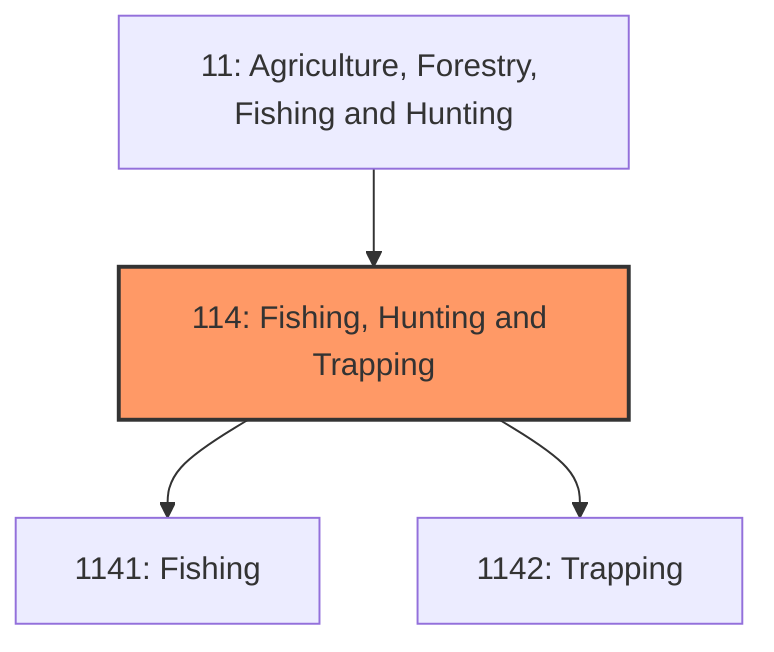
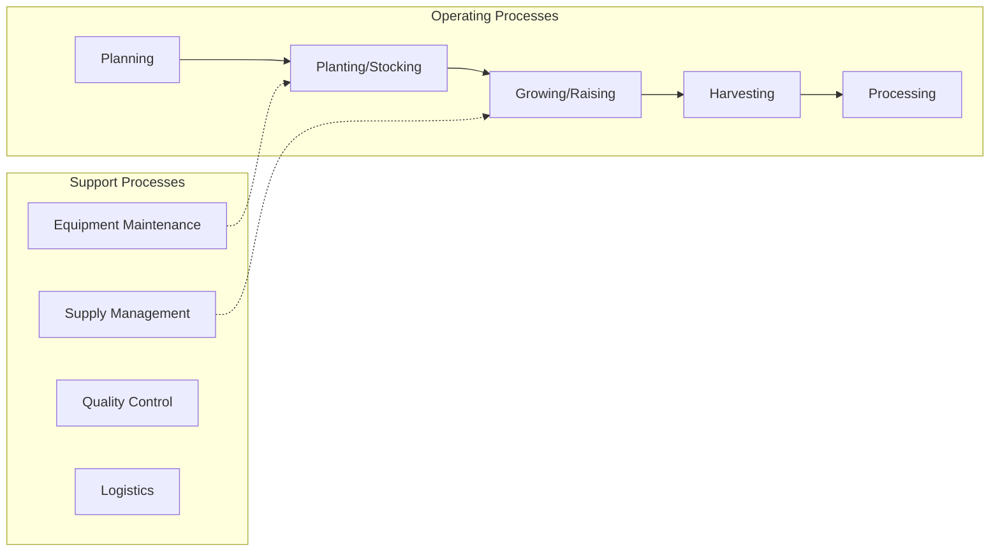

# Fishing, Hunting and Trapping

> Industries in the Fishing, Hunting and Trapping subsector harvest fish and other wild animals from their natural habitats and are dependent upon a continued supply of the natural resource.

## Overview

Fishing, Hunting and Trapping represents an important category within the Agriculture, Forestry, Fishing and Hunting sector (NAICS 11). This subsector encompasses establishments primarily engaged in fishing, hunting and trapping.

Industries in the Fishing, Hunting and Trapping subsector harvest fish and other wild animals from their natural habitats and are dependent upon a continued supply of the natural resource. The harvesting of fish is the predominant economic activity of this subsector and it usually requires specialized vessels that, by the nature of their size, configuration and equipment, are not suitable for any other type of production, such as transportation. Hunting and trapping activities utilize a wide variety of production processes and are classified in the same subsector as fishing because the availability of resources and the constraints imposed, such as conservation requirements and proper habitat maintenance, are similar.

## Industry Hierarchy

## Key Statistics

| Metric | Value |
|--------|-------|
| NAICS Code | 114 |
| Level | Subsector |
| Parent | [Agriculture, Fishing and Hunting](../) |
| Child Industries | 2 |

## Sub-Industries

| Industry | Code | Description |
|----------|------|-------------|
| [Fishing](./Fishing/) | 1141 | Fishing |
| [Trapping](./Trapping/) | 1142 | Trapping |

## Core Business Processes

## Industry Value Chain

```mermaid
graph LR
    subgraph Inputs["Inputs"]
        I1["Seeds/Stock"]
        I2["Equipment"]
        I3["Fertilizers"]
        I4["Labor"]
    end

    subgraph Primary["Primary Activities"]
        A1["Inbound Logistics"]
        A2["Core Operations"]
        A3["Quality Assurance"]
        A4["Outbound/Delivery"]
    end

    subgraph Outputs["Products/Services"]
        O1["Crops"]
        O2["Livestock"]
        O3["Raw Materials"]
    end

    subgraph Customers["Markets"]
        C1["Processors"]
        C2["Distributors"]
        C3["Retailers"]
        C4["Export Markets"]
    end

    Inputs --> Primary --> Outputs --> Customers
```

---

*Source: NAICS 114 - Fishing, Hunting and Trapping*
