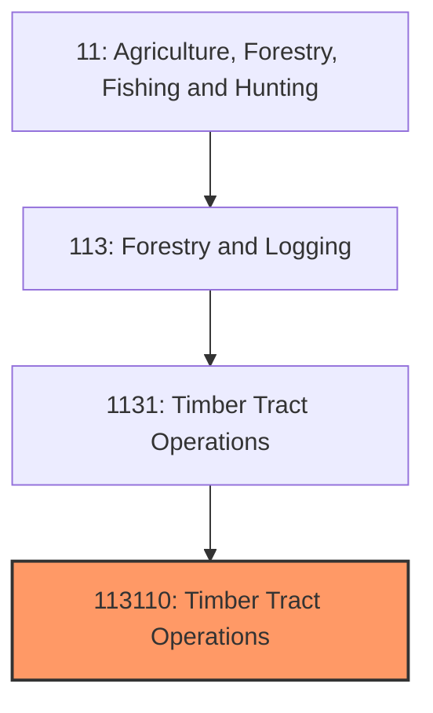
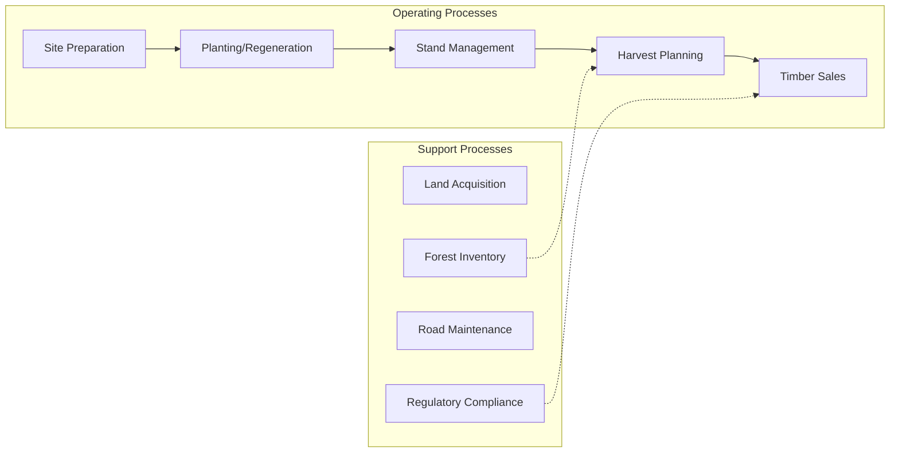

# Timber Tract Operations

> Establishments primarily engaged in the operation of timber tracts for the purpose of growing and harvesting timber on a long production cycle.

## Overview

Timber tract operations encompass the ownership, management, and harvesting of forestland for commercial timber production. This industry includes timberland investment management organizations (TIMOs), real estate investment trusts (REITs), industrial forest owners, and private landowners managing forests for periodic timber harvests. Unlike logging operations that provide harvesting services, timber tract operators own or lease the land and standing timber, managing it over long rotation periods (20-80+ years depending on species and region).

The United States contains approximately 765 million acres of forestland, with about 450 million acres considered timberland capable of producing commercial timber. Private ownership (including families, corporations, and institutional investors) accounts for approximately 58% of U.S. timberland. The Southeast dominates commercial timber production due to favorable growing conditions and established plantation forestry, while the Pacific Northwest produces high-value softwoods from both plantations and managed natural forests.

## Market Context

| Metric | Value |
|--------|-------|
| U.S. Timberland Area | ~450 million acres |
| Annual Timber Harvest | ~16 billion cubic feet |
| Stumpage Value | $10-15 billion annually |
| Private Ownership | ~58% of timberland |
| Institutional Investment | $60+ billion in TIMO/REIT portfolios |

Institutional ownership of timberland has grown substantially since the 1980s as forest products companies divested land holdings and pension funds sought alternative investments with inflation-hedging characteristics and uncorrelated returns.

## Industry Hierarchy

## Key Statistics

| Metric | Value |
|--------|-------|
| NAICS Code | 113110 |
| Level | National Industry |
| Parent | [Timber Tract Operations](../) |
| Child Industries | 0 |

## Related Occupations

- [Forest and Conservation Workers](/occupations/FarmingFishingAndForestry/ForestAndConservationWorkers) - Plant and tend trees, maintain forest health
- [Conservation Scientists](/occupations/Science/ConservationScientistsAndForesters) - Develop forest management plans
- [Foresters](/occupations/Science/ConservationScientistsAndForesters) - Manage timber resources and harvesting
- [Financial Analysts](/occupations/Business/FinancialAnalysts) - Analyze timberland investments
- [Real Estate Appraisers](/occupations/Business/AppraisersAndAssessorsOfRealEstate) - Value timberland properties
- [Environmental Scientists](/occupations/Science/EnvironmentalScientists) - Assess environmental impacts

## Core Business Processes

### Site Preparation and Planting
Preparing harvested or acquired land for new forest establishment.

**Key Activities:**
- Harvesting residue management (burn, chip, or leave)
- Mechanical site preparation
- Seedling selection and sourcing
- Planting operations (hand or machine)
- First-year survival assessment

### Stand Management
Managing growing forests to optimize timber value and forest health.

**Key Activities:**
- Pre-commercial thinning
- Commercial thinning harvests
- Fertilization applications
- Prescribed burning for understory management
- Pest and disease monitoring

### Timber Sales and Harvesting
Marketing standing timber and managing harvest operations.

**Key Activities:**
- Forest inventory and cruise
- Timber sale design and layout
- Bid solicitation or negotiated sales
- Harvest contract administration
- Post-harvest assessment

## Industry Value Chain

```mermaid
graph LR
    subgraph Inputs["Inputs"]
        I1["Land/Capital"]
        I2["Seedlings"]
        I3["Management Services"]
        I4["Equipment"]
    end

    subgraph Primary["Primary Activities"]
        A1["Establishment"]
        A2["Growing"]
        A3["Harvesting"]
        A4["Sale"]
    end

    subgraph Outputs["Products"]
        O1["Sawtimber"]
        O2["Pulpwood"]
        O3["Biomass"]
        O4["Carbon Credits"]
    end

    subgraph Markets["End Markets"]
        C1["Sawmills"]
        C2["Pulp Mills"]
        C3["Energy Producers"]
        C4["Carbon Markets"]
    end

    Inputs --> Primary --> Outputs --> Markets
```

## Ownership Structures

### Timberland Investment Management Organizations (TIMOs)
Investment managers acquiring and managing timberland on behalf of institutional investors (pension funds, endowments); fee-based management.

### Timber REITs
Publicly traded real estate investment trusts holding timberland; dividend distribution requirements; examples include Weyerhaeuser, Rayonier, PotlatchDeltic.

### Industrial Owners
Forest products companies retaining timberland to supply manufacturing operations.

### Family Forest Owners
Individuals and families owning forestland, often for multiple objectives including recreation, wildlife, and timber.

## Regional Characteristics

### U.S. South
Dominant timber production region; loblolly pine plantations; 25-30 year rotations; highly productive; pulpwood and sawtimber markets.

### Pacific Northwest
Douglas fir and western softwoods; longer rotations (40-60+ years); high-value logs; significant federal timber restrictions.

### Northeast/Lake States
Northern hardwoods and softwoods; mix of natural forest and plantation; diverse product markets.

### Intermountain West
Federal land dominant; limited private timberland; wildfire risk significant.

## Regulatory Environment

- **EPA** - Clean Water Act compliance for forest roads and harvesting
- **U.S. Fish and Wildlife Service** - Endangered Species Act compliance
- **State Forestry Agencies** - Forest practice rules, harvesting permits
- **State and Local Tax Authorities** - Property tax, severance tax administration
- **Certification Bodies** - SFI, FSC, ATFS certification standards

### Key Regulations
- State forest practice acts
- Wetland and stream buffer requirements
- Threatened and endangered species protections
- Smoke management for prescribed burning
- Best management practices (BMPs) for water quality

## Technology & Innovation

- **Remote Sensing** - LiDAR and satellite imagery for inventory and planning
- **Forest Management Software** - GIS-based planning and tracking systems
- **Genetic Improvement** - Superior seedling development for growth and quality
- **Precision Forestry** - GPS-guided operations and site-specific management
- **Carbon Measurement** - Protocols for carbon credit quantification
- **Fire Management Technology** - Prescribed burn planning and wildfire risk modeling

## Investment Characteristics

### Return Components
- Biological growth (volume increase)
- Timber price appreciation
- Land value appreciation
- Operational income (hunting leases, carbon credits)

### Risk Factors
- Commodity price volatility
- Natural catastrophe (fire, wind, insects, disease)
- Regulatory changes
- Illiquidity

### Portfolio Benefits
- Low correlation with financial markets
- Inflation hedging
- Real asset diversification
- ESG/sustainability appeal

## Industry Challenges

- **Climate/Wildfire Risk** - Increasing fire severity in western forests
- **Timber Price Volatility** - Housing market cycles affecting sawtimber demand
- **Land Competition** - Conversion pressure from development and conservation
- **Regulatory Uncertainty** - Species listings and water quality requirements
- **Labor Availability** - Difficulty finding skilled forestry workers
- **Infrastructure Access** - Road construction and maintenance costs

## Industry Outlook

Timber tract operations benefit from long-term fundamentals supporting wood demand including population growth, housing needs, and emerging markets for mass timber construction. Carbon markets present significant opportunities as methodologies mature for forest carbon projects. Climate change creates both risks (wildfire, pests) and opportunities (faster growth in some regions). Institutional investment continues expanding, bringing professional management and capital to the sector. The industry increasingly emphasizes sustainable forestry certification and environmental stewardship to maintain social license and market access. Challenges include adapting management practices to changing climate conditions, balancing timber production with conservation values, and navigating evolving carbon market opportunities. Long-term investors remain attracted to the asset class for its tangible nature, inflation protection, and alignment with sustainability goals.

---

*Source: NAICS 113110 - Timber Tract Operations*
