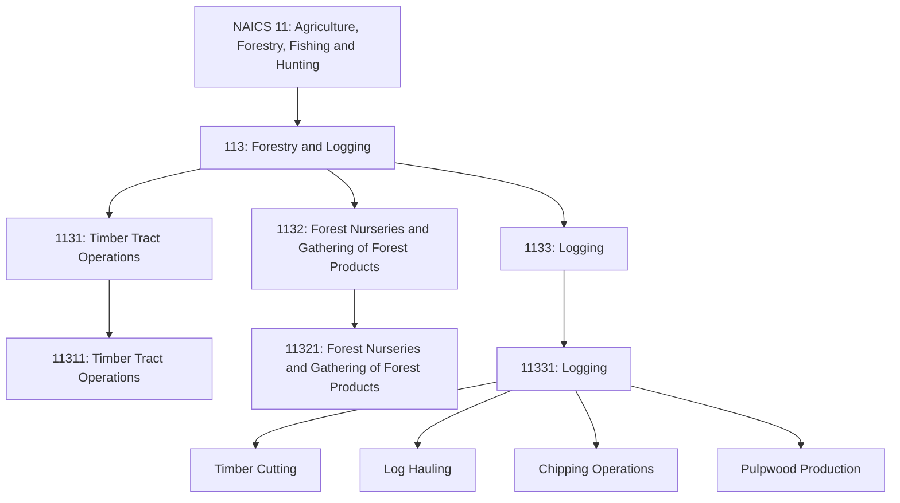
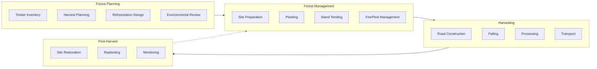

# Forestry and Logging

> Industries in the Forestry and Logging subsector grow and harvest timber on a long production cycle (i.e., of 10 years or more). Long production cycles use different production processes than short production cycle agriculture, and result in separate subsector grouping.

## Overview

The Forestry and Logging subsector encompasses establishments engaged in growing and harvesting timber on long production cycles. Unlike crop production, which typically operates on annual cycles, forestry involves multi-decade planning horizons for timber production. This subsector includes timber tract operations, forest nurseries, gathering of forest products, and logging operations.

Establishments in this subsector are typically characterized by significant capital investments in land and equipment, long-term forest management planning, and integration with sustainable forestry practices. The production cycle begins with reforestation or natural regeneration and concludes with timber harvest, often 20-80 years later depending on species and end use.

## Industry Hierarchy

## Key Statistics

| Metric | Value |
|--------|-------|
| NAICS Code | 113 |
| Level | Subsector |
| Parent Sector | [Agriculture, Forestry, Fishing and Hunting](../) |
| Industry Groups | 3 |
| Industries | 3 |
| National Industries | 3 |

## Sub-Industries

| Industry Group | Code | Description |
|----------------|------|-------------|
| Timber Tract Operations | 1131 | Growing and managing standing timber with the intent of selling standing timber |
| Forest Nurseries and Gathering of Forest Products | 1132 | Growing trees for reforestation and gathering non-timber forest products |
| Logging | 1133 | Cutting timber, producing rough round or hewn products, and transporting logs |

## Related Occupations

- [Foresters](/occupations/Foresters) - Manage forested lands for timber, conservation, and recreation
- [Forest and Conservation Workers](/occupations/ForestAndConservationWorkers) - Perform forestry labor under supervision
- [Forest and Conservation Technicians](/occupations/ForestAndConservationTechnicians) - Compile forest data and assist foresters
- [Fallers](/occupations/Fallers) - Cut down trees using chainsaws or mechanical equipment
- [Logging Equipment Operators](/occupations/LoggingEquipmentOperators) - Operate logging equipment
- [Log Graders and Scalers](/occupations/LogGradersAndScalers) - Grade and scale logs for market
- [First-Line Supervisors of Farming, Fishing, and Forestry Workers](/occupations/FirstLineSupervisorsOfFarmingFishingAndForestryWorkers) - Supervise forestry crews

## Core Business Processes

### Forest Planning and Inventory

Developing long-term management plans based on timber inventory and market analysis.

**Key Activities:**
- Conduct timber cruises and inventory assessments
- Develop harvest schedules and rotation plans
- Complete environmental impact assessments
- Secure harvesting permits and approvals
- Plan road systems and access routes

### Forest Management

Maintaining forest health and productivity throughout the growth cycle.

**Key Activities:**
- Prepare sites for planting or natural regeneration
- Plant seedlings and manage early establishment
- Conduct thinning and stand improvement operations
- Implement fire prevention and suppression measures
- Manage pests and diseases

### Logging Operations

Harvesting timber and transporting it to mills and processing facilities.

**Key Activities:**
- Construct and maintain logging roads
- Fell trees using appropriate methods
- Process logs at landing sites
- Transport logs to mills
- Manage slash and debris

## Industry Value Chain

```mermaid
graph LR
    subgraph Inputs["Inputs"]
        I1["Timberland"]
        I2["Seedlings"]
        I3["Equipment"]
        I4["Labor"]
        I5["Chemicals"]
    end

    subgraph Primary["Primary Activities"]
        A1["Forest Establishment"]
        A2["Stand Management"]
        A3["Timber Harvest"]
        A4["Log Transport"]
    end

    subgraph Outputs["Products"]
        O1["Sawlogs"]
        O2["Pulpwood"]
        O3["Veneer Logs"]
        O4["Biomass"]
        O5["Non-Timber Products"]
    end

    subgraph Customers["Markets"]
        C1["Sawmills"]
        C2["Pulp Mills"]
        C3["Plywood/Veneer"]
        C4["Biomass Energy"]
        C5["Export Markets"]
    end

    Inputs --> Primary --> Outputs --> Customers
```

## Regulatory Environment

Forestry and logging operations face extensive environmental regulation:

- **U.S. Forest Service**: Management of national forests, timber sales programs
- **EPA**: Clean Water Act compliance, wetland protection, pesticide regulations
- **Fish and Wildlife Service**: Endangered species habitat protection
- **State Forestry Agencies**: Forest practice rules, fire regulations, reforestation requirements
- **OSHA**: Logging safety standards

Key compliance areas include:
- Best Management Practices (BMPs) for water quality
- Streamside Management Zones (SMZs)
- Endangered species surveys and mitigation
- Reforestation requirements
- Logging road construction standards
- Worker safety training and equipment

## Technology & Innovation

The forestry industry continues to evolve with technological advancement:

- **Forest Inventory Technology**: LiDAR and satellite imagery for inventory, drone-based monitoring, GPS-enabled timber cruising
- **Precision Forestry**: Site-specific silviculture, GIS-based planning systems, growth and yield modeling
- **Mechanized Harvesting**: Feller-bunchers and harvesters, cut-to-length systems, forwarding and skidding equipment
- **Sustainability Practices**: Forest certification (FSC, SFI), carbon sequestration programs, climate-adapted species selection
- **Safety Improvements**: Improved PPE and cut-resistant clothing, rollover protection, remote monitoring
- **Processing Technology**: Portable sawmills, in-woods chipping, log optimization systems

## Related Industries

- [Logging](../Logging/) - Specialized timber harvesting operations
- [Support Activities for Forestry](../AgriculturalSupport/) - Contract forestry services
- [Wood Product Manufacturing](/industries/Manufacturing/WoodProductManufacturing/) - Primary wood processing
- [Paper Manufacturing](/industries/Manufacturing/PaperManufacturing/) - Pulp and paper production

---

*Source: NAICS 113 - Forestry and Logging*
