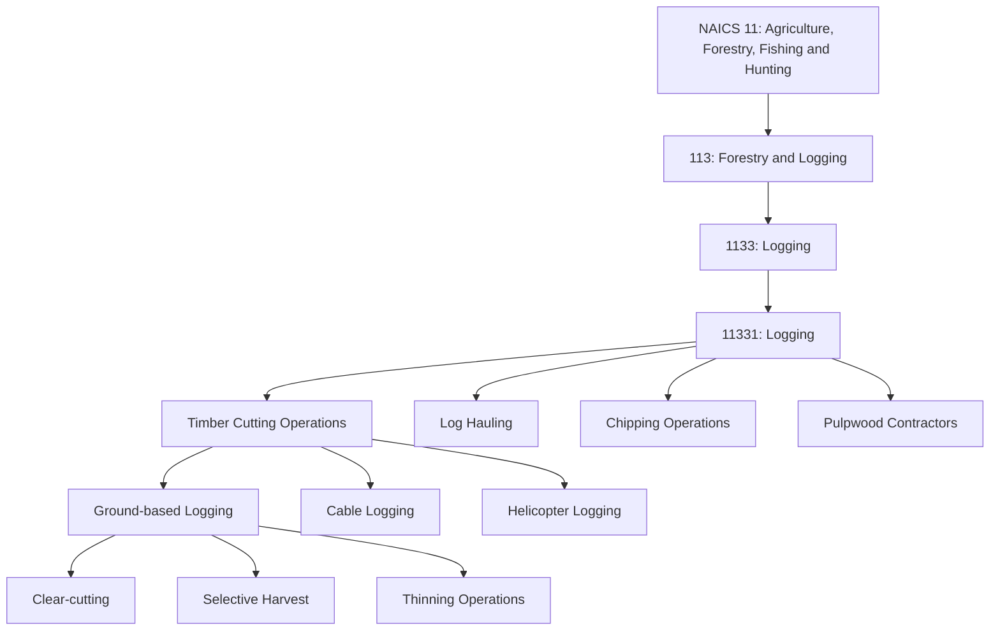

# Logging

> Industries in the Logging industry group cut timber; produce rough, round, or hewn primary wood and forest products; and transport logs and primary wood and forest products from the forest to the first processing facility.

## Overview

The Logging industry group represents the harvesting component of the forestry sector, encompassing establishments primarily engaged in cutting timber, processing it into rough products, and transporting it to mills and other processing facilities. Unlike timber tract operations that focus on growing and selling standing timber, logging operations perform the physical harvesting work.

Logging establishments may operate on their own timber tracts or on tracts owned by others, including federal, state, and private landowners. The industry includes traditional ground-based logging operations as well as specialized operations such as helicopter logging for steep terrain or sensitive areas.

## Industry Hierarchy

## Key Statistics

| Metric | Value |
|--------|-------|
| NAICS Code | 1133 |
| Level | Industry Group |
| Parent Subsector | [Forestry and Logging](../Forestry/) |
| Industries | 1 |
| National Industries | 1 |

## Logging Methods

| Method | Description | Terrain |
|--------|-------------|---------|
| Ground-based | Uses wheeled or tracked equipment on the forest floor | Gentle to moderate slopes |
| Cable | Uses steel cables to lift and transport logs | Steep terrain |
| Helicopter | Uses helicopters to extract logs | Very steep or sensitive areas |
| Cut-to-length | Processes trees at the stump into logs | Various |
| Whole-tree | Removes entire tree for processing at landing | Ground-based terrain |

## Related Occupations

- [Fallers](/occupations/Fallers) - Cut down trees using chainsaws or mechanical equipment
- [Logging Equipment Operators](/occupations/LoggingEquipmentOperators) - Operate skidders, feller-bunchers, and processors
- [Log Graders and Scalers](/occupations/LogGradersAndScalers) - Grade logs for quality and measure volume
- [Logging Workers, All Other](/occupations/LoggingWorkersAllOther) - Perform various logging support tasks
- [First-Line Supervisors of Farming, Fishing, and Forestry Workers](/occupations/FirstLineSupervisorsOfFarmingFishingAndForestryWorkers) - Supervise logging crews
- [Heavy and Tractor-Trailer Truck Drivers](/occupations/HeavyAndTractorTrailerTruckDrivers) - Haul logs to mills

## Core Business Processes

### Pre-Harvest Planning

Preparing for harvest operations through site assessment and logistics planning.

**Key Activities:**
- Assess timber sale or harvest unit boundaries
- Plan road construction and landing locations
- Determine appropriate harvest methods
- Mobilize equipment and crews
- Coordinate with landowners and regulators

### Harvest Operations

Executing the timber harvest using appropriate methods and equipment.

**Key Activities:**
- Fell trees using chainsaws or mechanical harvesters
- Remove limbs and cut logs to length
- Skid or forward logs to landing areas
- Manage operations to minimize site damage
- Maintain safety protocols

### Log Processing and Transport

Preparing harvested timber for market and delivering to buyers.

**Key Activities:**
- Sort logs by species, grade, and destination
- Scale logs for accurate volume measurement
- Load logs onto trucks using loaders
- Process residuals into chips or biomass
- Transport logs to mills and processing facilities

## Industry Value Chain

## Regulatory Environment

Logging operations are heavily regulated to protect worker safety and environmental quality:

- **OSHA**: Comprehensive logging safety standards (29 CFR 1910.266)
- **EPA**: Clean Water Act, wetland protection, spill prevention
- **State Forest Practice Acts**: Rules governing harvest methods, road construction, reforestation
- **Federal Land Agencies**: Timber sale contract requirements on federal lands
- **State Transportation**: Log truck weight and safety regulations

Key compliance areas include:
- Logging safety training and certification
- Personal protective equipment requirements
- Streamside buffer zones and water crossings
- Erosion and sediment control
- Endangered species protection
- Log truck safety and weight limits

## Technology & Innovation

Modern logging operations increasingly rely on advanced technology:

- **Mechanized Harvesting**: Single-grip harvesters, feller-bunchers, cut-to-length systems, tracked carriers for sensitive sites
- **GPS and GIS Technology**: Real-time machine tracking, harvest area mapping, production monitoring
- **Telemetry Systems**: Equipment diagnostics, fuel consumption monitoring, maintenance scheduling
- **Safety Technology**: Proximity detection systems, backup cameras, enclosed operator cabs
- **Processing Technology**: Computer-optimized bucking, scanning systems, quality sensors
- **Environmental Technology**: Low-impact equipment, biomass recovery systems, erosion control measures

## Equipment Types

| Equipment | Function | Application |
|-----------|----------|-------------|
| Feller-buncher | Cuts and accumulates multiple trees | High-volume ground-based logging |
| Harvester | Fells, delimbs, and bucks trees | Cut-to-length operations |
| Skidder | Drags logs to landing | Ground-based log extraction |
| Forwarder | Carries processed logs to landing | Cut-to-length operations |
| Loader | Loads logs onto trucks | Landing operations |
| Log Truck | Transports logs to mill | Highway transport |
| Chipper | Processes residuals into chips | Biomass recovery |

## Related Industries

- [Forestry](../Forestry/) - Timber tract management and forest nurseries
- [Support Activities for Forestry](../AgriculturalSupport/) - Contract services for forestry and logging
- [Wood Product Manufacturing](/industries/Manufacturing/WoodProductManufacturing/) - Sawmills and wood processing
- [Trucking](/industries/Transportation/TruckingTransportation/) - Log transportation services

---

*Source: NAICS 1133 - Logging*
