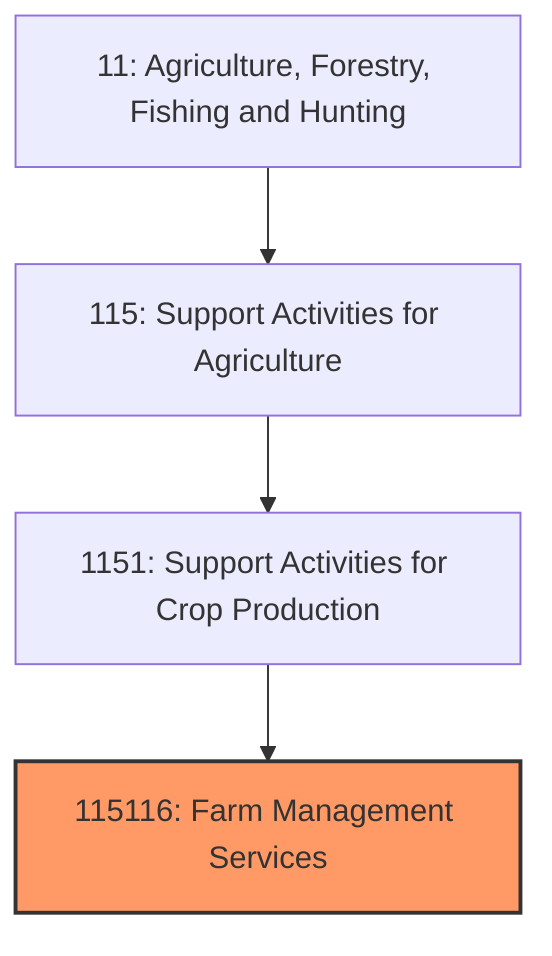
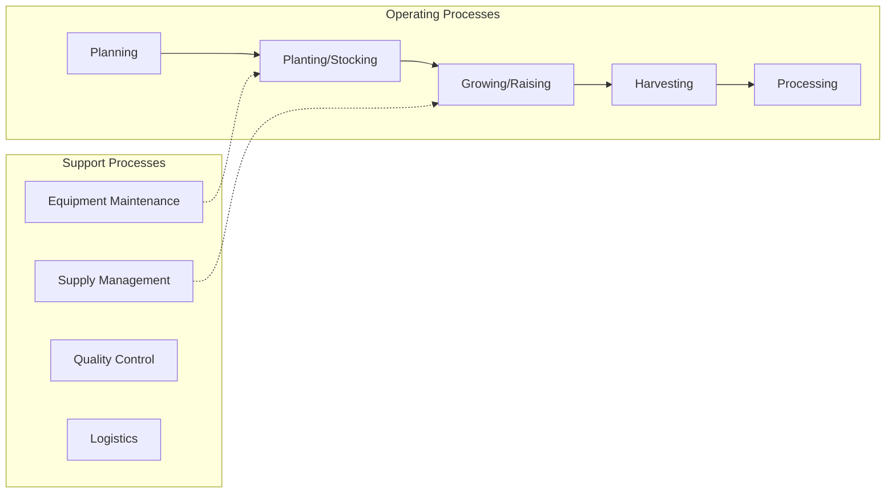

# Farm Management Services

> This U.

## Overview

Farm Management Services represents a specialized segment within the Agriculture, Forestry, Fishing and Hunting sector (NAICS 11).

This U.S. industry comprises establishments primarily engaged in providing farm management services on a contract or fee basis usually to citrus groves, orchards, or vineyards. These establishments always provide management and may arrange or contract for the partial or the complete operations of the farm establishment(s) they manage. Operational activities may include cultivating, harvesting, and/or other specialized agricultural support activities. Cross-References.

## Industry Hierarchy

## Key Statistics

| Metric | Value |
|--------|-------|
| NAICS Code | 115116 |
| Level | National Industry |
| Child Industries | 0 |

## Related Occupations

See the [occupations directory](/occupations) for roles commonly found in this industry.

## Core Business Processes

## Industry Value Chain

```mermaid
graph LR
    subgraph Inputs["Inputs"]
        I1["Seeds/Stock"]
        I2["Equipment"]
        I3["Fertilizers"]
        I4["Labor"]
    end

    subgraph Primary["Primary Activities"]
        A1["Inbound Logistics"]
        A2["Core Operations"]
        A3["Quality Assurance"]
        A4["Outbound/Delivery"]
    end

    subgraph Outputs["Products/Services"]
        O1["Crops"]
        O2["Livestock"]
        O3["Raw Materials"]
    end

    subgraph Customers["Markets"]
        C1["Processors"]
        C2["Distributors"]
        C3["Retailers"]
        C4["Export Markets"]
    end

    Inputs --> Primary --> Outputs --> Customers
```

---

*Source: NAICS 115116 - Farm Management Services*
