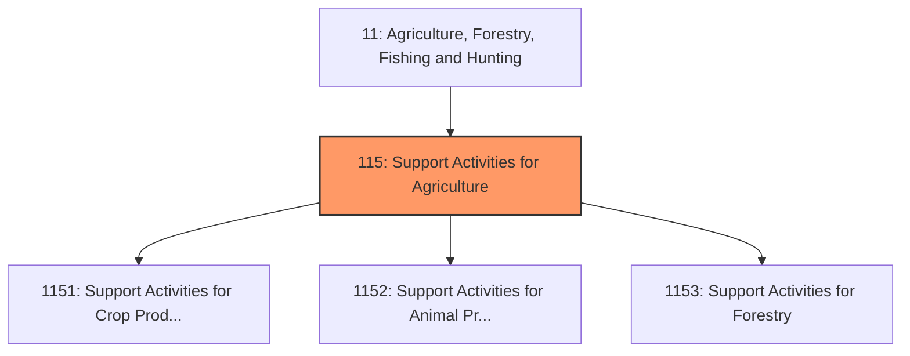
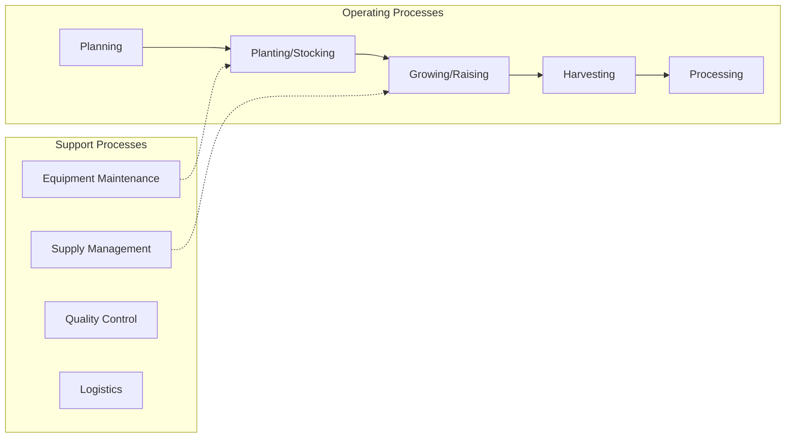

# Support Activities for Agriculture

> Industries in the Support Activities for Agriculture and Forestry subsector provide support services that are an essential part of agricultural and forestry production.

## Overview

Support Activities for Agriculture represents an important category within the Agriculture, Forestry, Fishing and Hunting sector (NAICS 11). This subsector encompasses establishments primarily engaged in support activities for agriculture.

Industries in the Support Activities for Agriculture and Forestry subsector provide support services that are an essential part of agricultural and forestry production. These support activities may be performed by the agriculture or forestry producing establishment or conducted independently as an alternative source of inputs required for the production process for a given crop, animal, or forestry industry. Establishments that primarily perform these activities independent of the agriculture or forestry producing establishment are in this subsector.

## Industry Hierarchy

## Key Statistics

| Metric | Value |
|--------|-------|
| NAICS Code | 115 |
| Level | Subsector |
| Parent | [Agriculture, Fishing and Hunting](../) |
| Child Industries | 3 |

## Sub-Industries

| Industry | Code | Description |
|----------|------|-------------|
| [Support Activities for Crop Production](./SupportActivitiesForCropProduction/) | 1151 | Support Activities for Crop Production |
| [Support Activities for Animal Production](./SupportActivitiesForAnimalProduction/) | 1152 | Support Activities for Animal Production |
| [Support Activities for Forestry](./SupportActivitiesForForestry/) | 1153 | Support Activities for Forestry |

## Core Business Processes

## Industry Value Chain

```mermaid
graph LR
    subgraph Inputs["Inputs"]
        I1["Seeds/Stock"]
        I2["Equipment"]
        I3["Fertilizers"]
        I4["Labor"]
    end

    subgraph Primary["Primary Activities"]
        A1["Inbound Logistics"]
        A2["Core Operations"]
        A3["Quality Assurance"]
        A4["Outbound/Delivery"]
    end

    subgraph Outputs["Products/Services"]
        O1["Crops"]
        O2["Livestock"]
        O3["Raw Materials"]
    end

    subgraph Customers["Markets"]
        C1["Processors"]
        C2["Distributors"]
        C3["Retailers"]
        C4["Export Markets"]
    end

    Inputs --> Primary --> Outputs --> Customers
```

---

*Source: NAICS 115 - Support Activities for Agriculture*
