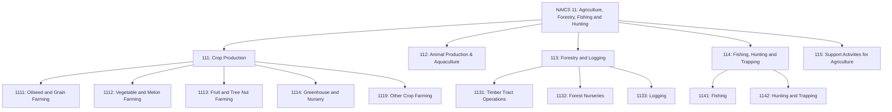
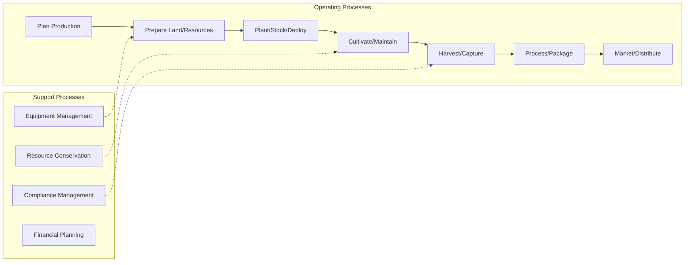
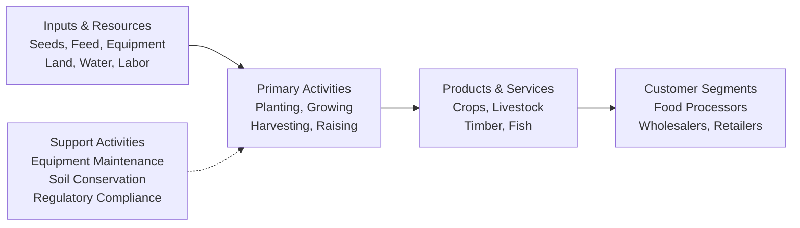

# Agriculture, Forestry, Fishing and Hunting

> The Agriculture, Forestry, Fishing and Hunting sector comprises establishments primarily engaged in growing crops, raising animals, harvesting timber, and harvesting fish and other animals from a farm, ranch, or their natural habitats.

## Overview

This sector encompasses a diverse range of establishments including farms, ranches, dairies, greenhouses, nurseries, orchards, and hatcheries. The sector distinguishes two basic activities: agricultural production (establishments performing complete farm or ranch operations) and agricultural support activities (establishments performing activities such as soil preparation, planting, harvesting, and management on a contract or fee basis).

A farm may consist of a single tract of land or multiple separate tracts held under different tenures. Operations may be run by the operator alone, with household members, hired employees, or through partnerships and corporations.

## Industry Hierarchy

## Key Statistics

| Metric | Value |
|--------|-------|
| NAICS Code | 11 |
| Level | Sector |
| Subsectors | 5 |
| Industry Groups | 19 |
| Industries | 42+ |

## Sub-Industries

| Subsector | Code | Description |
|-----------|------|-------------|
| [Crop Production](./CropProduction/) | 111 | Growing crops for food and fiber including farms, orchards, greenhouses, and nurseries |
| [Animal Production & Aquaculture](./AnimalProduction/) | 112 | Raising or fattening animals for sale or animal products, and aquaculture operations |
| [Forestry and Logging](./Forestry/) | 113 | Growing and harvesting timber on long production cycles (10+ years) |
| [Fishing, Hunting and Trapping](./FishingAndHunting/) | 114 | Harvesting fish and wild animals from natural habitats |
| [Support Activities](./AgriculturalSupport/) | 115 | Essential support services for agricultural and forestry production |

## Related Occupations

- [Farmers, Ranchers, and Agricultural Managers](/occupations/FarmersRanchersAndAgriculturalManagers) - Farm operations management
- [Agricultural Workers](/occupations/Agriculture/AgriculturalWorkers) - Crop and livestock production
- [Forest and Conservation Workers](/occupations/Agriculture/ForestAndConservationWorkers) - Timber and forestry operations
- [Fishing and Hunting Workers](/occupations/Agriculture/FishingAndHuntingWorkers) - Commercial fishing and game management
- [Agricultural Equipment Operators](/occupations/Agriculture/AgriculturalEquipmentOperators) - Farm machinery operation

## Core Business Processes

### Production Planning

Developing seasonal and long-term production plans based on market demand, weather patterns, and resource availability. This includes crop rotation planning, livestock breeding schedules, and timber harvest cycles.

**Key Activities:**
- Analyze market conditions and pricing trends
- Plan resource allocation and labor requirements
- Coordinate with suppliers and buyers
- Manage seasonal timing and cycles

### Harvest and Post-Harvest Operations

Managing the collection, initial processing, and preparation of agricultural products for market.

**Key Activities:**
- Coordinate harvest timing for optimal quality
- Operate specialized harvesting equipment
- Manage initial processing and grading
- Arrange storage and transportation

## Industry Value Chain

## Regulatory Environment

This sector is subject to extensive federal and state regulations including:

- **USDA Regulations**: Agricultural standards, inspection requirements, and subsidy programs
- **EPA Requirements**: Pesticide use, water quality, and environmental protection
- **Fish and Wildlife Service**: Hunting and fishing licenses, endangered species protection
- **State Agricultural Departments**: Local production standards and marketing orders

Agricultural research establishments and government conservation program administration are classified in other sectors (54171 and 92412 respectively).

## Technology & Innovation

The sector is experiencing significant technological transformation:

- **Precision Agriculture**: GPS-guided equipment, drone monitoring, and satellite imagery for optimized resource application
- **Automation**: Robotic harvesters, automated feeding systems, and smart irrigation
- **Biotechnology**: Improved crop varieties, sustainable pest management, and enhanced livestock genetics
- **Data Analytics**: Predictive modeling for weather, market prices, and yield optimization
- **Sustainable Practices**: Organic farming, regenerative agriculture, and carbon sequestration

---

*Source: NAICS 11 - Agriculture, Forestry, Fishing and Hunting*
