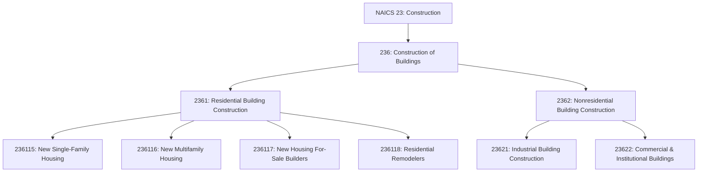
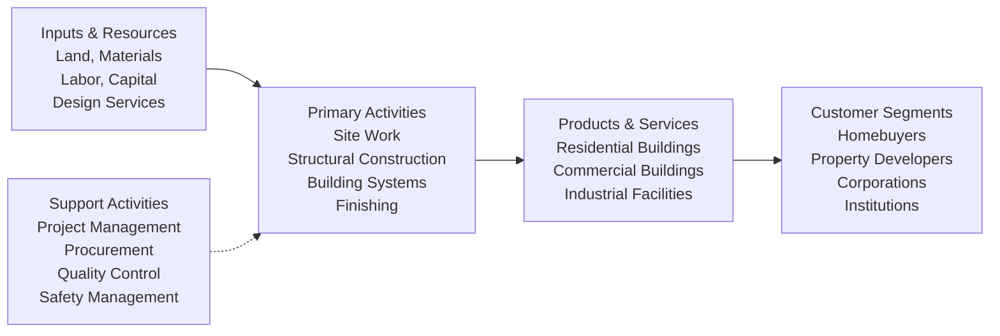

# Construction of Buildings

> The Construction of Buildings subsector comprises establishments primarily responsible for the construction of buildings. The work performed may include new work, additions, alterations, or maintenance and repairs. The on-site assembly of precut, panelized, and prefabricated buildings and construction of temporary buildings are included in this subsector.

## Overview

The Construction of Buildings subsector (NAICS 236) encompasses establishments primarily responsible for constructing residential and nonresidential buildings. This includes general contractors, for-sale builders, design-build firms, and construction management firms. The work performed may include new construction, additions, alterations, or maintenance and repairs.

Part or all of the production work for which establishments in this subsector have responsibility may be subcontracted to other construction establishments, usually specialty trade contractors. Establishments are classified based on the types of buildings they construct, reflecting variations in the requirements of underlying production processes.

## Industry Hierarchy

## Key Statistics

| Metric | Value |
|--------|-------|
| NAICS Code | 236 |
| Level | Subsector |
| Parent Sector | [Construction](../) (23) |
| Industry Groups | 2 |
| National Industries | 6 |

## Sub-Industries

| Industry | Code | Description |
|----------|------|-------------|
| Residential Building Construction | 2361 | Construction of single-family homes, multifamily housing, for-sale builders, and residential remodelers |
| Nonresidential Building Construction | 2362 | Construction of industrial, commercial, and institutional buildings |

### Residential Building Construction (2361)

| Industry | Code | Description |
|----------|------|-------------|
| New Single-Family Housing Construction | 236115 | General contractors for single-family detached houses and townhouses |
| New Multifamily Housing Construction | 236116 | General contractors for apartments, condos, and high-rise residential |
| New Housing For-Sale Builders | 236117 | Merchant builders constructing homes on owned/controlled land |
| Residential Remodelers | 236118 | Remodeling, additions, alterations, and repairs to residential buildings |

### Nonresidential Building Construction (2362)

| Industry | Code | Description |
|----------|------|-------------|
| Industrial Building Construction | 23621 | Manufacturing plants, warehouses, and industrial facilities |
| Commercial & Institutional Building Construction | 23622 | Office buildings, retail, healthcare, education, and public facilities |

## Related Occupations

- [Construction Managers](/occupations/Management/ConstructionManagers) - Plan, coordinate, and supervise construction projects
- [Architects](/occupations/Architecture/Architects) - Design buildings and oversee construction
- [Carpenters](/occupations/Construction/Carpenters) - Build and install building frameworks and structures
- [First-Line Supervisors of Construction Trades](/occupations/FirstLineSupervisorsOfConstructionTrades) - Supervise construction workers
- [Cost Estimators](/occupations/Business/CostEstimators) - Prepare cost estimates for construction projects
- [Civil Engineers](/occupations/Architecture/CivilEngineers) - Design and supervise construction of structures

## Core Business Processes

### Project Development and Planning

Managing the pre-construction phase including site selection, feasibility studies, design coordination, and project planning.

**Key Activities:**
- Conduct site feasibility and due diligence
- Coordinate architectural and engineering design
- Obtain building permits and approvals
- Develop project schedules and budgets
- Procure materials and subcontractors

### Building Construction Execution

Managing the on-site construction process from groundbreaking through substantial completion.

**Key Activities:**
- Coordinate foundation and structural work
- Manage mechanical, electrical, and plumbing installation
- Oversee exterior envelope and interior finishing
- Ensure building code compliance
- Monitor quality and safety standards

### Project Closeout and Turnover

Completing final inspections, addressing punch list items, and transitioning to building occupancy.

**Key Activities:**
- Conduct final inspections and testing
- Complete punch list corrections
- Obtain certificate of occupancy
- Provide owner training and documentation
- Manage warranty obligations

## Industry Value Chain

## Market Segments

### Residential Construction
- **Single-Family Homes**: Custom homes, production housing, and luxury residences
- **Multifamily Housing**: Apartments, condominiums, townhouses, and senior living
- **Remodeling**: Kitchen and bath renovations, additions, and whole-house remodels

### Nonresidential Construction
- **Commercial**: Office buildings, retail centers, hotels, and restaurants
- **Industrial**: Manufacturing plants, warehouses, and distribution centers
- **Institutional**: Schools, hospitals, government buildings, and religious facilities

## Regulatory Environment

The Construction of Buildings subsector operates under comprehensive regulatory oversight:

- **Building Codes**: International Building Code (IBC), International Residential Code (IRC), local amendments
- **Energy Codes**: IECC, ASHRAE 90.1, state energy standards (e.g., California Title 24)
- **Fire Codes**: NFPA codes, fire sprinkler requirements, egress standards
- **Accessibility**: ADA compliance, Fair Housing Act requirements
- **Environmental**: Stormwater permits, erosion control, hazardous material handling
- **Zoning**: Land use regulations, setbacks, height restrictions, density requirements
- **Licensing**: General contractor licensing, trade certifications, bonding requirements

## Technology & Innovation

The Construction of Buildings sector is experiencing significant technological advancement:

- **Building Information Modeling (BIM)**: 3D design coordination, clash detection, and virtual construction
- **Prefabrication & Modular**: Factory-built components and volumetric modular construction
- **Smart Buildings**: IoT sensors, building automation, and energy management systems
- **Sustainable Construction**: Net-zero buildings, passive house design, green building certifications (LEED, WELL, Living Building Challenge)
- **Construction Technology**: Project management software, drones, laser scanning, and robotic equipment
- **Advanced Materials**: Cross-laminated timber (CLT), high-performance concrete, and advanced insulation
- **Virtual Reality**: Design visualization, safety training, and client presentations
- **Digital Twins**: Real-time building performance monitoring and predictive maintenance

## Related Industries

- [Heavy and Civil Engineering Construction](../CivilEngineering/) - Infrastructure and engineering projects
- [Specialty Trade Contractors](../SpecialtyTradeContractors/) - Specialized construction activities
- [Real Estate](/industries/RealEstate/) - Property development and management
- [Architectural Services](/industries/ArchitecturalServices/) - Building design services
- [Building Material Dealers](/industries/BuildingMaterialDealers/) - Construction material supply

---

*Source: NAICS 236 - Construction of Buildings*
