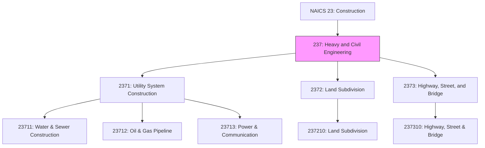
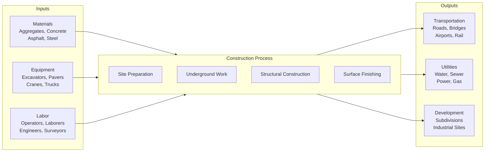

# Heavy and Civil Engineering Construction

> The Heavy and Civil Engineering Construction subsector comprises establishments whose primary activity is the construction of entire engineering projects (e.g., highways and dams), and specialty trade contractors whose primary activity is the production of a specific component for such projects.

## Overview

The Heavy and Civil Engineering Construction subsector (NAICS 237) encompasses the construction of infrastructure and engineering projects that serve the public and private sectors. Unlike building construction, these projects focus on transportation networks, utility systems, and land development that form the backbone of modern civilization.

Specialty trade contractors in this subsector perform activities specific to heavy and civil engineering construction projects and are not normally performed on buildings. For example, specialized equipment is needed to paint lines on highways. Traffic signal installation, while specific to highways, uses similar skills and equipment as building electrical work and is classified under Specialty Trade Contractors (238).

Construction projects involving water resources (e.g., dredging and land drainage) and projects involving open space improvement (e.g., parks and trails) are included in this subsector.

## Industry Hierarchy

## Key Statistics

| Metric | Value |
|--------|-------|
| NAICS Code | 237 |
| Level | Subsector |
| Parent Sector | [Construction](../) (23) |
| Industry Groups | 3 |
| National Industries | 5 |

## Sub-Industries

| Industry Group | Code | Description |
|----------------|------|-------------|
| Utility System Construction | 2371 | Distribution lines and related structures for utilities |
| Land Subdivision | 2372 | Subdivision of land and site improvements |
| Highway, Street, and Bridge Construction | 2373 | Roads, bridges, tunnels, and transportation infrastructure |

### Utility System Construction (2371)

Establishments primarily engaged in constructing distribution lines and related buildings and structures for utilities including water, sewer, petroleum, gas, power, and communication.

| Industry | Code | Key Activities |
|----------|------|----------------|
| Water and Sewer Line | 23711 | Water mains, sewer lines, pumping stations, storage tanks |
| Oil and Gas Pipeline | 23712 | Oil pipelines, gas mains, pump stations, refineries |
| Power and Communication | 23713 | Electric transmission lines, substations, communication towers |

### Land Subdivision (2372)

Establishments primarily engaged in subdividing real property into lots for sale, usually performing site improvements such as road building and utility installation.

| Industry | Code | Key Activities |
|----------|------|----------------|
| Land Subdivision | 237210 | Land surveying, platting, grading, road construction, utility installation |

### Highway, Street, and Bridge Construction (2373)

Establishments primarily engaged in constructing highways, streets, roads, airport runways, bridges, overpasses, and tunnels.

| Industry | Code | Key Activities |
|----------|------|----------------|
| Highway, Street, and Bridge | 237310 | Paving, bridge construction, tunnel construction, guardrails |

## Related Occupations

- [Civil Engineers](/occupations/Architecture/CivilEngineers) - Design infrastructure projects
- [Construction Managers](/occupations/Management/ConstructionManagers) - Oversee heavy civil projects
- [Operating Engineers](/occupations/Construction/OperatingEngineers) - Operate heavy equipment
- [Surveying and Mapping Technicians](/occupations/SurveyingTechnicians) - Land surveying
- [Pipelayers](/occupations/Construction/Pipelayers) - Install pipes for utilities
- [Structural Iron and Steel Workers](/occupations/StructuralIronWorkers) - Erect structural steel

## Core Business Processes

### Pre-Construction Planning

Preparing for heavy civil projects through bidding, design, and regulatory compliance.

**Key Activities:**
- Prepare bid proposals and estimates
- Conduct environmental impact assessments
- Complete engineering design and specifications
- Obtain permits and acquire rights-of-way
- Procure materials and equipment

### Project Execution

Performing the physical construction of infrastructure projects.

**Key Activities:**
- Mobilize equipment and establish site facilities
- Execute earthwork, grading, and excavation
- Construct structures, bridges, and culverts
- Install utilities and drainage systems
- Complete paving, surfacing, and restoration

### Quality and Compliance Management

Ensuring projects meet specifications, codes, and regulatory requirements.

**Key Activities:**
- Perform materials testing and quality assurance
- Conduct safety inspections and compliance audits
- Document progress and maintain records
- Coordinate with regulatory agencies
- Manage environmental compliance

## Industry Value Chain

## Market Segments

### Public Sector
- **Federal**: Interstate highways, dams, federal facilities
- **State**: State highways, bridges, state parks
- **Local**: Municipal roads, water systems, public works

### Private Sector
- **Developers**: Residential and commercial subdivisions
- **Utilities**: Power plants, pipelines, transmission systems
- **Industrial**: Plant sites, private roads, rail spurs

## Regulatory Environment

Heavy civil engineering construction is subject to extensive regulation:

- **Transportation**: Federal Highway Administration (FHWA), state DOT standards
- **Environmental**: National Environmental Policy Act (NEPA), Clean Water Act Section 404
- **Safety**: OSHA 29 CFR 1926, state safety regulations
- **Quality**: AASHTO specifications, ASTM standards
- **Labor**: Davis-Bacon Act (prevailing wages), state labor laws
- **Utilities**: State utility commissions, PHMSA (pipelines), FERC (energy)
- **Land Use**: Local zoning, subdivision regulations

## Technology & Innovation

Heavy civil engineering is being transformed by technology:

- **Machine Control**: GPS/GNSS guided grading, paving, and excavation
- **Digital Project Delivery**: BIM for infrastructure, digital twins
- **Drones and Sensors**: Aerial surveying, volumetric calculations, progress monitoring
- **Advanced Materials**: Self-healing concrete, recycled aggregates, warm-mix asphalt
- **Automation**: Semi-autonomous equipment, robotic inspection
- **Sustainable Practices**: Permeable pavements, green infrastructure, carbon-neutral materials
- **Connected Jobsites**: IoT equipment monitoring, real-time project dashboards
- **AI and Analytics**: Predictive scheduling, risk analysis, resource optimization

## Sustainability and Environmental Considerations

- **Recycled Materials**: Reclaimed asphalt pavement (RAP), recycled concrete aggregate
- **Green Infrastructure**: Bioswales, rain gardens, permeable surfaces
- **Wildlife Protection**: Fish passages, wildlife crossings, habitat restoration
- **Erosion Control**: Silt fencing, sediment basins, revegetation
- **Carbon Reduction**: Low-carbon concrete, renewable diesel, electric equipment

## Related Industries

- [Construction of Buildings](../Buildings/) - Building construction
- [Specialty Trade Contractors](../SpecialtyTradeContractors/) - Specialized construction
- [Engineering Services](/industries/EngineeringServices/) - Civil and structural engineering
- [Architectural Services](/industries/ArchitecturalServices/) - Project design
- [Mining](/industries/Mining/) - Aggregate supply

---

*Source: NAICS 237 - Heavy and Civil Engineering Construction*
