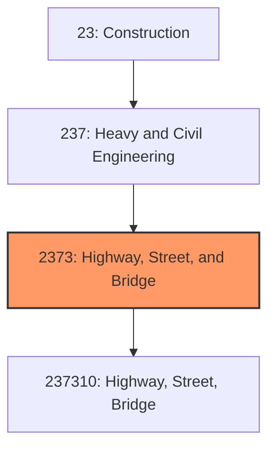
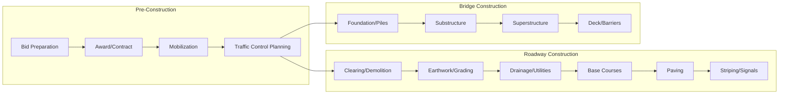

# Highway, Street, and Bridge Construction

> This industry group comprises establishments primarily engaged in the construction of highways, streets, roads, airport runways, public sidewalks, or bridges.

## Overview

Highway, Street, and Bridge Construction encompasses establishments engaged in constructing and rehabilitating the transportation infrastructure that connects communities and enables commerce. This includes interstate highways, state routes, local streets, bridges, tunnels, airport runways, and related structures.

The industry represents one of the largest segments of heavy civil construction, requiring specialized equipment, engineering expertise, and significant capital investment. Projects range from local street repairs to major interstate construction spanning multiple years and billions of dollars. The work is predominantly funded by public agencies at federal, state, and local levels.

## Market Context

The U.S. highway, street, and bridge construction market represents approximately $120 billion in annual spending:

| Segment | Market Size | Key Drivers |
|---------|-------------|-------------|
| Highway Construction | $50 billion | Federal highway program, state transportation budgets |
| Street and Local Roads | $35 billion | Municipal budgets, impact fees, development |
| Bridge Construction | $25 billion | Bridge replacement programs, structural deficiency |
| Airport Construction | $10 billion | FAA grants, airport improvement programs |

The market is heavily influenced by federal infrastructure legislation, with the Infrastructure Investment and Jobs Act (IIJA) providing historic funding levels through 2026. Over 43,000 bridges are currently rated structurally deficient, creating substantial backlog.

## Industry Hierarchy

## Key Statistics

| Metric | Value |
|--------|-------|
| NAICS Code | 2373 |
| Level | Industry Group |
| Parent | [Heavy and Civil Engineering Construction](../) |
| U.S. Establishments | ~15,000 |
| Annual Revenue | ~$120 billion |
| Employment | ~400,000 |
| Highway Lane-Miles | 4.2 million |
| U.S. Bridges | 617,000 |

## Related Occupations

- [Civil Engineers](/occupations/Architecture/CivilEngineers) - Design roads, bridges, and drainage systems
- [Construction Managers](/occupations/Management/ConstructionManagers) - Oversee highway and bridge projects
- [Operating Engineers](/occupations/Construction/OperatingEngineers) - Operate excavators, graders, pavers, and cranes
- [Paving Equipment Operators](/occupations/Construction/PavingOperators) - Operate asphalt pavers and rollers
- [Concrete Finishers](/occupations/Construction/ConcreteFinishers) - Place and finish concrete structures
- [Ironworkers](/occupations/Construction/Ironworkers) - Erect structural steel and reinforcing
- [Pile Driver Operators](/occupations/Construction/PileDrivers) - Install bridge foundations
- [Traffic Control Workers](/occupations/Construction/TrafficControl) - Manage work zone traffic safety

## Core Business Processes

### Bidding and Contract Award

Most highway and bridge work is competitively bid through public procurement processes.

**Key Activities:**
- Obtain plans, specifications, and bid documents
- Prepare detailed quantity takeoffs
- Solicit subcontractor and supplier quotes
- Develop construction schedule and work plan
- Submit sealed bid proposal
- Execute contract upon award

### Roadway Construction

Roadway construction follows a systematic sequence from earthwork through final paving.

**Key Activities:**
- Clear right-of-way and demolish existing structures
- Perform mass grading and earthwork
- Install drainage structures and utilities
- Construct aggregate base and subbase courses
- Place asphalt or concrete pavement
- Install striping, signals, and signage
- Complete landscaping and restoration

### Bridge Construction

Bridge construction requires specialized techniques for foundation and structural work.

**Key Activities:**
- Install deep foundations (piles or drilled shafts)
- Construct abutments and piers
- Erect girders and superstructure elements
- Form and pour concrete deck
- Install barriers, expansion joints, and bearings
- Complete approach roadway connections

### Traffic Management

Maintaining traffic flow during construction is critical for public safety and project success.

**Key Activities:**
- Develop work zone traffic control plans
- Install temporary barriers and signage
- Coordinate lane closures and detours
- Deploy flaggers and pilot cars
- Monitor traffic flow and make adjustments
- Ensure ADA-compliant pedestrian access

## Industry Value Chain

## Regulatory Environment

Highway and bridge construction operates under comprehensive federal and state oversight:

### Federal Requirements
- **FHWA** - Federal Highway Administration design and construction standards
- **Buy America** - Domestic content requirements for federal-aid projects
- **Davis-Bacon Act** - Prevailing wage requirements
- **DBE Programs** - Disadvantaged Business Enterprise participation goals

### Design Standards
- **AASHTO** - American Association of State Highway and Transportation Officials standards
- **MUTCD** - Manual on Uniform Traffic Control Devices
- **ADA** - Americans with Disabilities Act accessibility requirements
- **AREMA** - Railroad engineering standards for grade crossings

### Safety Requirements
- **OSHA Construction Standards** - General construction safety
- **OSHA Trenching Standards** - Excavation safety requirements
- **Work Zone Safety** - Traffic control and temporary barriers
- **Confined Space** - Requirements for culverts and enclosed areas

### Environmental Compliance
- **NEPA** - Environmental review for federal projects
- **Clean Water Act** - Stormwater permits and wetland mitigation
- **Section 106** - Historic preservation review
- **Noise and Air Quality** - Construction impact mitigation

## Technology & Innovation

### Design Technology
- **Civil 3D and InfraWorks** - 3D highway and bridge design
- **Bridge Design Software** - Structural analysis and design
- **Traffic Simulation** - Work zone traffic modeling
- **Lidar and Photogrammetry** - Existing conditions documentation

### Construction Technology
- **GPS Machine Control** - Automated grading and paving
- **Intelligent Compaction** - Real-time compaction monitoring
- **3D Paving Control** - Stringless paving technology
- **Drones** - Progress monitoring and quantity verification

### Materials Innovation
- **Warm-Mix Asphalt** - Lower temperature, extended season paving
- **Recycled Asphalt Pavement (RAP)** - Sustainable material reuse
- **Ultra-High Performance Concrete** - Enhanced durability for bridges
- **Accelerated Bridge Construction** - Prefabricated elements for rapid installation

### Asset Management
- **Pavement Management Systems** - Condition assessment and maintenance planning
- **Bridge Inspection Technology** - Drones and sensors for structural monitoring
- **Connected/Autonomous Vehicle (CAV)** - Infrastructure for smart vehicles
- **V2X Communication** - Vehicle-to-infrastructure systems

## Major Project Types

### Highway Construction
- Interstate new construction and widening
- Interchange reconstruction
- HOV and managed lanes
- Highway rehabilitation and resurfacing

### Bridge Projects
- New bridge construction
- Bridge replacement
- Bridge rehabilitation and deck repair
- Seismic retrofit

### Urban Streets
- Complete streets and road diets
- Arterial reconstruction
- Traffic signal modernization
- Pedestrian and bicycle facilities

### Airport Pavements
- Runway construction and rehabilitation
- Taxiway and apron work
- Airfield lighting and signage

## Industry Trends and Outlook

Key trends shaping highway, street, and bridge construction:

- **Historic Funding** - IIJA providing unprecedented federal investment
- **Bridge Replacement** - Major programs addressing structurally deficient bridges
- **Accelerated Construction** - Prefabrication and rapid replacement techniques
- **Sustainability** - Recycled materials and reduced carbon footprint
- **Technology Adoption** - GPS control, intelligent compaction, and automation
- **Workforce Shortage** - Aging workforce and need for skilled trades
- **Resilience** - Climate adaptation for flooding and extreme weather
- **Electric Vehicles** - Infrastructure for EV charging networks

The outlook is exceptionally strong with the largest federal infrastructure investment in decades. The industry faces capacity constraints from equipment availability and workforce shortages, driving increased use of technology and prefabrication to improve productivity.

---

*Source: NAICS 2373 - Highway, Street, and Bridge Construction*
