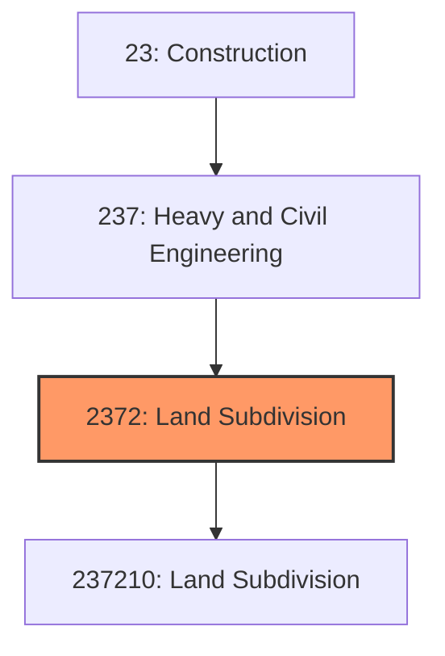

# Land Subdivision

> This industry group comprises establishments primarily engaged in servicing land and subdividing real property into lots for sale to builders or subsequent sale to others.

## Overview

Land Subdivision encompasses establishments engaged in the development of raw land into buildable lots with installed infrastructure. This industry serves as the essential first step in real estate development, transforming undeveloped land into subdivided parcels complete with roads, utilities, and drainage systems ready for vertical construction.

Establishments in this industry perform site improvements including grading, street construction, utility installation, and stormwater management. They may retain ownership of developed lots for sale or transfer subdivided property to builders and developers. The industry operates at the intersection of real estate development and construction, requiring expertise in land planning, civil engineering, and public approvals processes.

## Market Context

The U.S. land subdivision market is closely tied to residential and commercial construction activity, representing approximately $25 billion in annual spending:

| Segment | Market Share | Key Characteristics |
|---------|-------------|---------------------|
| Residential Subdivision | 70% | Single-family lots, master-planned communities |
| Commercial/Industrial | 20% | Business parks, retail centers, logistics sites |
| Mixed-Use Development | 10% | Urban infill, town centers |

The market is highly cyclical, driven by housing demand, interest rates, and local economic conditions. Activity concentrates in high-growth metropolitan areas with strong population in-migration and employment growth.

## Industry Hierarchy

## Key Statistics

| Metric | Value |
|--------|-------|
| NAICS Code | 2372 |
| Level | Industry Group |
| Parent | [Heavy and Civil Engineering Construction](../) |
| U.S. Establishments | ~8,000 |
| Annual Revenue | ~$25 billion |
| Employment | ~45,000 |
| Average Project Size | $5-50 million |

## Related Occupations

- [Civil Engineers](/occupations/Architecture/CivilEngineers) - Design subdivision infrastructure and drainage systems
- [Land Surveyors](/occupations/Architecture/Surveyors) - Establish property boundaries and construction staking
- [Urban Planners](/occupations/Community/UrbanPlanners) - Plan land use and community design
- [Construction Managers](/occupations/Management/ConstructionManagers) - Oversee site development construction
- [Operating Engineers](/occupations/Construction/OperatingEngineers) - Operate graders, excavators, and compaction equipment
- [Pipelayers](/occupations/Construction/Pipelayers) - Install water, sewer, and drainage infrastructure
- [Real Estate Developers](/occupations/Business/Developers) - Manage land acquisition and development

## Core Business Processes

```mermaid
flowchart LR
    subgraph Acquisition["Land Acquisition"]
        A1["Site Identification"]
        A2["Due Diligence"]
        A3["Purchase/Option"]
    end

    subgraph Entitlement["Entitlement"]
        E1["Zoning/Rezoning"]
        E2["Preliminary Plat"]
        E3["Final Plat"]
        E4["Permitting"]
    end

    subgraph Development["Site Development"]
        D1["Clearing/Grading"]
        D2["Roads/Paving"]
        D3["Utilities"]
        D4["Drainage"]
        D5["Landscaping"]
    end

    subgraph Sales["Lot Sales"]
        S1["Marketing"]
        S2["Lot Sales"]
        S3["Builder Contracts"]
    end

    A1 --> A2 --> A3
    A3 --> E1 --> E2 --> E3 --> E4
    E4 --> D1 --> D2 --> D3 --> D4 --> D5
    D5 --> S1 --> S2 --> S3
```

### Land Acquisition and Due Diligence

Successful subdivision requires careful site selection and thorough evaluation of development potential.

**Key Activities:**
- Identify potential development sites based on market demand
- Evaluate zoning, comprehensive plans, and growth patterns
- Conduct environmental and geotechnical assessments
- Analyze utility availability and infrastructure costs
- Negotiate purchase agreements or option contracts
- Secure financing for land acquisition

### Entitlement and Approvals

Obtaining necessary approvals is often the most time-consuming and uncertain phase.

**Key Activities:**
- Submit rezoning applications if required
- Prepare subdivision plats and supporting documents
- Coordinate with planning commissions and elected officials
- Address community concerns through public hearings
- Negotiate development agreements and impact fees
- Obtain final plat approval and construction permits

### Site Development Construction

Physical development transforms raw land into finished lots.

**Key Activities:**
- Clear vegetation and demolish existing structures
- Perform mass grading and earthwork
- Construct streets, curbs, and sidewalks
- Install water, sewer, and storm drainage systems
- Construct retention/detention ponds
- Install landscaping and common area improvements
- Complete final grading and lot preparation

### Lot Sales and Marketing

Successful projects require effective marketing and sales strategies.

**Key Activities:**
- Develop lot pricing and release strategies
- Market to builders and developers
- Negotiate bulk purchase agreements
- Process individual lot sales
- Coordinate with builders on construction timing
- Manage community development and maintenance

## Industry Value Chain

```mermaid
graph LR
    subgraph Inputs["Inputs & Resources"]
        I1["Raw Land"]
        I2["Capital/Financing"]
        I3["Engineering"]
        I4["Heavy Equipment"]
        I5["Materials"]
    end

    subgraph Primary["Primary Activities"]
        A1["Entitlement"]
        A2["Grading"]
        A3["Infrastructure"]
        A4["Marketing"]
    end

    subgraph Outputs["Products"]
        O1["Finished Lots"]
        O2["Common Areas"]
        O3["Infrastructure"]
    end

    subgraph Customers["Customer Segments"]
        C1["National Builders"]
        C2["Regional Builders"]
        C3["Custom Builders"]
        C4["Commercial Developers"]
    end

    Inputs --> Primary --> Outputs --> Customers
```

## Regulatory Environment

Land subdivision operates under extensive local, state, and federal regulations:

### Land Use Regulations
- **Zoning Ordinances** - Permitted uses, density, and building requirements
- **Subdivision Regulations** - Lot size, street standards, and required improvements
- **Comprehensive Plans** - Long-range land use and growth policies
- **Growth Management** - Urban growth boundaries and adequate public facilities

### Environmental Regulations
- **NEPA/State Environmental Review** - Environmental impact assessment
- **Clean Water Act Section 404** - Wetland permits for fill activities
- **Endangered Species Act** - Habitat protection requirements
- **Phase I/II Environmental Assessments** - Contamination investigation

### Infrastructure Standards
- **Local Street Standards** - Road design, width, and construction requirements
- **Stormwater Regulations** - Detention, retention, and water quality requirements
- **Utility Extension Policies** - Water and sewer service requirements
- **Fire Marshal Requirements** - Access, hydrant spacing, and turnaround standards

### Safety and Construction
- **OSHA Excavation Standards** - Trench safety requirements
- **SWPPP Requirements** - Stormwater pollution prevention during construction
- **Erosion Control** - Sediment control during and after construction

## Technology & Innovation

### Design and Planning Technology
- **GIS Mapping** - Site analysis and constraint mapping
- **Civil 3D/CAD** - Subdivision design and grading plans
- **Stormwater Modeling** - Drainage design and detention sizing
- **Cost Estimating Software** - Development budget analysis

### Construction Technology
- **GPS Machine Control** - Automated grading and excavation
- **Drone Surveying** - Progress monitoring and volume calculations
- **Compaction Monitoring** - Real-time soil compaction verification
- **Fleet Management** - Equipment tracking and utilization

### Sales and Marketing
- **Virtual Reality** - Immersive community visualization
- **Interactive Maps** - Online lot availability and selection
- **Drone Photography** - Aerial marketing imagery
- **CRM Systems** - Builder and lot sales management

### Sustainable Development
- **Low Impact Development (LID)** - Minimize stormwater runoff
- **Conservation Subdivisions** - Cluster development with open space
- **Native Landscaping** - Reduce irrigation and maintenance
- **Permeable Pavement** - Allow infiltration in parking and driveways

## Development Economics

Successful land subdivision requires careful financial analysis:

| Cost Category | Typical % of Total |
|--------------|-------------------|
| Land Acquisition | 30-40% |
| Entitlement/Soft Costs | 15-20% |
| Site Development | 35-45% |
| Financing/Carry Costs | 5-10% |

Key financial metrics include:
- Lot yield (lots per acre)
- Development cost per lot
- Lot sales price and margin
- Absorption rate (lots sold per month)
- Internal rate of return (IRR)

## Industry Trends and Outlook

Key trends shaping land subdivision:

- **Land Scarcity** - Limited developable land in desirable markets
- **Entitlement Difficulty** - Longer approval timelines and community opposition
- **Infrastructure Costs** - Rising costs for roads, utilities, and impact fees
- **Sustainability Requirements** - Stormwater, open space, and environmental mandates
- **Build-to-Rent** - New lot demand from single-family rental development
- **Master-Planned Communities** - Large-scale, amenity-rich developments
- **Infill Development** - Urban lot development on underutilized sites

The outlook is closely tied to housing market conditions. Strong demographic demand from millennials and Gen Z supports long-term activity, but interest rate sensitivity and affordability challenges create near-term uncertainty. Limited land supply in high-demand markets supports lot pricing but constrains production growth.

---

*Source: NAICS 2372 - Land Subdivision*
