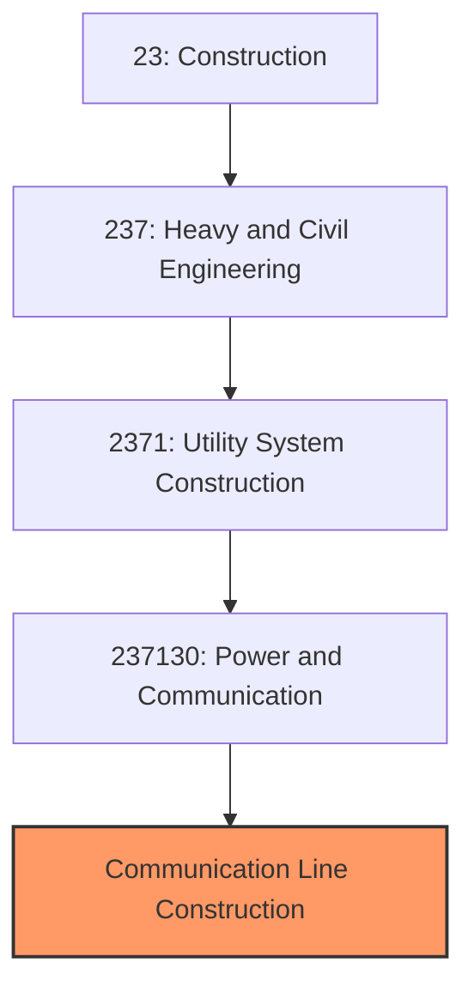

# Communication Line and Infrastructure Construction

> This industry comprises establishments primarily engaged in the construction of telecommunications lines, towers, and related infrastructure including fiber optic networks, wireless facilities, and broadcasting structures.

## Overview

Communication Line and Infrastructure Construction represents a rapidly growing segment of utility construction (NAICS 237130), focused on building the telecommunications networks that enable modern connectivity. This includes fiber optic cables, wireless cell towers, 5G small cells, microwave towers, and broadcasting facilities.

The industry is experiencing transformational growth driven by 5G deployment, federal broadband funding through the Broadband Equity, Access, and Deployment (BEAD) program, and the ever-increasing demand for data capacity. Projects range from local last-mile fiber installations to major backbone networks spanning continents.

## Market Context

The U.S. communication infrastructure construction market represents approximately $25 billion in annual spending:

| Segment | Market Size | Key Drivers |
|---------|-------------|-------------|
| Fiber Optic Networks | $12 billion | BEAD funding, FTTP deployment, 5G backhaul |
| Wireless Infrastructure | $8 billion | 5G deployment, tower construction, small cells |
| Cable/Hybrid Networks | $3 billion | Network upgrades, DOCSIS 4.0 |
| Broadcasting | $2 billion | Tower maintenance, ATSC 3.0 transition |

The market is driven by unprecedented federal broadband investment ($42.5 billion in BEAD alone), the 5G buildout requiring dense small cell networks, and growing data demands from streaming, cloud computing, and IoT applications.

## Industry Hierarchy

## Key Statistics

| Metric | Value |
|--------|-------|
| NAICS Code | 237130 |
| Level | National Industry (Segment) |
| Parent | [Power and Communication Line Construction](./Power/) |
| U.S. Fiber Miles | 55+ million |
| U.S. Cell Towers | 100,000+ |
| BEAD Funding | $42.5 billion |

## Related Occupations

- [Telecommunications Line Installers](/occupations/Installation/TelecomTechnicians) - Install fiber optic and copper cables
- [Tower Climbers](/occupations/Construction/TowerClimbers) - Erect and maintain communication towers
- [Fiber Optic Splicers](/occupations/Installation/FiberSplicers) - Splice and terminate fiber optic cables
- [Construction Managers](/occupations/Management/ConstructionManagers) - Oversee network construction projects
- [RF Engineers](/occupations/Architecture/RFEngineers) - Design wireless network coverage
- [Heavy Equipment Operators](/occupations/Construction/OperatingEngineers) - Operate directional drills and trenchers

## Core Business Processes

### Fiber Optic Network Construction

Fiber networks require specialized installation and splicing expertise.

**Key Activities:**
- Design network routes and node locations
- Obtain permits and pole attachment agreements
- Complete make-ready work on existing poles
- Install conduit through underground boring or trenching
- Place fiber optic cables using pulling or blowing techniques
- Splice fiber at handholes, pedestals, and splice cases
- Install network electronics at hubs and customer premises
- Test and document network performance

### Wireless Tower Construction

Tower construction requires specialized structural and safety expertise.

**Key Activities:**
- Conduct site acquisition and zoning approvals
- Complete tower foundation design and construction
- Erect tower structures (monopole, lattice, guyed)
- Install transmission lines and antennas
- Complete shelter and equipment installations
- Connect power and backhaul communications
- Commission and optimize RF systems

### Small Cell and Distributed Antenna Systems

5G deployment relies heavily on small cell infrastructure.

**Key Activities:**
- Identify and secure attachment locations
- Coordinate with municipalities and utilities
- Install small cell equipment on poles and structures
- Connect fiber backhaul to each node
- Provide power connections
- Commission and integrate with network

## Regulatory Environment

### Federal Regulations
- **FCC** - Telecommunications and spectrum licensing
- **FAA** - Tower height and lighting requirements
- **NEPA** - Environmental review for federal lands
- **Section 106** - Historic preservation review

### State and Local Requirements
- **Right-of-Way Permits** - Access to public ways for construction
- **Pole Attachment Agreements** - Use of utility and telephone poles
- **Small Cell Ordinances** - Local regulations for 5G equipment
- **OTMR** - One Touch Make Ready rules for pole work

### Industry Standards
- **TIA Standards** - Tower and antenna standards
- **NESC** - Clearance and installation requirements
- **FOA Standards** - Fiber optic installation practices
- **ANSI/TIA-568** - Telecommunications cabling standards

## Technology & Innovation

### Fiber Technology
- **Bend-Insensitive Fiber** - Improved installation flexibility
- **High-Count Cables** - 864+ fiber cables for capacity
- **Ribbon Fiber** - Faster mass splicing capabilities
- **Air-Blown Fiber** - Rapid deployment in microduct

### Installation Methods
- **Microtrenching** - Shallow, narrow trenches for fiber
- **Directional Boring** - Subsurface installation without excavation
- **Aerial Lashing** - Rapid deployment on existing strand
- **Plowing** - Direct burial in rural areas

### Testing and Documentation
- **OTDR Testing** - Optical time-domain reflectometer testing
- **GIS Asset Management** - Geographic documentation of networks
- **AI Route Optimization** - Automated network design
- **Drone Inspection** - Aerial assessment of tower and aerial plant

### 5G and Small Cells
- **mmWave Technology** - High-frequency, high-capacity wireless
- **O-RAN** - Open radio access network architecture
- **Integrated Small Cells** - Combined antenna and radio units
- **Private 5G** - Enterprise and industrial wireless networks

## Project Types

- Fiber-to-the-Premises (FTTP) deployment
- Long-haul fiber backbone construction
- Middle-mile network extension
- 5G small cell deployment
- Macro tower construction
- Distributed antenna systems (DAS)
- Cable network upgrades (HFC to fiber)
- Rural broadband expansion

## Industry Trends and Outlook

Key trends shaping communication construction:

- **BEAD Deployment** - $42.5 billion federal broadband funding
- **5G Densification** - Small cell networks requiring fiber backhaul
- **Fiber Deep** - Cable operators extending fiber closer to homes
- **Private Networks** - Enterprise 5G and industrial IoT
- **Open Access** - Shared infrastructure models
- **Workforce Development** - Critical shortage of fiber technicians
- **Speed to Market** - Pressure to deploy networks quickly

The outlook is exceptionally strong with historic federal broadband investment creating unprecedented demand. The BEAD program alone will fund construction through 2030 or beyond. Ongoing 5G deployment and enterprise connectivity needs provide additional growth drivers. The primary constraint is workforce availability rather than market demand.

---

*Source: NAICS 237130 - Power and Communication Line and Related Structures Construction (Communication Segment)*
