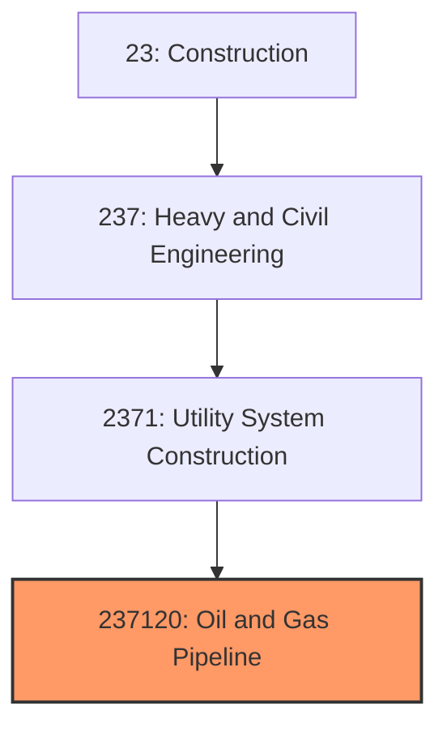

# Oil and Gas Pipeline Construction

> This industry comprises establishments primarily engaged in the construction of oil and gas mains and related structures, including compressor stations, pump stations, and storage tanks.

## Overview

Oil and Gas Pipeline Construction (NAICS 237120) encompasses establishments engaged in constructing the pipeline infrastructure that transports petroleum products and natural gas from production areas to refineries, processing facilities, and distribution networks. This includes natural gas transmission and distribution lines, crude oil pipelines, refined product pipelines, gathering systems, and associated facilities.

The industry operates at the intersection of energy infrastructure and heavy civil construction, requiring specialized welding, testing, and safety protocols. Projects range from small distribution line extensions to major interstate transmission pipelines spanning thousands of miles and costing billions of dollars.

## Market Context

The U.S. oil and gas pipeline construction market represents approximately $30 billion in annual spending:

| Segment | Market Size | Key Drivers |
|---------|-------------|-------------|
| Natural Gas Transmission | $12 billion | LNG exports, power generation, production growth |
| Natural Gas Distribution | $8 billion | System expansion, replacement, safety upgrades |
| Crude Oil Pipelines | $5 billion | Production capacity, export terminals |
| Refined Products | $3 billion | Distribution, optimization, replacement |
| Gathering Systems | $2 billion | Production development, gas processing |

The market is influenced by commodity prices, production levels, export capacity needs, and the regulatory environment. The energy transition creates both challenges and opportunities as natural gas serves as a bridge fuel while hydrogen and carbon capture pipeline opportunities emerge.

## Industry Hierarchy

## Key Statistics

| Metric | Value |
|--------|-------|
| NAICS Code | 237120 |
| Level | National Industry |
| Parent | [Utility System Construction](../) |
| U.S. Establishments | ~3,500 |
| Annual Revenue | ~$30 billion |
| Employment | ~70,000 |
| U.S. Natural Gas Pipelines | 3 million miles |
| U.S. Liquid Pipelines | 225,000 miles |

## Related Occupations

- [Construction Managers](/occupations/Management/ConstructionManagers) - Oversee pipeline construction projects
- [Civil Engineers](/occupations/Architecture/CivilEngineers) - Design pipeline routes and facilities
- [Welders](/occupations/Production/Welders) - Perform pipeline welding to strict standards
- [Pipelayers](/occupations/Construction/Pipelayers) - Install pipe in trenches
- [Operating Engineers](/occupations/Construction/OperatingEngineers) - Operate sidebooms, excavators, and bending machines
- [Pipeline Inspectors](/occupations/Construction/Inspectors) - Verify welding and construction quality
- [NDT Technicians](/occupations/Production/NDTTechnicians) - Perform radiographic and ultrasonic weld testing

## Core Business Processes

### Pipeline Development and Permitting

Major pipelines require years of planning, environmental review, and regulatory approval.

**Key Activities:**
- Conduct route studies and engineering analysis
- File applications with FERC (interstate) or state regulators
- Prepare environmental impact statements
- Negotiate right-of-way easements with landowners
- Obtain construction permits and approvals
- Complete detailed engineering and procurement

### Pipeline Construction (Spread Operations)

Large-diameter pipeline construction uses spread operations with specialized crews.

**Key Activities:**
- Survey and stake pipeline right-of-way
- Clear vegetation and grade work area
- String pipe sections along right-of-way
- Bend pipe to match terrain using bending machines
- Weld pipe joints using qualified procedures
- Inspect welds using radiography or other NDT
- Apply field joint coating
- Lower pipe into trench using sidebooms
- Backfill and compact trench
- Restore right-of-way to original condition

### Facilities Construction

Pipeline projects include compressor stations, pump stations, and meter stations.

**Key Activities:**
- Construct equipment foundations and buildings
- Install compressor or pump units
- Complete piping, valves, and controls
- Install electrical and instrumentation systems
- Commission equipment and controls
- Integrate with pipeline SCADA systems

## Industry Value Chain

```mermaid
graph LR
    subgraph Inputs["Inputs & Resources"]
        I1["Line Pipe"]
        I2["Pipe Coatings"]
        I3["Valves/Fittings"]
        I4["Specialty Equipment"]
        I5["Skilled Welders"]
    end

    subgraph Primary["Primary Activities"]
        A1["Right-of-Way Prep"]
        A2["Pipe Installation"]
        A3["Welding/Coating"]
        A4["Facilities"]
    end

    subgraph Outputs["Infrastructure"]
        O1["Gas Transmission"]
        O2["Gas Distribution"]
        O3["Crude Oil Lines"]
        O4["Products Lines"]
        O5["Gathering Systems"]
    end

    subgraph Customers["Customer Segments"]
        C1["Interstate Pipelines"]
        C2["Gas Utilities"]
        C3["Oil Companies"]
        C4["Midstream Companies"]
        C5["Producers"]
    end

    Inputs --> Primary --> Outputs --> Customers
```

## Regulatory Environment

Pipeline construction operates under extensive federal safety regulations:

### Federal Regulations
- **FERC** - Federal Energy Regulatory Commission interstate pipeline approval
- **PHMSA** - Pipeline and Hazardous Materials Safety Administration safety rules
- **49 CFR 192** - Federal natural gas pipeline safety regulations
- **49 CFR 195** - Federal hazardous liquid pipeline safety regulations
- **NEPA** - Environmental review requirements

### Industry Standards
- **API Standards** - American Petroleum Institute specifications
- **ASME B31.4** - Pipeline transportation systems for liquids
- **ASME B31.8** - Gas transmission and distribution systems
- **AWS D1.1** - Structural welding code
- **NACE Standards** - Corrosion control and coating

### Safety Requirements
- **OSHA Pipeline Standards** - Workplace safety requirements
- **Pipeline Welding Qualification** - Welder and procedure qualification
- **Operator Qualification** - Worker competency requirements
- **Public Awareness** - Community notification programs

## Technology & Innovation

### Design and Engineering
- **GIS Route Analysis** - Corridor optimization and constraint mapping
- **Pipeline Design Software** - Stress analysis and wall thickness calculations
- **Hydraulic Modeling** - Flow capacity and compressor station design
- **Lidar Surveying** - Terrain mapping for route selection

### Welding Technology
- **Mechanized Welding** - Automated welding for production efficiency
- **Phased Array Ultrasonic Testing** - Advanced weld inspection
- **Automatic Ultrasonic Testing (AUT)** - Real-time weld inspection
- **Laser Welding** - Emerging technology for certain applications

### Construction Methods
- **Horizontal Directional Drilling (HDD)** - Trenchless crossings of rivers and roads
- **Direct Pipe** - Microtunneling installation method
- **Guided Boring** - Precise subsurface installations
- **Aerial Construction** - Helicopter support in remote areas

### Operations Technology
- **In-Line Inspection (ILI)** - Smart pig technology for integrity assessment
- **Leak Detection Systems** - Real-time monitoring for releases
- **SCADA Systems** - Remote monitoring and control
- **Cathodic Protection** - Corrosion prevention systems

## Project Types

### Natural Gas Transmission
- Interstate pipeline construction
- Compression station additions
- Looping and expansion projects
- LNG terminal connections

### Natural Gas Distribution
- Distribution main construction
- Service line installation
- Plastic pipe replacement
- System integrity projects

### Liquid Pipelines
- Crude oil transmission lines
- Refined products pipelines
- NGL and LPG pipelines
- Storage terminal connections

### Gathering and Processing
- Field gathering systems
- Processing plant connections
- Condensate handling systems
- Produced water lines

## Industry Trends and Outlook

Key trends shaping oil and gas pipeline construction:

- **LNG Export Growth** - Pipeline capacity to Gulf Coast terminals
- **Gas-Fired Power** - Pipeline connections to new power plants
- **Hydrogen Pipelines** - Emerging opportunity for clean hydrogen transport
- **Carbon Capture** - CO2 pipeline infrastructure for CCUS
- **Integrity Management** - Replacement and upgrade of aging systems
- **Permitting Challenges** - Longer approval timelines and opposition
- **Workforce Development** - Shortage of qualified pipeline welders
- **Energy Transition** - Adapting to changing energy mix

The outlook is mixed with natural gas demand supporting continued investment but facing increasing permitting challenges and environmental opposition. Emerging opportunities in hydrogen transport and carbon capture may offset potential declines in traditional hydrocarbon infrastructure. Distribution pipeline replacement and safety upgrades provide steady baseline demand.

---

*Source: NAICS 237120 - Oil and Gas Pipeline and Related Structures Construction*
