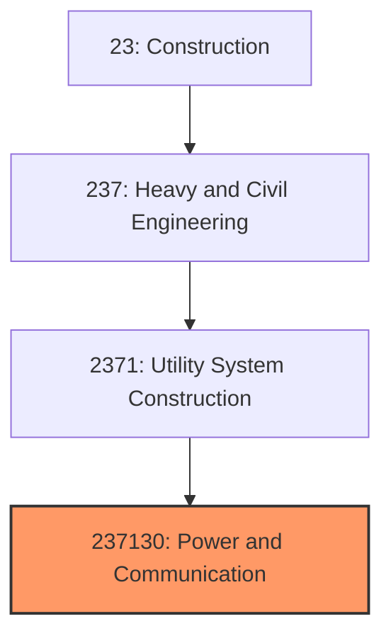

# Power and Communication Line Construction

> This industry comprises establishments primarily engaged in the construction of power lines and towers, power plants, and radio, television, and telecommunications transmitting/receiving towers.

## Overview

Power and Communication Line Construction (NAICS 237130) encompasses establishments engaged in constructing the electrical and telecommunications infrastructure that powers modern society and enables global connectivity. This includes high-voltage transmission lines, distribution systems, substations, power plants, cell towers, fiber optic networks, and broadcasting infrastructure.

The industry is experiencing transformative growth driven by renewable energy deployment, grid modernization, 5G network buildout, and broadband expansion. Projects range from local distribution upgrades to massive multi-billion dollar transmission lines spanning hundreds of miles.

## Market Context

The U.S. power and communication line construction market represents approximately $75 billion in annual spending:

| Segment | Market Size | Key Drivers |
|---------|-------------|-------------|
| Power Transmission | $25 billion | Renewable interconnection, grid reliability |
| Power Distribution | $20 billion | Grid modernization, undergrounding, resilience |
| Fiber Optic/Broadband | $15 billion | BEAD program, rural broadband, 5G backhaul |
| Wireless Infrastructure | $10 billion | 5G deployment, tower construction, small cells |
| Power Generation | $5 billion | Renewable energy, battery storage, peaker plants |

The market is driven by the clean energy transition requiring massive transmission expansion, grid modernization for reliability and resilience, and federal broadband funding closing the digital divide.

## Industry Hierarchy

## Key Statistics

| Metric | Value |
|--------|-------|
| NAICS Code | 237130 |
| Level | National Industry |
| Parent | [Utility System Construction](../) |
| U.S. Establishments | ~10,000 |
| Annual Revenue | ~$75 billion |
| Employment | ~180,000 |
| U.S. Transmission Miles | 160,000 |
| U.S. Distribution Miles | 5.5 million |

## Related Occupations

- [Construction Managers](/occupations/Management/ConstructionManagers) - Oversee power and communication line projects
- [Electrical Engineers](/occupations/Architecture/ElectricalEngineers) - Design transmission and distribution systems
- [Lineworkers](/occupations/Construction/Lineworkers) - Install and maintain overhead power lines
- [Operating Engineers](/occupations/Construction/OperatingEngineers) - Operate cranes, digger-derricks, and bucket trucks
- [Electricians](/occupations/Construction/Electricians) - Install electrical systems in substations and facilities
- [Telecommunications Technicians](/occupations/Installation/TelecomTechnicians) - Install fiber optic and wireless systems
- [Tower Climbers](/occupations/Construction/TowerClimbers) - Erect and maintain communication towers

## Core Business Processes

### Transmission Line Development

Major transmission projects require years of planning, permitting, and right-of-way acquisition.

**Key Activities:**
- Conduct routing studies and alternatives analysis
- Prepare environmental impact statements
- Obtain certificates of public convenience and necessity
- Negotiate easements with landowners
- Coordinate with regulatory agencies (FERC, state commissions)
- Complete engineering design and procurement

### Line Construction

Transmission and distribution line construction requires specialized equipment and crews.

**Key Activities:**
- Clear rights-of-way and construct access roads
- Install foundations for towers and poles
- Erect transmission towers or distribution poles
- String conductors using tensioners and pullers
- Install insulators, hardware, and ground wires
- Complete grounding and bonding systems

### Substation Construction

Substations require civil, structural, and electrical construction expertise.

**Key Activities:**
- Prepare site and construct foundations
- Erect steel structures and bus work
- Install transformers and switchgear
- Complete control building and equipment
- Install protection and control systems
- Perform commissioning and testing

## Industry Value Chain

```mermaid
graph LR
    subgraph Inputs["Inputs & Resources"]
        I1["Conductors/Cable"]
        I2["Towers/Poles"]
        I3["Transformers"]
        I4["Heavy Equipment"]
        I5["Lineworkers"]
    end

    subgraph Primary["Primary Activities"]
        A1["Site Preparation"]
        A2["Structure Erection"]
        A3["Wire Stringing"]
        A4["Equipment Install"]
    end

    subgraph Outputs["Infrastructure"]
        O1["Transmission Lines"]
        O2["Distribution Lines"]
        O3["Substations"]
        O4["Fiber Networks"]
        O5["Cell Towers"]
    end

    subgraph Customers["Customer Segments"]
        C1["Investor-Owned Utilities"]
        C2["Cooperatives"]
        C3["Municipal Utilities"]
        C4["Telecom Companies"]
        C5["Data Center Operators"]
    end

    Inputs --> Primary --> Outputs --> Customers
```

## Regulatory Environment

Power and communication construction operates under extensive federal and state oversight:

### Federal Regulations
- **FERC** - Interstate transmission line approval and rates
- **FCC** - Telecommunications tower licensing and spectrum
- **NEPA** - Environmental review for federal lands and permits
- **FAA** - Tower height and lighting requirements
- **OSHA** - Electrical safety standards (29 CFR 1926 Subpart V)

### State Requirements
- **Public Utility Commissions** - State transmission approval
- **Environmental Agencies** - State-level NEPA equivalents
- **Construction Permits** - Local building and electrical permits
- **Right-of-Way Permits** - Highway and railroad crossings

### Industry Standards
- **NESC** - National Electrical Safety Code
- **IEEE Standards** - Electrical engineering specifications
- **RUS Standards** - Rural Utilities Service design standards
- **TIA Standards** - Telecommunications tower standards

## Technology & Innovation

### Design Technology
- **Power Systems Modeling** - Transmission planning and analysis
- **Lidar Surveying** - Corridor mapping and clearance analysis
- **PLS-CADD** - Transmission line design software
- **GIS Mapping** - Network documentation and analysis

### Construction Technology
- **Drone Line Stringing** - Pilot line installation in difficult terrain
- **Helicopter Construction** - Tower erection in remote areas
- **GPS Machine Control** - Foundation and road construction
- **Robotic Welding** - Automated tower fabrication

### Grid Technology
- **Advanced Conductors** - High-capacity composite conductors
- **HVDC Transmission** - Long-distance, high-efficiency power transfer
- **Grid-Enhancing Technology** - Dynamic line rating, power flow control
- **Battery Energy Storage** - Grid-scale storage systems

### Communication Technology
- **5G Small Cells** - Dense urban wireless networks
- **Fiber Optic Cable** - High-capacity data transmission
- **OTDR Testing** - Fiber optic testing and commissioning
- **Wireless Backhaul** - Point-to-point microwave systems

## Project Types

### Electric Transmission
- High-voltage transmission lines (115kV-765kV)
- HVDC converter stations
- Renewable interconnection projects
- Grid reliability upgrades

### Electric Distribution
- Distribution line construction and upgrade
- Underground conversion (undergrounding)
- Smart grid and AMI deployment
- Storm hardening and resilience

### Substations
- Transmission substations
- Distribution substations
- Switching stations
- Renewable energy collector substations

### Telecommunications
- Fiber optic network construction
- Cell tower construction
- 5G small cell deployment
- Rural broadband expansion

## Industry Trends and Outlook

Key trends shaping power and communication construction:

- **Transmission Expansion** - Massive investment needed for renewable energy
- **Grid Modernization** - Smart grid, automation, and resilience upgrades
- **Renewable Interconnection** - Solar, wind, and storage connections
- **Undergrounding** - Converting overhead lines in high-risk areas
- **5G Deployment** - Continued buildout of 5G networks
- **Broadband Expansion** - BEAD funding for rural connectivity
- **Workforce Development** - Critical shortage of skilled lineworkers
- **Supply Chain** - Transformer and equipment lead times

The outlook is exceptionally strong with the clean energy transition requiring unprecedented transmission investment. The Department of Energy estimates $2 trillion in transmission investment needed by 2050. Broadband funding from BEAD and 5G expansion support sustained communication infrastructure demand.

---

*Source: NAICS 237130 - Power and Communication Line and Related Structures Construction*
