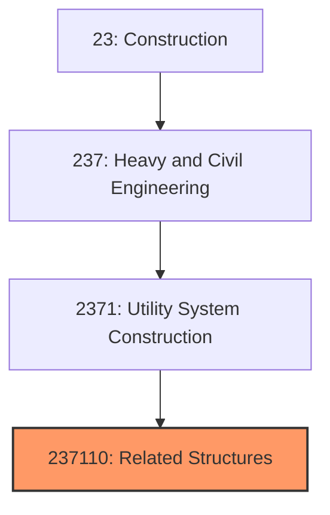
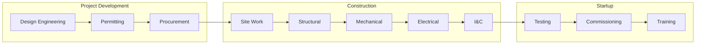

# Utility Related Structures Construction

> This industry comprises establishments primarily engaged in the construction of related structures that are integral parts of utility systems, including pumping stations, water treatment plants, storage tanks, and similar facilities.

## Overview

Utility Related Structures Construction encompasses the specialized building construction required for utility system operations. While utility line contractors focus on distribution infrastructure, related structures contractors build the facilities that produce, treat, store, and control utility services. This includes water treatment plants, wastewater treatment facilities, pumping stations, storage tanks, power plants, and control buildings.

These projects combine heavy civil construction with process mechanical and electrical systems, requiring integration of structural, architectural, mechanical, and instrumentation disciplines. Projects are typically more complex than standard line work and involve longer construction durations.

## Market Context

The U.S. utility-related structures market represents approximately $50 billion in annual spending:

| Segment | Market Size | Key Drivers |
|---------|-------------|-------------|
| Water/Wastewater Treatment | $22 billion | Regulatory compliance, capacity expansion, replacement |
| Power Generation | $15 billion | Renewable energy, grid reliability, peaking capacity |
| Pump/Compressor Stations | $8 billion | System expansion, redundancy, efficiency |
| Storage Facilities | $5 billion | Water towers, reservoirs, fuel storage |

The market is driven by aging treatment facilities requiring replacement, new regulatory requirements for water quality and emissions, renewable energy construction, and system capacity needs in growing regions.

## Industry Hierarchy

## Key Statistics

| Metric | Value |
|--------|-------|
| NAICS Code | 237110 |
| Level | National Industry |
| Parent | [Utility System Construction](../) |
| U.S. Water Treatment Plants | 50,000+ |
| U.S. Wastewater Plants | 16,000+ |
| Average Project Size | $10-200 million |

## Related Occupations

- [Construction Managers](/occupations/Management/ConstructionManagers) - Oversee complex facility construction
- [Civil Engineers](/occupations/Architecture/CivilEngineers) - Design structures and site improvements
- [Mechanical Engineers](/occupations/Architecture/MechanicalEngineers) - Design process mechanical systems
- [Electrical Engineers](/occupations/Architecture/ElectricalEngineers) - Design power and control systems
- [Ironworkers](/occupations/Construction/Ironworkers) - Erect structural steel
- [Pipefitters](/occupations/Construction/Pipefitters) - Install process piping systems
- [Instrumentation Technicians](/occupations/Installation/InstrumentTechnicians) - Install and calibrate controls

## Core Business Processes

### Water and Wastewater Treatment Plants

Treatment facilities require specialized process knowledge and construction expertise.

**Key Activities:**
- Construct concrete basins and structures
- Install process equipment (pumps, blowers, clarifiers)
- Complete process piping systems
- Install chemical feed systems
- Complete electrical power distribution
- Install instrumentation and control systems
- Commission treatment processes

### Pumping and Compressor Stations

Stations require integration of mechanical equipment with control systems.

**Key Activities:**
- Construct equipment buildings and structures
- Install pump or compressor units
- Complete suction and discharge piping
- Install electrical motor control centers
- Integrate SCADA and remote monitoring
- Commission and test equipment

### Storage Facilities

Storage construction includes tanks, reservoirs, and containment structures.

**Key Activities:**
- Construct concrete or steel storage tanks
- Install liners and coatings
- Complete inlet/outlet piping
- Install level monitoring and controls
- Construct secondary containment
- Test for integrity and capacity

## Regulatory Environment

### Federal Regulations
- **Safe Drinking Water Act** - Water treatment requirements
- **Clean Water Act** - Wastewater treatment standards
- **EPA Regulations** - Treatment technology requirements
- **OSHA** - Construction safety requirements

### State Requirements
- **State Environmental Agencies** - Construction permits and inspections
- **Public Health Departments** - Water system approvals
- **Dam Safety** - Reservoir and impoundment requirements
- **Fire Codes** - Fuel storage facility requirements

### Industry Standards
- **AWWA Standards** - Water treatment design and construction
- **WEF Standards** - Wastewater treatment practices
- **ASME Codes** - Pressure vessel and piping
- **NFPA** - Fire protection for facilities

## Technology & Innovation

### Treatment Technology
- **Membrane Filtration** - Advanced treatment processes
- **UV Disinfection** - Chemical-free disinfection
- **Ozone Treatment** - Oxidation for contaminant removal
- **Biological Nutrient Removal** - Nitrogen and phosphorus control

### Construction Methods
- **Precast Concrete** - Factory-built tank and basin components
- **Modular Treatment Units** - Packaged treatment systems
- **Self-Performing Concrete** - In-house structural work
- **BIM Coordination** - 3D modeling for complex systems

### Automation and Control
- **SCADA Systems** - Remote monitoring and control
- **Process Automation** - Optimized treatment operations
- **Digital Twin** - Virtual facility modeling
- **Predictive Maintenance** - IoT-enabled equipment monitoring

## Project Types

### Water Treatment
- Conventional treatment plants
- Membrane filtration facilities
- Disinfection upgrades
- Chemical feed systems

### Wastewater Treatment
- Secondary treatment plants
- Nutrient removal upgrades
- Biosolids handling facilities
- Odor control systems

### Pumping Facilities
- Water booster stations
- Wastewater lift stations
- Stormwater pump stations
- Raw water intake structures

### Storage and Distribution
- Ground storage tanks
- Elevated water towers
- Clear well construction
- Reservoir improvements

## Industry Trends and Outlook

Key trends shaping utility structures construction:

- **Aging Infrastructure** - Replacement of facilities built 40-60 years ago
- **Regulatory Compliance** - Meeting stricter water quality standards
- **Energy Efficiency** - Reducing treatment facility energy use
- **Nutrient Removal** - Upgrading for nitrogen and phosphorus
- **PFAS Treatment** - Emerging contaminant treatment systems
- **Resilience** - Hardening facilities against climate impacts
- **Workforce Development** - Addressing skilled labor shortages

The outlook is strong with significant federal investment, regulatory mandates, and aging facilities requiring replacement. Water and wastewater utilities face substantial capital needs for the next 20+ years.

---

*Source: NAICS 237110 - Water and Sewer Line and Related Structures Construction*
