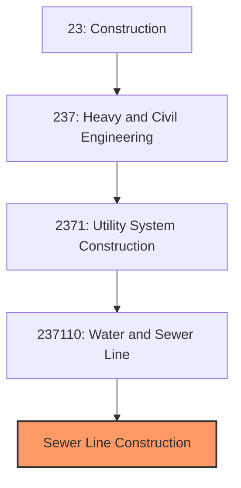

# Sewer Line and Related Structures Construction

> This industry comprises establishments primarily engaged in the construction of sewer mains, storm drains, and related structures including lift stations, pump stations, and wastewater treatment facilities.

## Overview

Sewer Line and Related Structures Construction represents a critical component of water and sewer construction (NAICS 237110), focusing specifically on wastewater collection infrastructure. This includes gravity sewer mains, force mains, storm drains, manholes, lift stations, and connections to wastewater treatment facilities.

The industry addresses one of the most essential public health needs: safely collecting and conveying wastewater away from homes and businesses for treatment. Much of America's sewer infrastructure was built 50-100 years ago and requires significant investment in replacement and rehabilitation to prevent failures, overflows, and environmental contamination.

## Market Context

The U.S. sewer construction market represents approximately $20 billion in annual spending:

| Segment | Market Size | Key Drivers |
|---------|-------------|-------------|
| Gravity Sewer Construction | $8 billion | New development, system expansion |
| Sewer Rehabilitation | $5 billion | Inflow/infiltration, structural repair |
| Pump/Lift Stations | $3 billion | Force main systems, low-lying areas |
| Stormwater Systems | $4 billion | Flood control, CSO separation, green infrastructure |

The market is driven by aging infrastructure, EPA consent decrees for combined sewer overflow (CSO) reduction, new development in growing communities, and climate adaptation for increased storm intensity.

## Industry Hierarchy

## Key Statistics

| Metric | Value |
|--------|-------|
| NAICS Code | 237110 |
| Level | National Industry (Segment) |
| Parent | [Water and Sewer Line Construction](./Water/) |
| U.S. Sewer Systems | 16,000+ |
| U.S. Sewer Miles | 800,000+ |
| CSO Communities | 860 |

## Related Occupations

- [Construction Managers](/occupations/Management/ConstructionManagers) - Oversee sewer construction projects
- [Civil Engineers](/occupations/Architecture/CivilEngineers) - Design collection systems and treatment facilities
- [Pipelayers](/occupations/Construction/Pipelayers) - Install sewer mains and laterals
- [Operating Engineers](/occupations/Construction/OperatingEngineers) - Operate excavators and trenching equipment
- [Concrete Workers](/occupations/Construction/ConcreteWorkers) - Construct manholes and structures
- [CCTV Technicians](/occupations/Installation/CCTVTechnicians) - Inspect sewer lines with video equipment

## Core Business Processes

```mermaid
flowchart LR
    subgraph Design["Planning/Design"]
        D1["System Analysis"]
        D2["Alignment Design"]
        D3["Permitting"]
    end

    subgraph Construction["Construction"]
        C1["Bypass Pumping"]
        C2["Excavation"]
        C3["Pipe Installation"]
        C4["Manhole Construction"]
        C5["Connections"]
        C6["Testing"]
    end

    subgraph Closeout["Acceptance"]
        O1["CCTV Inspection"]
        O2["Mandrel Testing"]
        O3["Documentation"]
    end

    D1 --> D2 --> D3
    D3 --> C1 --> C2 --> C3 --> C4 --> C5 --> C6
    C6 --> O1 --> O2 --> O3
```

### Gravity Sewer Construction

Gravity sewers rely on proper grade to convey wastewater, requiring precise installation.

**Key Activities:**
- Establish line and grade using laser guidance
- Excavate trenches to specified depths
- Install bedding material and pipe sections
- Construct manholes at changes in direction and grade
- Make lateral connections for services
- Backfill and compact per specifications
- Restore surface improvements

### Force Main Construction

Force mains use pumping to move wastewater in areas without adequate gravity flow.

**Key Activities:**
- Install pressure-rated pipe (ductile iron, HDPE)
- Construct pump/lift stations with wet wells
- Install pumps, valves, and controls
- Complete electrical and SCADA connections
- Test system under pressure
- Commission pumping equipment

### Sewer Rehabilitation

Rehabilitation extends the life of existing sewers without full replacement.

**Key Activities:**
- Assess condition using CCTV inspection
- Clean and prepare existing pipe
- Install cured-in-place pipe (CIPP) liners
- Apply spray-applied linings
- Perform point repairs at localized defects
- Rehabilitate or replace manholes
- Test rehabilitated sections

## Regulatory Environment

### Federal Regulations
- **Clean Water Act** - NPDES permits for wastewater discharge
- **EPA Consent Decrees** - Court-ordered CSO remediation
- **OSHA Trenching Standards** - Excavation safety requirements
- **OSHA Confined Space** - Manhole entry requirements

### State and Local Requirements
- **State Environmental Permits** - Sewer construction approvals
- **Local Sewer Codes** - Material and installation standards
- **Traffic Control Permits** - Right-of-way work requirements
- **Industrial Pretreatment** - Requirements for industrial connections

### Industry Standards
- **ASTM Standards** - Pipe material and testing specifications
- **WEF/ASCE Standards** - Gravity sewer design criteria
- **NASSCO PACP** - Pipeline Assessment Certification Program
- **OSHA Permit-Required Confined Space** - Entry procedures

## Technology & Innovation

### Assessment Technology
- **CCTV Inspection** - Video documentation of pipe condition
- **Side-Scanning Sonar** - Detailed pipe wall imaging
- **Laser Profiling** - Measurement of pipe deformation
- **Smoke/Dye Testing** - Inflow and infiltration detection

### Trenchless Methods
- **Cured-in-Place Pipe (CIPP)** - Structural rehabilitation without excavation
- **Pipe Bursting** - Replacement through existing alignment
- **Slip Lining** - Insertion of new pipe in existing pipe
- **Horizontal Directional Drilling** - New installations avoiding surface disruption

### Construction Technology
- **Laser Guidance** - Precision grade control for gravity sewers
- **GPS Machine Control** - Automated excavation systems
- **Digital As-Builts** - Electronic documentation of installations
- **Real-Time Monitoring** - Flow monitoring during construction

## Project Types

- Gravity sewer main installation
- Force main construction
- Lift/pump station construction
- Manhole rehabilitation
- CIPP rehabilitation
- CSO separation projects
- Stormwater system construction
- Green infrastructure installations

## Industry Trends and Outlook

Key trends shaping sewer construction:

- **Aging Infrastructure** - Massive reinvestment in deteriorating systems
- **I/I Reduction** - Programs to reduce inflow and infiltration
- **CSO Elimination** - EPA consent decree compliance
- **Green Infrastructure** - Natural stormwater management
- **Trenchless Adoption** - Minimizing surface disruption
- **Smart Sewers** - Real-time monitoring and optimization
- **Climate Adaptation** - Systems sized for increased storm intensity

The outlook is strong with significant federal investment, regulatory mandates, and critical need to address aging infrastructure. Combined sewer overflow programs in major cities provide substantial multi-year backlogs.

---

*Source: NAICS 237110 - Water and Sewer Line and Related Structures Construction (Sewer Segment)*
