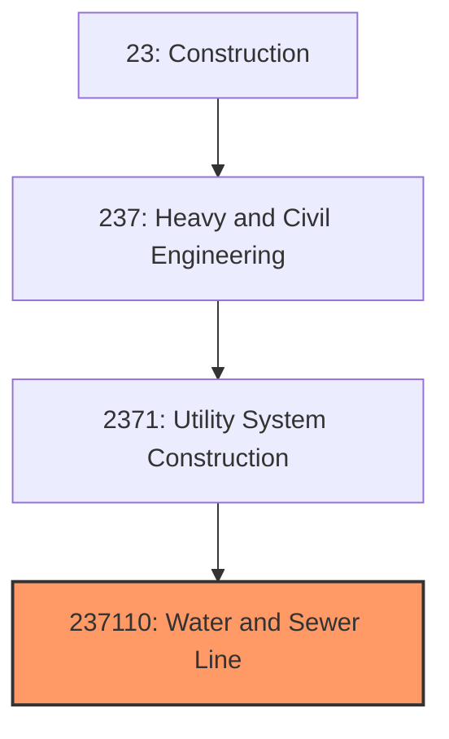

# Water and Sewer Line Construction

> This industry comprises establishments primarily engaged in the construction of water and sewer mains, and related structures such as pumping stations, water treatment plants, and sewage treatment facilities.

## Overview

Water and Sewer Line Construction (NAICS 237110) encompasses establishments engaged in constructing the infrastructure that delivers potable water to communities and collects and treats wastewater. This critical public health infrastructure includes water mains, distribution systems, fire hydrants, storage tanks, pumping stations, sewer lines, lift stations, and treatment facilities.

The industry operates primarily on public contracts with municipalities, water districts, and sewer authorities. Projects range from extending service to new developments to major capital improvements replacing aging infrastructure. The current focus on replacing lead service lines and addressing aging water mains creates substantial long-term demand.

## Market Context

The U.S. water and sewer construction market represents approximately $45 billion in annual spending:

| Segment | Market Size | Key Drivers |
|---------|-------------|-------------|
| Water Distribution | $18 billion | Lead service line replacement, main breaks, growth |
| Sewer Collection | $12 billion | Inflow/infiltration reduction, CSO separation |
| Water Treatment | $8 billion | Treatment upgrades, emerging contaminants |
| Wastewater Treatment | $7 billion | Nutrient removal, capacity expansion |

The market is driven by aging infrastructure (much of which is 50-100 years old), federal funding from the Infrastructure Investment and Jobs Act, EPA mandates for water quality, and population growth in Sun Belt states.

## Industry Hierarchy

## Key Statistics

| Metric | Value |
|--------|-------|
| NAICS Code | 237110 |
| Level | National Industry |
| Parent | [Utility System Construction](../) |
| U.S. Establishments | ~8,000 |
| Annual Revenue | ~$45 billion |
| Employment | ~100,000 |
| U.S. Water Mains | 2.2 million miles |
| U.S. Sewer Lines | 800,000 miles |

## Related Occupations

- [Construction Managers](/occupations/Management/ConstructionManagers) - Oversee water and sewer infrastructure projects
- [Civil Engineers](/occupations/Architecture/CivilEngineers) - Design water distribution and collection systems
- [Pipelayers](/occupations/Construction/Pipelayers) - Install water mains and sewer lines
- [Operating Engineers](/occupations/Construction/OperatingEngineers) - Operate excavators and trenching equipment
- [Plumbers and Pipefitters](/occupations/Construction/Plumbers) - Install piping and make connections
- [Concrete Workers](/occupations/Construction/ConcreteWorkers) - Construct manholes, vaults, and structures
- [Water Treatment Operators](/occupations/Production/WaterTreatment) - Commission treatment facilities

## Core Business Processes

```mermaid
flowchart LR
    subgraph Planning["Project Development"]
        P1["Utility Planning"]
        P2["Engineering Design"]
        P3["Permitting"]
        P4["Bidding"]
    end

    subgraph Construction["Construction"]
        C1["Potholing/Locates"]
        C2["Trenching/Shoring"]
        C3["Pipe Installation"]
        C4["Structure Construction"]
        C5["Connections/Testing"]
        C6["Backfill/Restoration"]
    end

    subgraph Closeout["Commissioning"]
        O1["Pressure Testing"]
        O2["Disinfection"]
        O3["Inspection/Acceptance"]
    end

    P1 --> P2 --> P3 --> P4
    P4 --> C1 --> C2 --> C3 --> C4 --> C5 --> C6
    C6 --> O1 --> O2 --> O3
```

### Project Planning and Design

Water and sewer projects require coordination with utility master plans and regulatory requirements.

**Key Activities:**
- Develop capital improvement programs based on system needs
- Design pipe alignments, sizing, and connections
- Prepare plans meeting AWWA and EPA standards
- Obtain permits from state environmental agencies
- Coordinate with other utilities for joint trenching

### Underground Utility Construction

Construction requires careful excavation in urban environments with existing utilities.

**Key Activities:**
- Locate existing underground utilities (811/One Call)
- Perform potholing to verify utility locations
- Excavate trenches with proper shoring and sloping
- Install bedding and pipe sections
- Construct manholes, vaults, and valve boxes
- Make connections to existing systems
- Backfill and compact per specifications
- Restore pavement and surface improvements

### Testing and Commissioning

All water systems require pressure testing and disinfection before service.

**Key Activities:**
- Conduct hydrostatic pressure testing of water mains
- Perform air testing or mandrel testing of sewer lines
- Disinfect water mains before placing in service
- Complete CCTV inspection of gravity sewers
- Document as-built locations and elevations
- Transfer to utility for operation and maintenance

## Industry Value Chain

```mermaid
graph LR
    subgraph Inputs["Inputs & Resources"]
        I1["Ductile Iron Pipe"]
        I2["PVC/HDPE Pipe"]
        I3["Valves/Fittings"]
        I4["Excavation Equipment"]
        I5["Skilled Labor"]
    end

    subgraph Primary["Primary Activities"]
        A1["Excavation"]
        A2["Pipe Installation"]
        A3["Structures"]
        A4["Connections"]
    end

    subgraph Outputs["Infrastructure"]
        O1["Water Mains"]
        O2["Service Lines"]
        O3["Sewer Lines"]
        O4["Pump Stations"]
    end

    subgraph Customers["Customer Segments"]
        C1["Municipalities"]
        C2["Water Districts"]
        C3["Sewer Authorities"]
        C4["Developers"]
    end

    Inputs --> Primary --> Outputs --> Customers
```

## Regulatory Environment

Water and sewer construction operates under strict public health regulations:

### Federal Regulations
- **Safe Drinking Water Act** - EPA standards for drinking water quality
- **Clean Water Act** - Wastewater discharge permits and standards
- **Lead and Copper Rule** - Requirements for lead service line replacement
- **OSHA Trenching Standards** - Excavation safety requirements (Subpart P)

### State and Local Requirements
- **State Environmental Permits** - Water system construction approvals
- **Public Utility Commission** - Rate and service regulations
- **Local Health Departments** - Water quality monitoring
- **Traffic Control** - ROW permits and work zone requirements

### Industry Standards
- **AWWA Standards** - American Water Works Association design and construction
- **WEF Standards** - Water Environment Federation wastewater guidelines
- **ASCE 38** - Standard for utility locating quality levels
- **ASTM Standards** - Material and testing specifications

## Technology & Innovation

### Design Technology
- **Hydraulic Modeling** - Water system analysis and design
- **GIS Mapping** - Asset mapping and management
- **CAD/Civil 3D** - Pipe network design
- **SCADA Systems** - Remote monitoring and control

### Construction Technology
- **Horizontal Directional Drilling (HDD)** - Trenchless installation
- **Pipe Bursting** - Trenchless pipe replacement
- **Cured-in-Place Pipe (CIPP)** - Sewer rehabilitation without excavation
- **GPS Machine Control** - Precision excavation guidance

### Pipe Materials Innovation
- **HDPE Pipe** - Flexible, fusion-welded polyethylene
- **Lined Ductile Iron** - Corrosion-resistant water mains
- **Fiberglass Pipe (FRP)** - Corrosion-resistant for aggressive environments
- **Concrete Pressure Pipe** - Large diameter transmission mains

### Condition Assessment
- **CCTV Inspection** - Video inspection of sewer lines
- **Acoustic Leak Detection** - Finding leaks in water mains
- **Smart Meters (AMI)** - Advanced metering for leak detection
- **Pipe Wall Assessment** - Electromagnetic testing for pipe condition

## Project Types

### Water Distribution
- Transmission main installation
- Distribution main extension
- Lead service line replacement
- Fire hydrant installation
- Valve and meter replacement
- Water main rehabilitation

### Wastewater Collection
- Gravity sewer installation
- Force main construction
- Lift/pump station construction
- Manhole rehabilitation
- Inflow/Infiltration reduction
- CSO separation projects

### Treatment Facilities
- Water treatment plant construction
- Filter and membrane installation
- Wastewater treatment upgrades
- Nutrient removal systems
- Biosolids handling facilities

## Industry Trends and Outlook

Key trends shaping water and sewer construction:

- **Lead Service Line Replacement** - EPA mandate driving massive investment
- **Aging Infrastructure** - Replacement of pipes installed 50-100 years ago
- **PFAS Treatment** - Emerging contaminant treatment requirements
- **Smart Water** - Digital monitoring and leak detection systems
- **Trenchless Technology** - Minimizing excavation and surface disruption
- **Green Infrastructure** - Stormwater management and CSO control
- **Water Reuse** - Recycled water distribution systems
- **Climate Resilience** - Flood protection and drought planning

The outlook is very strong with federal funding from IIJA, mandatory lead service line replacement, and critical need to address aging water infrastructure. The industry faces workforce challenges but steady public investment supports sustained growth.

---

*Source: NAICS 237110 - Water and Sewer Line and Related Structures Construction*
