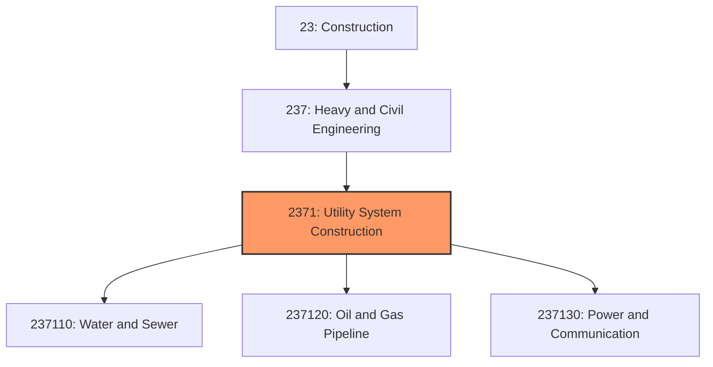

# Utility System Construction

> This industry group comprises establishments primarily engaged in the construction of distribution lines and related buildings and structures for utilities including water, sewer, petroleum, gas, power, and communication systems.

## Overview

Utility System Construction encompasses establishments engaged in constructing the critical infrastructure that delivers essential services to communities and businesses. This includes water treatment plants, sewage systems, power generation facilities, electrical transmission lines, natural gas pipelines, and telecommunications networks.

The industry serves as the backbone of modern civilization, providing the infrastructure necessary for clean water, waste management, energy delivery, and communications. Projects range from local distribution networks serving individual developments to massive interstate transmission systems spanning thousands of miles.

## Market Context

The U.S. utility system construction market represents approximately $150 billion in annual spending:

| Segment | Market Size | Key Drivers |
|---------|-------------|-------------|
| Power/Electrical | $55 billion | Grid modernization, renewable energy, electrification |
| Water/Sewer | $45 billion | Aging infrastructure, clean water mandates, population growth |
| Oil and Gas Pipeline | $30 billion | Production capacity, export terminals, replacement |
| Communications | $20 billion | 5G deployment, fiber expansion, broadband access |

The market is driven by significant infrastructure investment from the federal Infrastructure Investment and Jobs Act (IIJA), aging systems requiring replacement, renewable energy deployment, and digital connectivity initiatives.

## Industry Hierarchy

## Key Statistics

| Metric | Value |
|--------|-------|
| NAICS Code | 2371 |
| Level | Industry Group |
| Parent | [Heavy and Civil Engineering Construction](../) |
| Child Industries | 3 |
| U.S. Establishments | ~25,000 |
| Annual Revenue | ~$150 billion |
| Employment | ~350,000 |

## Sub-Industries

| Industry | Code | Description |
|----------|------|-------------|
| [Water and Sewer Line Construction](./Water/) | 237110 | Water mains, sewers, and related structures |
| [Oil and Gas Pipeline Construction](./GasPipeline/) | 237120 | Natural gas, crude oil, and refined product pipelines |
| [Power and Communication Line Construction](./Power/) | 237130 | Electrical transmission and telecommunications infrastructure |

## Related Occupations

- [Construction Managers](/occupations/Management/ConstructionManagers) - Oversee utility infrastructure projects
- [Civil Engineers](/occupations/Architecture/CivilEngineers) - Design water, sewer, and pipeline systems
- [Electrical Engineers](/occupations/Architecture/ElectricalEngineers) - Design power transmission and distribution systems
- [Pipelayers](/occupations/Construction/Pipelayers) - Lay pipe for water, sewer, and drainage systems
- [Operating Engineers](/occupations/Construction/OperatingEngineers) - Operate excavators, cranes, and trenching equipment
- [Electricians](/occupations/Construction/Electricians) - Install electrical systems and components
- [Lineworkers](/occupations/Construction/Lineworkers) - Install and maintain power and communication lines
- [Welders](/occupations/Production/Welders) - Join pipe sections and structural components

## Core Business Processes

```mermaid
flowchart LR
    subgraph Planning["Project Development"]
        P1["Route Selection"]
        P2["Environmental Review"]
        P3["Right-of-Way Acquisition"]
        P4["Permitting"]
    end

    subgraph Construction["Construction"]
        C1["Clearing/Grading"]
        C2["Trenching/Boring"]
        C3["Pipe/Line Installation"]
        C4["Backfill/Restoration"]
        C5["Testing"]
    end

    subgraph Closeout["Commissioning"]
        O1["Pressure Testing"]
        O2["System Activation"]
        O3["Documentation"]
    end

    P1 --> P2 --> P3 --> P4
    P4 --> C1 --> C2 --> C3 --> C4 --> C5
    C5 --> O1 --> O2 --> O3
```

### Project Development and Permitting

Utility projects require extensive planning, environmental review, and land rights acquisition.

**Key Activities:**
- Conduct route studies and alternatives analysis
- Prepare environmental impact assessments
- Negotiate right-of-way and easement agreements
- Obtain federal, state, and local permits
- Coordinate with other utilities for joint trenching
- Engage with communities and stakeholders

### Utility Construction

Construction involves specialized equipment and techniques for installing underground and overhead systems.

**Key Activities:**
- Clear and grade pipeline or transmission corridors
- Excavate trenches or perform horizontal directional drilling
- Install pipe, conduit, or overhead structures
- Make connections to existing systems
- Backfill and restore disturbed areas
- Test systems for integrity and function

### System Commissioning

Utility systems require thorough testing before being placed in service.

**Key Activities:**
- Conduct hydrostatic or pneumatic pressure testing
- Perform electrical testing and energization
- Document as-built conditions and system parameters
- Train owner operations personnel
- Transfer systems to operating entities

## Industry Value Chain

## Regulatory Environment

Utility construction operates under extensive federal, state, and local regulation:

### Federal Regulations
- **FERC** - Federal Energy Regulatory Commission oversight of interstate pipelines and transmission
- **EPA** - Environmental permits for construction near waterways and wetlands
- **PHMSA** - Pipeline and Hazardous Materials Safety Administration pipeline standards
- **OSHA** - Excavation, trenching, and confined space safety standards

### Utility-Specific Standards
- **AWWA** - American Water Works Association standards for water systems
- **NESC** - National Electrical Safety Code for power and communication lines
- **49 CFR 192/195** - Federal pipeline safety regulations
- **API/ASME** - American Petroleum Institute and ASME standards for pipelines

### Environmental Compliance
- **NEPA** - National Environmental Policy Act review for federal projects
- **Clean Water Act** - Section 404 permits for wetland impacts
- **Endangered Species Act** - Protection requirements for listed species
- **State Environmental Review** - CEQA (California), SEPA (Washington), etc.

### Safety Requirements
- **OSHA Excavation Standards** - Trench safety and protective systems
- **OSHA Electrical Standards** - Working near energized systems
- **Pipeline Safety Standards** - Welding, testing, and integrity requirements
- **Traffic Control** - Manual on Uniform Traffic Control Devices (MUTCD)

## Technology & Innovation

### Design and Planning
- **GIS Mapping** - Geographic information systems for route planning
- **CAD/BIM** - Computer-aided design for utility layouts
- **Subsurface Utility Engineering** - Underground utility detection and mapping
- **Lidar Surveying** - Aerial topographic mapping for route selection

### Construction Technology
- **Horizontal Directional Drilling (HDD)** - Trenchless installation under obstacles
- **Pipe Bursting** - Trenchless replacement of existing lines
- **GPS Machine Control** - Automated grading and trenching guidance
- **Automated Welding** - Robotic pipeline welding systems

### Asset Management
- **Smart Meters** - Advanced metering infrastructure for utilities
- **SCADA Systems** - Supervisory control and data acquisition
- **Leak Detection** - Acoustic and fiber optic monitoring systems
- **Drone Inspection** - Aerial inspection of transmission lines and pipelines

### Sustainable Infrastructure
- **Water Reuse Systems** - Recycled water distribution infrastructure
- **Renewable Integration** - Grid infrastructure for solar and wind
- **Undergrounding** - Converting overhead lines to underground
- **Green Infrastructure** - Natural stormwater management systems

## Major Market Segments

### Electric Power Infrastructure
- Transmission lines (high voltage)
- Distribution systems
- Substations and switching stations
- Renewable energy interconnection
- Grid modernization and resilience

### Water and Wastewater
- Water treatment plants
- Water transmission and distribution
- Wastewater collection systems
- Wastewater treatment plants
- Stormwater systems

### Oil and Gas Pipelines
- Natural gas transmission
- Gas distribution systems
- Crude oil pipelines
- Refined products pipelines
- Gathering systems

### Telecommunications
- Fiber optic networks
- Wireless tower infrastructure
- 5G small cell deployment
- Rural broadband expansion

## Industry Trends and Outlook

Key trends shaping utility system construction:

- **Infrastructure Investment** - Federal IIJA funding driving major investments
- **Grid Modernization** - Upgrading aging electrical infrastructure
- **Renewable Energy** - Transmission lines for solar and wind integration
- **Water Infrastructure** - Replacing lead service lines and aging mains
- **5G and Broadband** - Expanding telecommunications infrastructure
- **Resilience** - Hardening systems against extreme weather
- **Workforce Development** - Addressing skilled labor shortages

The outlook is exceptionally strong with historic federal infrastructure investment, clean energy transition requirements, and critical need to replace aging systems driving sustained demand across all utility sectors.

---

*Source: NAICS 2371 - Utility System Construction*
