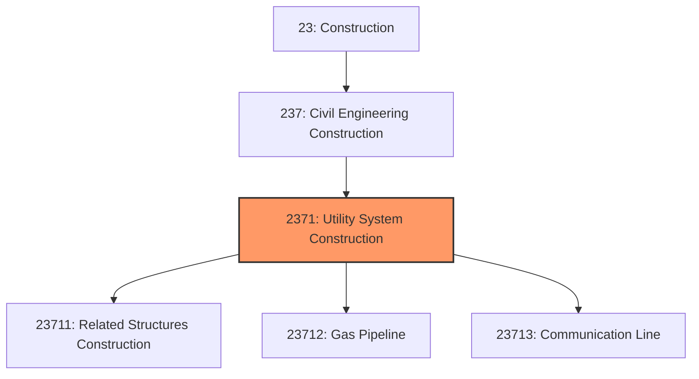
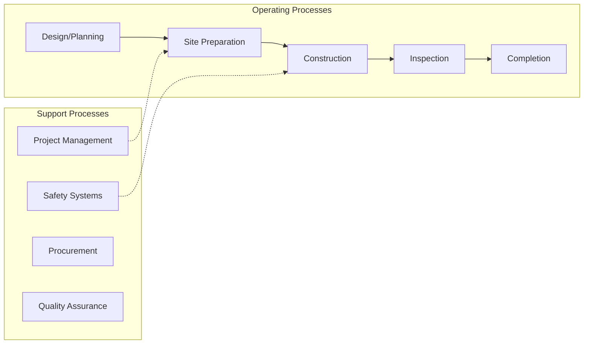

# Utility System Construction

> This industry group comprises establishments primarily engaged in the construction of distribution lines and related buildings and structures for utilities (i.

## Overview

Utility System Construction represents an important category within the Construction sector (NAICS 23). This industry group encompasses establishments primarily engaged in utility system construction.

This industry group comprises establishments primarily engaged in the construction of distribution lines and related buildings and structures for utilities (i.e., water, sewer, petroleum, gas, power, and communication). All structures (including buildings) that are integral parts of utility systems (e.g., storage tanks, pumping stations, power plants, and refineries) are included in this industry group.

## Industry Hierarchy

## Key Statistics

| Metric | Value |
|--------|-------|
| NAICS Code | 2371 |
| Level | Industry Group |
| Parent | [Civil Engineering Construction](../) |
| Child Industries | 3 |

## Sub-Industries

| Industry | Code | Description |
|----------|------|-------------|
| [Related Structures Construction](./RelatedStructuresConstruction/) | 23711 | See industry description for 237110 |
| [Gas Pipeline](./GasPipeline/) | 23712 | See industry description for 237120 |
| [Communication Line](./CommunicationLine/) | 23713 | See industry description for 237130 |

## Core Business Processes

## Industry Value Chain

```mermaid
graph LR
    subgraph Inputs["Inputs"]
        I1["Materials"]
        I2["Equipment"]
        I3["Labor"]
        I4["Plans"]
    end

    subgraph Primary["Primary Activities"]
        A1["Inbound Logistics"]
        A2["Core Operations"]
        A3["Quality Assurance"]
        A4["Outbound/Delivery"]
    end

    subgraph Outputs["Products/Services"]
        O1["Buildings"]
        O2["Infrastructure"]
        O3["Renovations"]
    end

    subgraph Customers["Markets"]
        C1["Property Owners"]
        C2["Government"]
        C3["Developers"]
        C4["Businesses"]
    end

    Inputs --> Primary --> Outputs --> Customers
```

---

*Source: NAICS 2371 - Utility System Construction*
