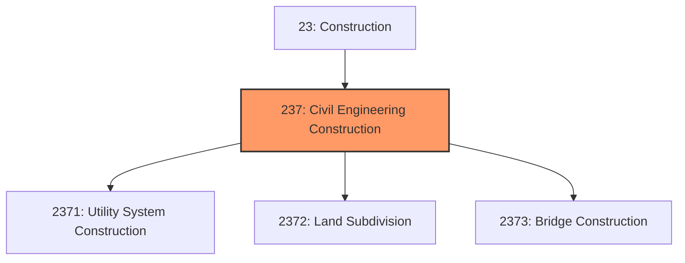
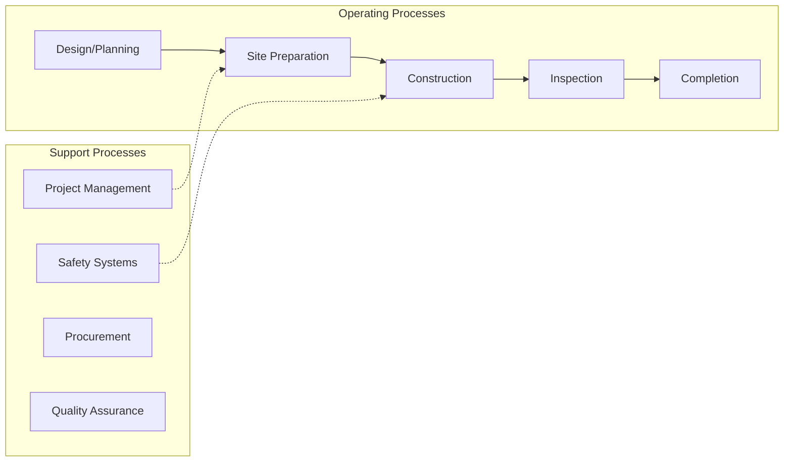

# Civil Engineering Construction

> The Heavy and Civil Engineering Construction subsector comprises establishments whose primary activity is the construction of entire engineering projects (e.

## Overview

Civil Engineering Construction represents an important category within the Construction sector (NAICS 23). This subsector encompasses establishments primarily engaged in civil engineering construction.

The Heavy and Civil Engineering Construction subsector comprises establishments whose primary activity is the construction of entire engineering projects (e.g., highways and dams), and specialty trade contractors, whose primary activity is the production of a specific component for such projects. Specialty trade contractors in the Heavy and Civil Engineering Construction subsector generally are performing activities that are specific to heavy and civil engineering construction projects and are not normally performed on buildings. The work performed may include new work, additions, alterations, or maintenance and repairs. Specialty trade activities are classified in this subsector if the skills and equipment present are specific to heavy or civil engineering construction projects. For example, specialized equipment is needed to paint lines on highways. This equipment is not normally used in building applications so the activity is classified in this subsector. Traffic signal installation, while specific to highways, uses much of the same skills and equipment that are needed for electrical work in building projects and is therefore classified in Subsector 238, Specialty Trade Contractors. Construction projects involving water resources (e.g., dredging and land drainage) and projects involving open space improvement (e.g., parks and trails) are included in this subsector. Establishments whose primary activity is the subdivision of land into individual building lots usually perform various additional site-improvement activities (e.g., road building and utility line installation) and are included in this subsector. Establishments in this subsector are classified based on the types of structures that they construct. This classification reflects variations in the requirements of the underlying production processes.

## Industry Hierarchy

## Key Statistics

| Metric | Value |
|--------|-------|
| NAICS Code | 237 |
| Level | Subsector |
| Parent | [Construction](../) |
| Child Industries | 3 |

## Sub-Industries

| Industry | Code | Description |
|----------|------|-------------|
| [Utility System Construction](./UtilitySystemConstruction/) | 2371 | This industry group comprises establishments primarily engaged in the constructi |
| [Land Subdivision](./LandSubdivision/) | 2372 | Land Subdivision |
| [Bridge Construction](./BridgeConstruction/) | 2373 | Bridge Construction |

## Core Business Processes

## Industry Value Chain

```mermaid
graph LR
    subgraph Inputs["Inputs"]
        I1["Materials"]
        I2["Equipment"]
        I3["Labor"]
        I4["Plans"]
    end

    subgraph Primary["Primary Activities"]
        A1["Inbound Logistics"]
        A2["Core Operations"]
        A3["Quality Assurance"]
        A4["Outbound/Delivery"]
    end

    subgraph Outputs["Products/Services"]
        O1["Buildings"]
        O2["Infrastructure"]
        O3["Renovations"]
    end

    subgraph Customers["Markets"]
        C1["Property Owners"]
        C2["Government"]
        C3["Developers"]
        C4["Businesses"]
    end

    Inputs --> Primary --> Outputs --> Customers
```

---

*Source: NAICS 237 - Civil Engineering Construction*
