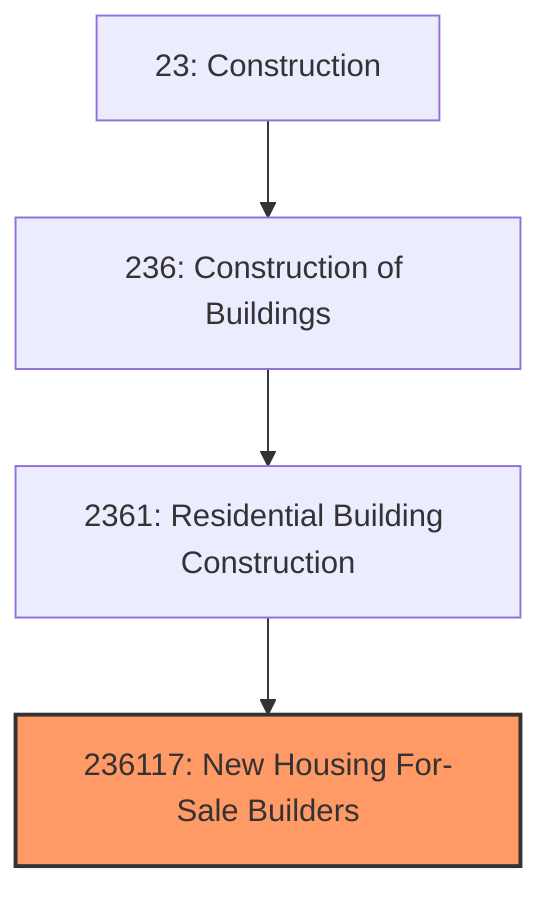
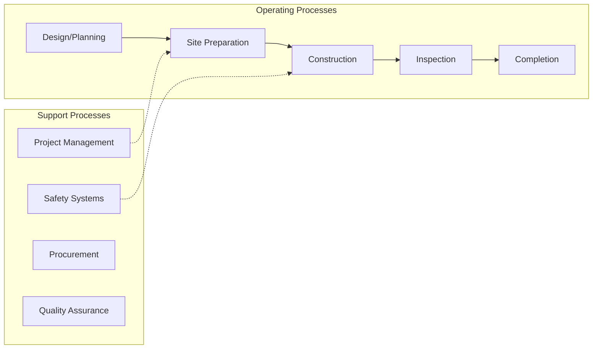

# New Housing For-Sale Builders

> This U.

## Overview

New Housing For-Sale Builders represents a specialized segment within the Construction sector (NAICS 23).

This U.S. industry comprises establishments primarily engaged in building new homes on land that is owned or controlled by the builder rather than the homebuyer or investor. The land is included with the sale of the home. Establishments in this industry build single-family and/or multifamily homes. These establishments are often referred to as merchant builders, but are also known as production or for-sale builders. Cross-References. Establishments primarily engaged in--

## Industry Hierarchy

## Key Statistics

| Metric | Value |
|--------|-------|
| NAICS Code | 236117 |
| Level | National Industry |
| Child Industries | 0 |

## Related Occupations

- [Construction Managers](/occupations/Management/ConstructionManagers) - Plan and coordinate construction projects
- [Carpenters](/occupations/Construction/Carpenters) - Construct and repair building frameworks
- [Electricians](/occupations/Construction/Electricians) - Install and maintain electrical systems
- [Construction Laborers](/occupations/Construction/ConstructionLaborers) - Perform physical labor at construction sites

## Core Business Processes

## Industry Value Chain

```mermaid
graph LR
    subgraph Inputs["Inputs"]
        I1["Materials"]
        I2["Equipment"]
        I3["Labor"]
        I4["Plans"]
    end

    subgraph Primary["Primary Activities"]
        A1["Inbound Logistics"]
        A2["Core Operations"]
        A3["Quality Assurance"]
        A4["Outbound/Delivery"]
    end

    subgraph Outputs["Products/Services"]
        O1["Buildings"]
        O2["Infrastructure"]
        O3["Renovations"]
    end

    subgraph Customers["Markets"]
        C1["Property Owners"]
        C2["Government"]
        C3["Developers"]
        C4["Businesses"]
    end

    Inputs --> Primary --> Outputs --> Customers
```

## Regulatory Environment

- **OSHA** (Occupational Safety and Health Administration) - Enforces workplace safety standards
- **EPA** (Environmental Protection Agency) - Regulates construction environmental impact
- **State and Local Building Codes** - Govern construction standards and permitting
- **Department of Labor** - Enforces prevailing wage and labor requirements

## Technology & Innovation

- **Building Information Modeling (BIM)** - 3D digital representations for design and construction planning
- **Prefabrication and Modular Construction** - Off-site manufacturing of building components
- **Construction Robotics** - Automated bricklaying, 3D-printed structures, and drone site surveys
- **Green Building** - Sustainable materials, energy-efficient designs, and LEED certification

## Industry Outlook

The construction industry benefits from sustained infrastructure investment, housing demand, and commercial development. Labor shortages continue to drive adoption of modular construction, prefabrication, and automation. Green building practices and energy-efficient design are becoming standard requirements, while technology adoption in project management and building information modeling improves productivity.

---

*Source: NAICS 236117 - New Housing For-Sale Builders*
