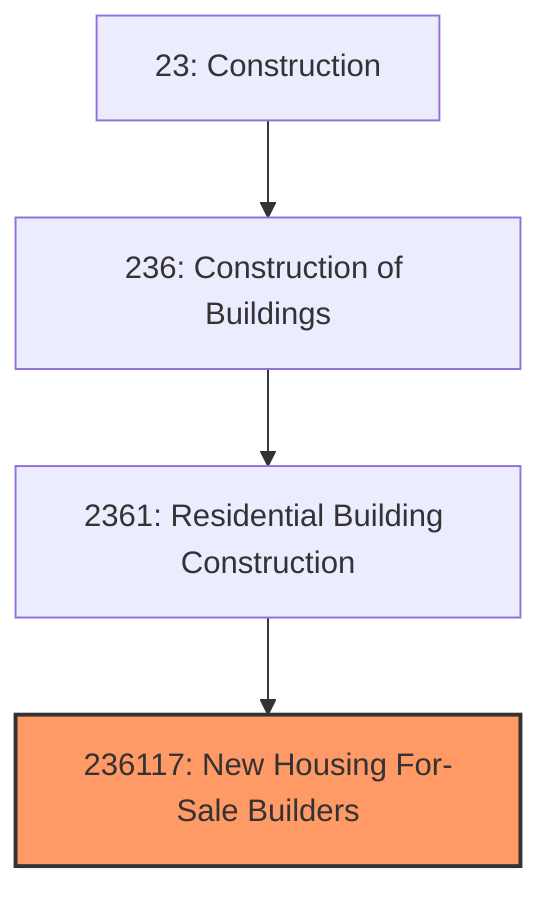
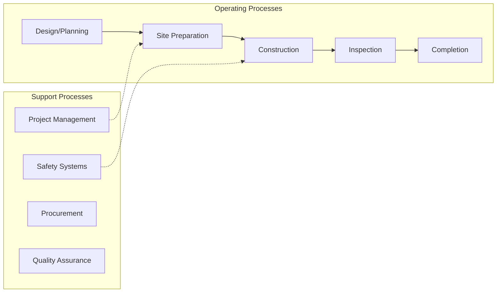

# New Housing For-Sale Builders

> This U.

## Overview

New Housing For-Sale Builders represents a specialized segment within the Construction sector (NAICS 23).

This U.S. industry comprises establishments primarily engaged in building new homes on land that is owned or controlled by the builder rather than the homebuyer or investor. The land is included with the sale of the home. Establishments in this industry build single-family and/or multifamily homes. These establishments are often referred to as merchant builders, but are also known as production or for-sale builders. Cross-References. Establishments primarily engaged in--

## Industry Hierarchy

## Key Statistics

| Metric | Value |
|--------|-------|
| NAICS Code | 236117 |
| Level | National Industry |
| Child Industries | 0 |

## Related Occupations

See the [occupations directory](/occupations) for roles commonly found in this industry.

## Core Business Processes

## Industry Value Chain

```mermaid
graph LR
    subgraph Inputs["Inputs"]
        I1["Materials"]
        I2["Equipment"]
        I3["Labor"]
        I4["Plans"]
    end

    subgraph Primary["Primary Activities"]
        A1["Inbound Logistics"]
        A2["Core Operations"]
        A3["Quality Assurance"]
        A4["Outbound/Delivery"]
    end

    subgraph Outputs["Products/Services"]
        O1["Buildings"]
        O2["Infrastructure"]
        O3["Renovations"]
    end

    subgraph Customers["Markets"]
        C1["Property Owners"]
        C2["Government"]
        C3["Developers"]
        C4["Businesses"]
    end

    Inputs --> Primary --> Outputs --> Customers
```

---

*Source: NAICS 236117 - New Housing For-Sale Builders*
