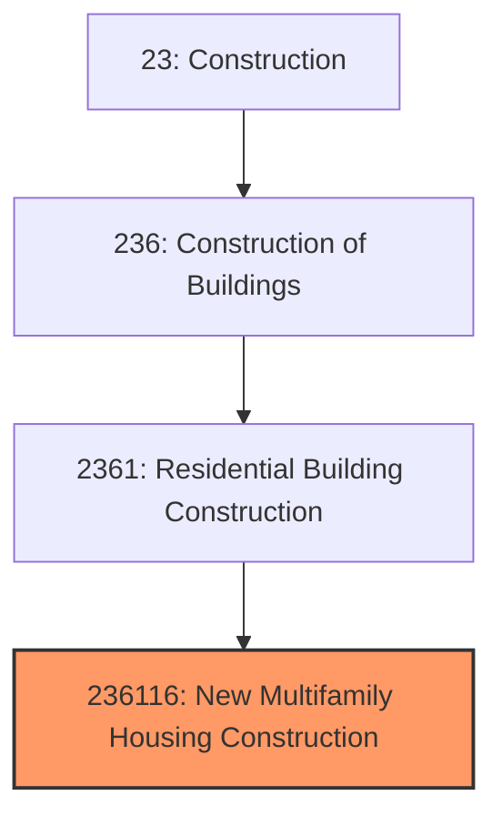
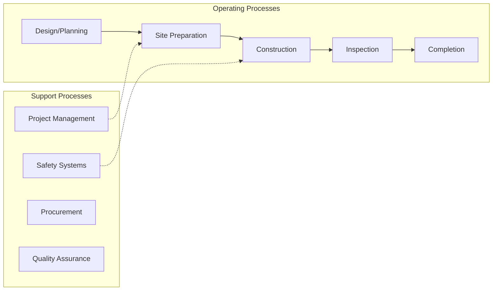

# New Multifamily Housing Construction

> This U.

## Overview

New Multifamily Housing Construction represents a specialized segment within the Construction sector (NAICS 23).

This U.S. industry comprises general contractor establishments primarily responsible for the construction of new multifamily residential housing units (e.g., high-rise, garden, town house apartments, and condominiums where each unit is not separated from its neighbors by a ground-to-roof wall). Multifamily design-build firms and multifamily housing construction management firms acting as general contractors are included in this industry. Cross-References. Establishments primarily engaged in--

## Industry Hierarchy

## Key Statistics

| Metric | Value |
|--------|-------|
| NAICS Code | 236116 |
| Level | National Industry |
| Child Industries | 0 |

## Related Occupations

See the [occupations directory](/occupations) for roles commonly found in this industry.

## Core Business Processes

## Industry Value Chain

```mermaid
graph LR
    subgraph Inputs["Inputs"]
        I1["Materials"]
        I2["Equipment"]
        I3["Labor"]
        I4["Plans"]
    end

    subgraph Primary["Primary Activities"]
        A1["Inbound Logistics"]
        A2["Core Operations"]
        A3["Quality Assurance"]
        A4["Outbound/Delivery"]
    end

    subgraph Outputs["Products/Services"]
        O1["Buildings"]
        O2["Infrastructure"]
        O3["Renovations"]
    end

    subgraph Customers["Markets"]
        C1["Property Owners"]
        C2["Government"]
        C3["Developers"]
        C4["Businesses"]
    end

    Inputs --> Primary --> Outputs --> Customers
```

---

*Source: NAICS 236116 - New Multifamily Housing Construction*
